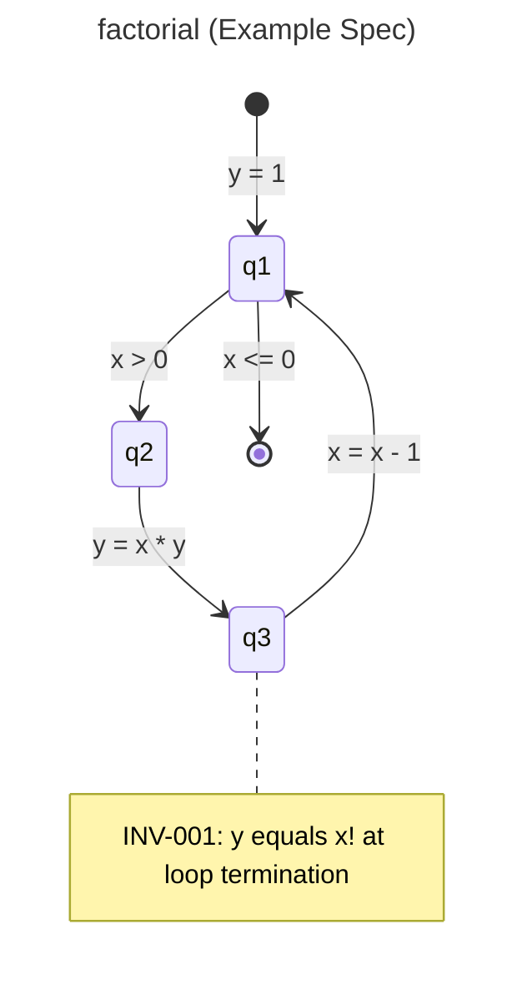
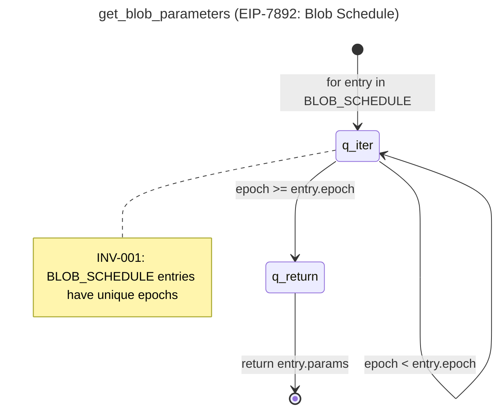
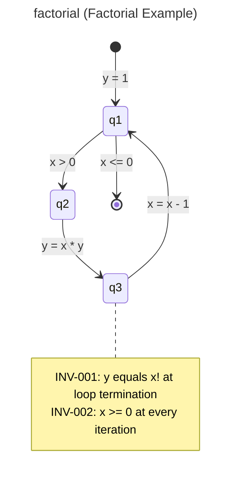

# SKILL: Subgraph Extractor

## Mindset

You are a **Formal Methods Specialist** trained in program graph extraction. Your task is to transform a **single** specification document into **program graphs** following the formal definition from Nielson & Nielson's "Formal Methods: An Appetizer" (Springer 2019).

> A program graph **PG = (Q, q▷, q◀, Act, E)** consists of:
> - **Q**: a finite set of nodes (program points)
> - **q▷, q◀ ∈ Q**: initial and final nodes
> - **Act**: a set of actions (assignments, tests/guards)
> - **E ⊆ Q × Act × Q**: a finite set of edges

## Scope

This skill processes **one specification URL** per invocation. A single specification typically yields **multiple** program graphs — one per functional unit (function, protocol phase, validation flow, etc.).

The calling worker is responsible for batching and aggregation.

## Input

The caller provides:
- `url` — the source URL of the specification (always provided)
- `output_dir` — directory where `.mmd` files should be written
- `local_path` *(optional)* — path to a pre-downloaded copy of the specification

## Procedure

1. **Read Specification**: If `local_path` is provided and the file exists, read from it. Otherwise, fetch the content from `url` using `mcp__fetch__fetch`.

2. **Identify Functional Units**: Break down the document into logical units:
   - Function definitions
   - State transition descriptions
   - Protocol phases
   - Validation logic

   Each functional unit becomes one program graph.

3. **Extract Program Graph Components**:

   For each functional unit, identify:

   | Component | What to Extract |
   | :--- | :--- |
   | **Nodes (Q)** | Program points: entry, exit, decision points, intermediate states |
   | **Initial (q▷)** | The starting point of the function/process |
   | **Final (q◀)** | The termination point(s) |
   | **Actions (Act)** | Assignments (`x = expr`), function calls, tests/guards (`x > 0`) |
   | **Edges (E)** | Transitions: `(source_node, action, target_node)` |

4. **Generate Mermaid Diagrams**: For each program graph, write a `.mmd` file to:
   ```
   {output_dir}/{spec_id}/{SG-ID}_{name}.mmd
   ```
   Where `spec_id` is a short identifier derived from the specification (e.g., `EIP-7594`, `fulu-beacon-chain`).

5. **Return Result**: Return the JSON structure described in Output Format below. Do **not** write `index.json` — the calling worker handles aggregation.

## Mermaid Syntax Rules

**CRITICAL**: Follow these rules to avoid parse errors:

1. **No `:=` in labels**: Use `=` instead of `:=` for assignments
2. **No spaces after colon**: Write `q1 --> q2: action` (space before colon is OK)
3. **Escape special characters**: Avoid `<`, `>`, `{`, `}` in labels, or use quotes
4. **Use simple node names**: `q1`, `q_validate`, etc. (alphanumeric + underscore only)

### Correct Mermaid Syntax



### Incorrect (Will Fail)

```
[*] --> q1 : y := 1     # WRONG: space before colon, := syntax
q1 --> q2 : x > 0       # WRONG: space before colon
```

## Output Format

The skill returns one JSON object per invocation (one spec → one object).

**Important**: `mermaid_file` paths are **relative to `output_dir`**, including the `spec_id` directory prefix.

```json
{
  "source_url": "https://...",
  "title": "EIP-7892: Blob Schedule",
  "sub_graphs": [
    {
      "id": "SG-001",
      "name": "get_blob_parameters",
      "mermaid_file": "EIP-7892/SG-001_get_blob_parameters.mmd"
    }
  ]
}
```

**Note**: The structured program graph (Q, q_init, q_final, Act, E) and invariants are encoded in the `.mmd` file itself. The JSON output contains only references. Include all invariants as `note right of` blocks in the `.mmd` file.

### Mermaid File (.mmd)



## Action Classification

| Type | Pattern | Mermaid Label |
| :--- | :--- | :--- |
| Assignment | `var := expr` | `var = expr` |
| Function Call | `func(args)` | `func(args)` |
| Test/Guard | boolean | `x > 0` |
| Return | `return expr` | `return expr` |
| Revert | `revert msg` | `revert msg` |
| Loop Entry | `for/while` | `for item in list` |

## Node Naming Convention

| Type | Pattern | Example |
| :--- | :--- | :--- |
| Initial | `q_init` | Entry point |
| Final | `q_final` | Exit point |
| Validation | `q_validate` | Input validation |
| Iteration | `q_iter` | Loop body |
| Decision | `q_check` | Branch point |
| Processing | `q_process` | Main logic |
| Error | `q_error` | Error handling |

## Quality Criteria

1. **Completeness**: Every function/process should have a corresponding program graph
2. **Correctness**: Edges must form valid paths from q_init to q_final
3. **Minimality**: Avoid redundant nodes; merge sequential assignments if appropriate
4. **Readability**: Use semantic node names, not just `q1`, `q2`, etc.
5. **Valid Mermaid**: All `.mmd` files must render without errors

## Example: Factorial Function

**Input (pseudocode)**:
```
function factorial(x):
    y := 1
    while x > 0:
        y := x * y
        x := x - 1
    return y
```

**Output (Mermaid)** - `examples/SG-factorial_factorial.mmd`:


**Output (JSON)**:
```json
{
  "id": "SG-factorial",
  "name": "factorial",
  "mermaid_file": "examples/SG-factorial_factorial.mmd"
}
```
