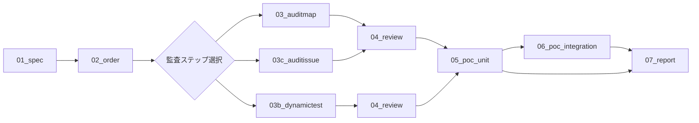

# ハッキング・ガイドライン

## ハッキングの流れ



## ハッキング・エージェントの全体像

| タイトル | 目的 | 前提 | プロンプト例 | 成果物ファイル名 |
| --- | --- | --- | --- | --- |
| [01_SPEC](.claude/commands/01_spec.md) | 仕様書とメタデータを洗い出し、仕様・スコープ・バウンティ条件の唯一のソースとして扱う | なし | `/01_spec ../docs "ethereum-el,zk" "Atlas L2" https://example.com/spec https://example.com/audit` | `security-agent/outputs/01_SPEC.json` |
| [02_ORDER](.claude/commands/02_order.md) | 探索すべきファイルに優先順位をつけ、対象関数のコールグラフを組み立てる | なし | `/02_order "OSK-TX-VALIDATION,ZK-PROVER-PIPELINE" "docs/specs/**/*.md,notes/design/overview.md"` | `security-agent/outputs/02_ORDER.json` |
| [03_AUDITMAP](.claude/commands/03_auditmap.md) | コードを一行ずつ精査し、怪しい箇所へ@auditコメントを追加して静的レビュー成果を集約する | `security-agent/outputs/02_ORDER.json` | `/03_auditmap "TX-ADMISSION,DA-SAMPLING" security-agent/docs/bugs/shared_findings.json` | `security-agent/outputs/03_AUDITMAP.json` |
| [03b_dynamictest](.claude/commands/03b_dynamictest.md) | ダイナミックテストやリプレイを実行してバグを探索する | `security-agent/outputs/02_ORDER.json` | `/03b_dynamictest "OSK-TX-VALIDATION,FULU-DATA-AVAILABILITY"` | なし |
| [03c_auditissue](.claude/commands/03c_auditissue.md) | 既知バグデータと照合しながら類似バグがないか監査し、静的レビュー成果に追記する | `security-agent/outputs/00_issues.json` | `/03c_auditissue reth security-agent/datasets/execution_bug_patterns.json` | `security-agent/outputs/03_AUDITMAP.json` |
| [04_review](.claude/commands/04_review.md) | 監査結果の妥当性をレビューし、逸脱指摘と再調整プランを記録したうえで人間レビューへ回す | `security-agent/outputs/03_AUDITMAP.json` | `/04_review crates/net/` | なし |
| [05_poc_unit](.claude/commands/05_poc_unit.md) | バグを再現する最低限の単体テストを作成する | 監査で特定した脆弱性 | `/05_poc_unit 03523523 crates/net/network/src/transactions/poc_reentrancy.rs` | なし |
| [06_poc_integration](.claude/commands/05_poc_integration.md) | バグを再現するE2Eテストを作成する（任意ステップ） | 05_poc_unit | `/06_poc_integration tests/integration/poc_reentrancy.rs 0023344` | なし |
| [07_report](.claude/commands/07_report.md) | 監査とPoCの結果を基に最終レポートを作成する | 監査とPoCの結果 | `/07_report 0023344 ETHEREUM critical` | `security-agent/outputs/report_xxxx.md` |

---

## ハッキング手順書

以下の手順に従い、エージェントベース監査を進めてください。

#### 1. ハッキング対象レポジトリのクローン

以下コマンドでクローン:
```
git clone <ハッキングしたいレポジトリ>
cd <レポジトリのルートディレクトリ>
```

---

#### 2. NyxFoundationのGitHub監査用レポ作成 (絶対にプライベートレポジトリ)

[NyxFoundationのGitHub OrgからCreate new repository](https://github.com/organizations/NyxFoundation/repositories/new) で `audit-<project>`（例: `audit-nimbus`）という名前の**プライベート**レポジトリを作成してください。もしレポジトリが既にある場合はレポ作成はしなくていい。

作成が完了したらリモートに追加:
```
git remote add audit git@github.com:NyxFoundation/<audit-repo>.git
```

---

#### 3. security-agentを準備

監査対象レポジトリのルートディレクトリで以下を実行:
```
git clone -b master git@github.com:NyxFoundation/security-agent.git
rm -rf security-agent/.git
```

---

#### 4. ハッキング

作業を始める前に必ず`master`ブランチを最新化し、NORMATIVE_IDごとに`master`から新しい作業ブランチを切って進める。NORMATIVE_IDは`security-agent/outputs/01_SPEC.json`の`normative_spec`に付与されているIDを指す。

[.claude/commands/](.claude/commands/)にあるプロンプトを02,03,04の順番に進めていく。

03系のステップは03_auditmap→03b_dynamictestをすべて完了させてから、最後に03c_auditissueへ進む。03cを実行する前に関連するissue/prを一気に取得するオプション手順があるが、03cのプロンプトで利用するためのものなので、すでに`00_issues.md`に作成済みの場合は無視して問題ない。

以下のようにテキストベースで引数を指定(引数はプロンプトのUsageを参考に):

```
codex --ask-for-approval never --sandbox workspace-write --search
>> Do the following task with ARGMENT=VELUE, ..., . <MDのプロンプトをコピペ>
...

>> 未着手箇所の調査を続けて
x10
...
```

気をつけること
- 02_order / 03_auditmap / 03c_auditissue では各実行が途中で終了することがよくあるため、続けて `未着手箇所の調査を続けて` を 10 回前後送信する。
- 各ステップごとにcodexを立ち上げ直し、コンテキストウィンドウをリセットする。

---

#### 5. ハッキング結果のレビュー

`outputs/03_AUDITMAP.json`に`Vuln`とラベル付けされた項目があれば、それがどのようなバグで、どのような攻撃に繋がるのか理解し、妥当性を自己検証する。

必要であればChat-GPT-5-thinkingにも妥当性を検証してもらう。

---

#### 6. GitHubへアップ

```
git add .
git commit -m"hacking finished"
git push audit HEAD
```

#### 7. Discordでレビュー依頼

@grandchildriceへハッキング終了を報告

```
@grandchildrice

ハッキングが終わったので、確認お願いします。

<GitHubのリンク>
```
