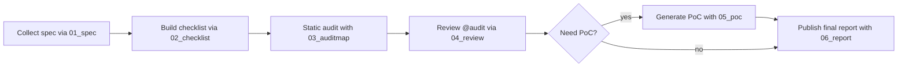

# ハッキング・ガイドライン

## ハッキングの流れ



## ハッキング・エージェントの全体像

| コマンド | 目的 | 主な前提 | Usage例 | 主な成果物 |
| --- | --- | --- | --- | --- |
| [01_spec](prompts/01_spec.md) | 仕様・スコープ・バウンティ条件を網羅した基礎資料を生成する | なし | `/01_spec TARGET_DIRECTORY="./docs" CATEGORY="ethereum-el" PROJECT_NAME="Atlas L2" REFERENCE_URLS="https://example.com/spec,https://example.com/audit"` | `security-agent/outputs/01_SPEC.json` |
| [02_checklist](prompts/02_checklist.md) | 既存アウトプットを基に自動化しやすい監査チェックリストを作る | `security-agent/outputs/01_SPEC.json` など既存成果物 | `/02_checklist` | `security-agent/outputs/02_CHECKLIST.json` |
| [03_auditmap](prompts/03_auditmap.md) | チェックリストに従ってソースを走査し、@audit/@audit-okを付与して監査結果を集約する | `security-agent/outputs/02_CHECKLIST.json` | `/03_auditmap PATH="./src"` | `security-agent/outputs/03_AUDITMAP.json` とソース内の注釈 |
| [04_review](prompts/04_review.md) | 既存@auditコメントの妥当性を再検証し、`03_AUDITMAP.json`を同期させる | `security-agent/outputs/03_AUDITMAP.json` | `/04_review` | 更新済みの `security-agent/outputs/03_AUDITMAP.json` |
| [05_poc](prompts/05_poc.md) | 指定した脆弱性ID向けに最小限のPoCテストを生成し自己検証する | `security-agent/outputs/03_AUDITMAP.json` で脆弱性IDが確定していること | `/05_poc TYPE=unit VULN_ID=03523523 OUTPUT_PATH=crates/net/network/src/transactions/poc_reentrancy.rs` | OUTPUT_PATHで指定したPoCテストファイル |
| [06_report](prompts/06_report.md) | PoCと監査結果をまとめ、バウンティ向け最終レポートを作成する | `security-agent/outputs/03_AUDITMAP.json` と PoC成果物 | `/06_report VULN_ID=0023344 REPORT_TYPE=ETHEREUM SEVERITY=critical` | `security-agent/outputs/report_<slug>.md` |

---

## ハッキング手順書

以下の手順に従い、エージェントベース監査を進めてください。

#### 1. ハッキング対象レポジトリのクローン

以下コマンドでクローン:
```
git clone <ハッキングしたいレポジトリ>
cd <レポジトリのルートディレクトリ>
```

---

#### 2. NyxFoundationのGitHub監査用レポ作成 (絶対にプライベートレポジトリ)

[NyxFoundationのGitHub OrgからCreate new repository](https://github.com/organizations/NyxFoundation/repositories/new) で `audit-<project>`（例: `audit-nimbus`）という名前の**プライベート**レポジトリを作成してください。もしレポジトリが既にある場合はレポ作成はしなくていい。

作成が完了したらリモートに追加:
```
git remote add audit git@github.com:NyxFoundation/<audit-repo>.git
```

---

#### 3. security-agentを準備

監査対象レポジトリのルートディレクトリで以下を実行:
```
git clone -b master git@github.com:NyxFoundation/security-agent.
./security-agent/setup.sh
git checkout -b audit-<監査者名>
```

監査リーダーは以下を実行(監査者はスキップ):
1. `security-agent/outputs/01_PAST_REPORTS/`に過去のハッカーレポートファイルを収納
2. `security-agent/get_github_issues  --repos list --keywords list`を実行
3. 01 / 02 のプロンプトを実行
4. ChatGPTに02のアウトプットファイルを洗練させる

---

#### 4. ハッキング

作業を始める前に必ず`master`ブランチを最新化し、フォルダパスごとにプロンプトを並行で実行する。

[./prompts/](./prompts)にあるプロンプトを03,04の順番に進めていく。

以下のようにテキストベースで引数を指定(引数はプロンプトのUsageを参考に):

```
codex --ask-for-approval never --sandbox workspace-write --search
>> /03_auditmap PATH=./src/
...

>> 未着手箇所の調査を続けて
x10
...
```

気をつけること
-  03_auditmap では各実行が途中で終了することがよくあるため、続けて `未着手箇所の調査を続けて` を 10 回前後送信する。
- 各ステップごとにcodexを立ち上げ直し、コンテキストウィンドウをリセットする。

---

#### 5. ハッキング結果のレビュー

`outputs/03_AUDITMAP.json`に`Vuln`とラベル付けされた項目があれば、それがどのようなバグで、どのような攻撃に繋がるのか理解し、妥当性を自己検証する。

必要であればChat-GPT-5-thinkingにも妥当性を検証してもらう。

---

#### 6. GitHubへアップ

```
git add .
git commit -m"hacking finished"
git push audit HEAD
```

#### 7. Discordでレビュー依頼

@grandchildriceへハッキング終了を報告

```
@grandchildrice

ハッキングが終わったので、確認お願いします。

<GitHubのリンク>
```
