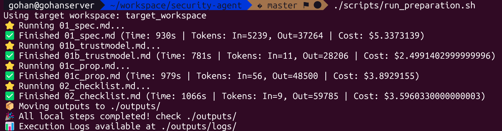
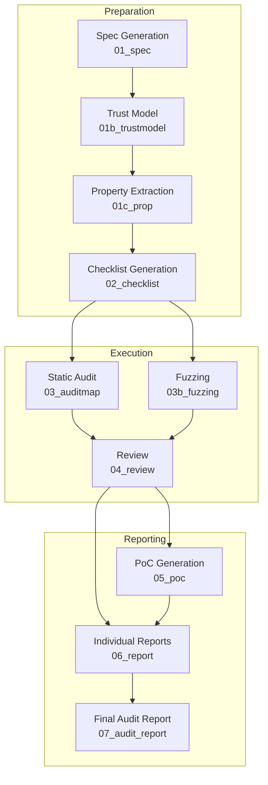

# Security Audit Agent

An automated security analysis system using LLMs for comprehensive Bug Bounty research and vulnerability assessment.

## Requirement

Before using this agent locally, please verify you have the following tools installed/configured:

- **Claude Code** (Currently, only this is supported)
- **[Serena MCP](https://github.com/oraios/serena)** (for web crawling and research)
- **Web Search** API (or MCP capability)

## Getting Started

Please Install Claude Code CLI if you haven't already.

```bash
npm install -g @anthropic-ai/claude-code
claude # and login with your Anthropic account
```

First, clone the repository and checkout the target branch.

```bash
git clone https://github.com/NyxFoundation/security-agent.git
cd security-agent
# Create a new branch for your specific audit target
git checkout -b audit/geth
```

### Option 1: Run Locally

Simply edit the configuration variables in the start scripts and run them.

#### Step 1: Clone Target Repository
Clone the target repository into the `target_workspace` folder.
```bash
git clone https://github.com/ethereum/go-ethereum.git target_workspace
```

#### Step 2: Grant Permissions
Make sure the scripts are executable.
```bash
chmod +x scripts/*.sh
```

#### Step 3: Preparation Phase
Edit `scripts/run_preparation.sh` to configure variables, then run it.
```bash
./scripts/run_preparation.sh
```



#### Step 4: Audit Phase
Edit `scripts/run_audit.sh` if needed, then run it.
```bash
./scripts/run_audit.sh
```

Then you can find the results in `/outputs`.

---

### Option 2: Run on GitHub Actions

You can automate the audit using GitHub Actions.

#### Step 1: Configure Workflows
Edit `.github/workflows/audit.yml` (and `preparation.yml` if needed) to configure your target repository.

```yaml
name: Security Audit - Execution (GitOps)

permissions:
  contents: write
  pull-requests: write

on:
  workflow_dispatch:
  schedule:
    - cron: '0 0 * * *'
  push:
    branches: 
      - 'audit/*'

jobs:
  audit_gitops:
    runs-on: ubuntu-latest
    if: "!startsWith(github.event.head_commit.message, 'Merge')"
    env:
      # --- CONFIGURATION (Override these in your branch) ---
      TARGET_REPO: "ethereum/go-ethereum" # Default (to be overridden)
      TARGET_REF: "master"                          # Default (HEAD of default branch)
      # -----------------------------------------------------
      ANTHROPIC_API_KEY: ${{ secrets.ANTHROPIC_API_KEY }}
      GH_TOKEN: ${{ secrets.GITHUB_TOKEN }}
      CLAUDE_CODE_PERMISSIONS: "bypassPermissions"

...
```

#### Step 2: Push Changes
Push your changes to your `audit/*` branch to trigger the pipeline.
```bash
git push origin audit/geth
```

#### Step 3: CI Execution
The CI pipeline will start automatically.


(example: https://github.com/NyxFoundation/security-agent/actions/runs/20120334544)


(example: https://github.com/NyxFoundation/security-agent/pull/10)

#### Step 4: Review Results
Once completed, a **Pull Request** will be created with the generated JSON results.


(example: https://github.com/NyxFoundation/security-agent/actions/runs/20127092838)


(example: https://github.com/NyxFoundation/security-agent/pull/11)

#### Step 5: Save Snapshot
Merge the PR to save the snapshot of the audit to your repository.

## Agent Specification

### Security Agent Approach

The Security Agent reconstructs the thought processes and procedures of professional white-hat hackers into an automated pipeline. It supports a continuous flow from specification understanding to vulnerability hypothesis formulation, checklist creation, code auditing, and reporting.

**Features / Approach**
- **Spec-Driven:** Extracts trust boundaries, user flows, and algorithms accurately from primary sources including EIPs and official documentation to clarify the audit scope.
- **Property-Centric:** Defines safety properties and their corresponding anti-properties, mapping them to known bug classes to enumerate attack scenarios.
- **Automated Checklist:** Associates static analysis, dynamic verification procedures, observation metrics, and expected attack chains with each property to generate satisfying audit tasks.
- **Static Audit & Feedback:** Scans source code based on the checklist, accumulating `@audit` comments and JSON logs with evidence. Results are scrutinized during the review phase, reflected in `@audit-ok`, and the audit map is updated.
- **Continuous Adaptation:** Each process is kept loosely coupled via JSON artifacts, allowing it to follow specification changes and file structure differences.

The audit pipeline consists of the following stages:



#### 1. Preparation Stage
**Goal:** Establish the specification information and safety requirements that form the foundation of the audit, creating a common context for subsequent steps.

##### 1-a. Spec Generation (`/01_spec`)
**Goal:** Structure project specifications to fully grasp trust boundaries, user flows, and key algorithms.
**Input:** Target project source directory, domain `CATEGORY`, reference URLs.
**Output:** `security-agent/outputs/01_SPEC.json`
```json
{
  "metadata": { ... },
  "domains": [
    {
      "id": "string",
      "name": "string",
      "trusted_entities": [ { "id": "...", "entity": "...", "assumption": "..." } ],
      "user_flows": ["FLOW_REF"],
      "algorithms": ["ALGO_REF"]
    }
  ],
  "user_flows": [ { "id": "...", "title": "...", "actors": [], "steps": [], "postconditions": [] } ],
  "algorithms": [ { "id": "...", "purpose": "...", "pseudocode": "..." } ]
}
```
**Algorithm:**
1. Crawls inputs to extract domain-specific entities, flows, and algorithms (up to depth 5).
2. Normalizes data into `trusted_entities`, `user_flows`, and `algorithms`.
3. Validates against the specified `CATEGORY` (e.g., `ethereum-el`, `zk`).

##### 1-b. Trust Model Construction (`/01b_trustmodel`)
**Goal:** Define all actors and trust boundaries operationally, identifying "who runs what" and their incentives.
**Input:** `01_SPEC.json`, architecture docs, operational scripts.
**Output:** `security-agent/outputs/01b_TRUSTMODEL.json`
```json
{
  "actors": [
    {
      "id": "ACTOR-XYZ",
      "trust_level": "Trusted|Semi-Trusted|Untrusted",
      "capabilities_if_malicious": ["..."],
      "mitigations": ["..."]
    }
  ]
}
```
**Algorithm:**
1. Enumerates all on-chain and off-chain actors.
2. Analyzes operational scenarios (e.g., centralized vs. decentralized indexer).
3. Assigns trust levels and capabilities for honest/malicious behaviors.

##### 1-c. Property Extraction (`/01c_prop`)
**Goal:** Translate normative behaviors into `{property, anti_property}` tuples, rigorously filtering out-of-scope items.
**Input:** `01_SPEC.json`, `01b_TRUSTMODEL.json`.
**Output:** `security-agent/outputs/01c_PROP.json`
```json
{
  "properties": [
    {
      "property_id": "PROP-...",
      "property": "Declarative invariant",
      "anti_property": "Attacker failure mode",
      "trust_scope": "Trusted|Untrusted",
      "reachability": "REACHABLE|UNREACHABLE",
      "status": "in_scope|out_of_scope"
    }
  ],
  "coverage": { "gaps": [] }
}
```
**Algorithm:**
1. Maps spec behaviors to properties.
2. Runs a "6-Step Validation Gauntlet" (Scope, Op vs Code, Feature vs Bug, Privileged Role, Crypto Guarantee, Cross-layer).
3. Enriches with `data_flow` and `reachability` analysis based on the Trust Model.

##### 1-d. Checklist Generation (`/02_checklist`)
**Goal:** Convert the property catalog into actionable, context-aware audit tasks.
**Input:** `01c_PROP.json`, `01b_TRUSTMODEL.json`.
**Output:** `security-agent/outputs/02_CHECKLIST.json`
```json
{
  "checklist_items": [
    {
      "id": "CL-...",
      "property_id": "PROP-...",
      "detection_procedure": ["..."],
      "executable_checks": [ { "command": "..." } ],
      "ok_if": "...",
      "not_ok_if": "..."
    }
  ]
}
```
**Algorithm:**
1. Generates checks for `in_scope` properties.
2. For `UNREACHABLE` properties, creates checks to verify the mitigation.
3. For properties with `cryptographic_guarantee`, verifies implementation correctness.

#### 2. Execution Stage
**Goal:** Detect vulnerabilities through static analysis, manual review, and dynamic testing.

##### 2-a. Static Audit (`/03_auditmap`)
**Goal:** Apply the checklist to the codebase, inserting `@audit` annotations and generating a structured audit map.
**Input:** `02_CHECKLIST.json`, Target Codebase path.
**Output:** `security-agent/outputs/03_AUDITMAP.json`, Inline `@audit` comments.
```json
{
  "audit_items": [
    {
      "id": "uuid",
      "status": "vuln|needs-investigation",
      "severity": "high",
      "attack_chain_score": 8
    }
  ]
}
```
**Algorithm:**
1. **Ten-Pass Property Audit Loop**:
    - Recon & Playbook Synthesis.
    - Static Detector Execution.
    - Call Graph & Dataflow Analysis.
    - Parity & Differential Testing.
2. Inserts `@audit` (vuln/investigate) or `@audit-ok` (safe) comments.
3. Appends findings to the JSON map.

##### 2-b. Fuzzing (`/03b_fuzzing`)
**Goal:** Auto-generate property-based fuzz tests for checklist items.
**Input:** `CHECKLIST_ID` from `02_CHECKLIST.json`.
**Output:** Fuzz test file (Solidity/Rust/TS), `security-agent/outputs/03b_FUZZING_RESULTS.json`.
**Algorithm:**
1. Detects project language and test framework (Foundry/Proptest/Fast-Check).
2. Generates test code covering `ok_if`/`not_ok_if` conditions.
3. Self-repair loop (compile -> run -> fix -> retry) up to 3 attempts.

##### 2-c. Review (`/04_review`)
**Goal:** Validate findings, filter false positives, and refine risk assessments.
**Input:** `03_AUDITMAP.json`, Source Code.
**Output:** Updated `03_AUDITMAP.json`, `@audit-ok` conversions.
**Algorithm:**
1. Iterates through all findings.
2. Verifies execution paths and guard conditions.
3. Converts non-exploitable items to `@audit-ok` and removes them from the JSON.
4. Enriches valid findings with proofs and higher-fidelity descriptions.

#### 3. Reporting Stage
**Goal:** Synthesize confirmed findings into professional reports and actionable artifacts.

##### 3-a. PoC Generation (`/05_poc`)
**Goal:** Create minimal Proof-of-Concept tests that reproduce confirmed vulnerabilities.
**Input:** `VULN_ID` from `03_AUDITMAP.json`, Type (`unit`|`it`|`e2e`).
**Output:** Standalone Test File, updated status in Audit Map.
**Algorithm:**
1. Scaffolds a test case reusing project fixtures.
2. Implements "Arrange-Act-Assert" to trigger the bug.
3. Ensures the test fails if the bug is fixed (verification logic).

##### 3-b. Individual Report Generation (`/06_report`)
**Goal:** Generate a markdown report for a specific finding, tailored to a bug bounty platform (e.g., Cantina, Sherlock).
**Input:** `VULN_ID`, `REPORT_TYPE`, `SEVERITY`.
**Output:** `security-agent/outputs/report_{slug}.md`
**Algorithm:**
1. Loads the appropriate template.
2. Fills placeholders with sanitized data (no internal paths).
3. Embeds the generated PoC code.

##### 3-c. Final Audit Report (`/07_audit_report`) *(Prompt: 06b_audit_report.md)*
**Goal:** Compile a comprehensive security assessment report for the entire project.
**Input:** All `outputs/` artifacts (`SPEC`, `PROP`, `AUDITMAP`, `FUZZING`, etc.).
**Output:** `security-agent/outputs/AUDIT_REPORT.md`
**Algorithm:**
1. Synthesizes Executive Summary, Scope, and Trust Model.
2. Maps all findings (renamed to generic labels like `Finding-01`) to Spec Requirements.
3. Summarizes Fuzzing coverage and Spec gaps.
4. Generates a publication-ready document free of internal repo identifiers.
