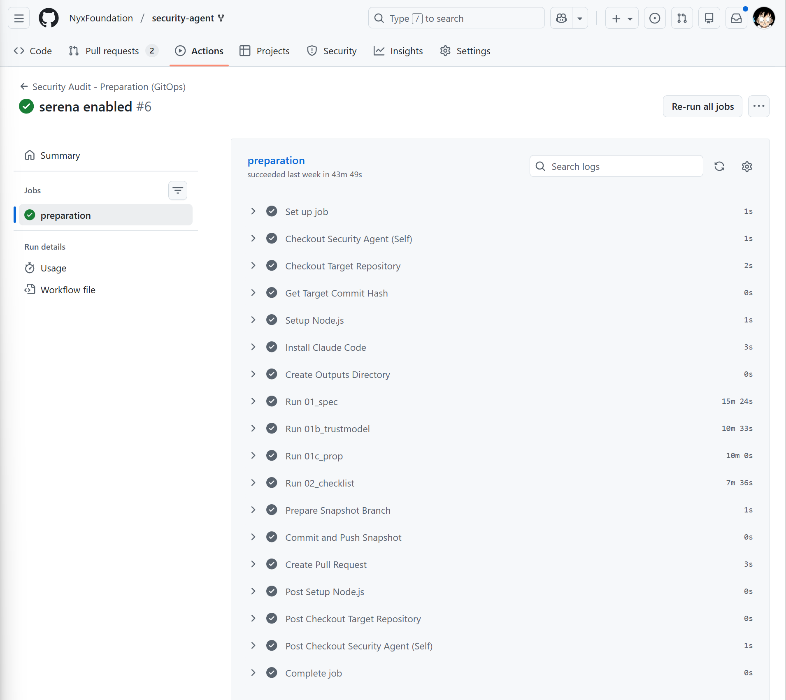
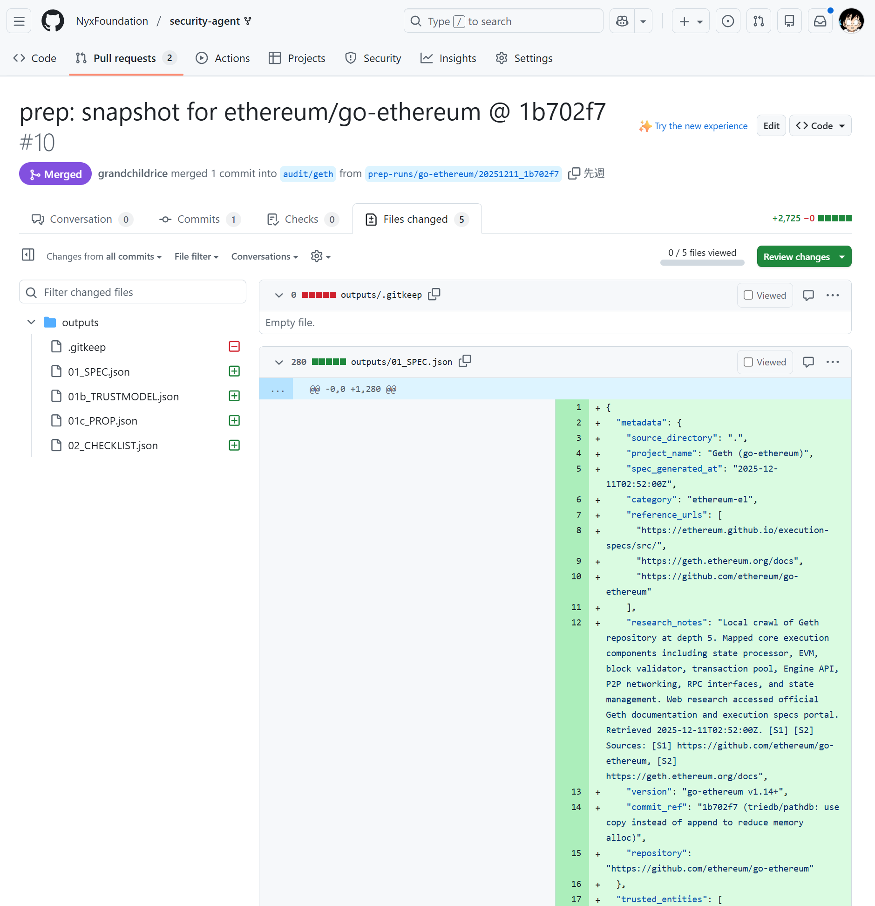
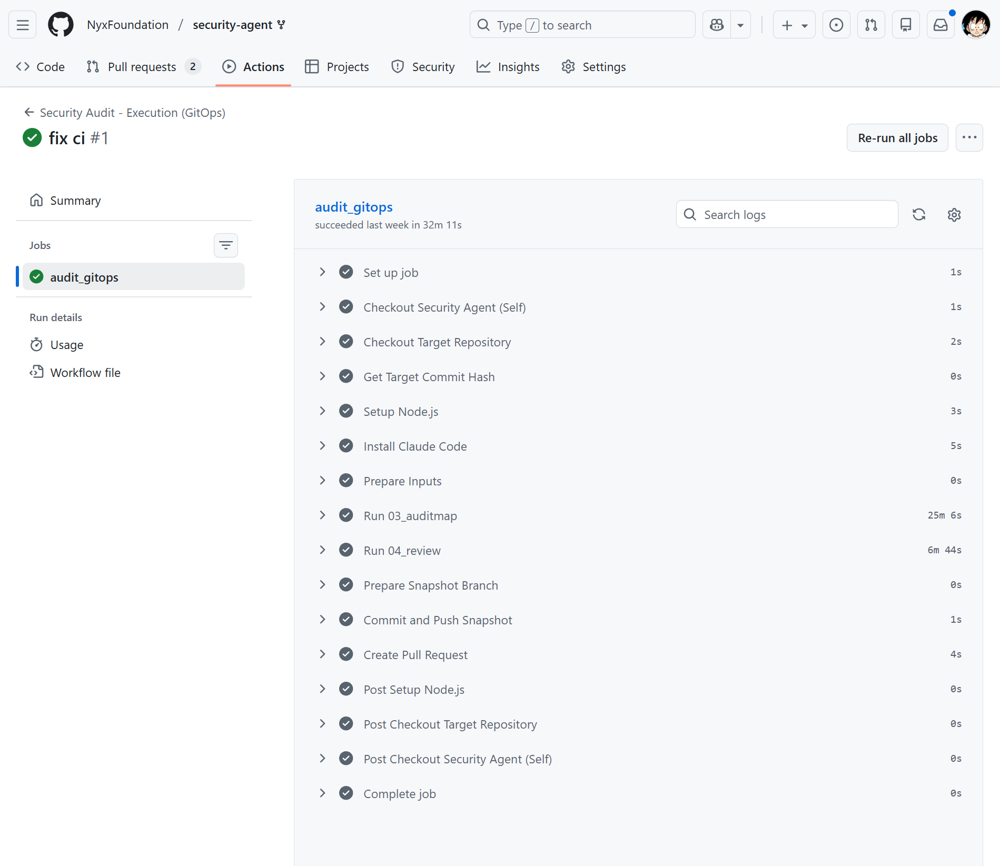
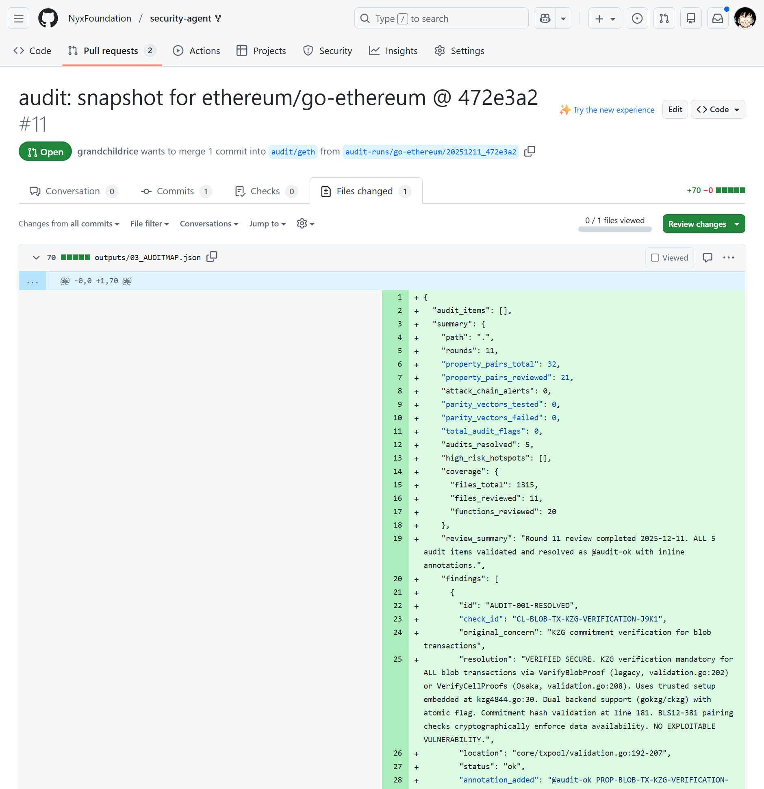
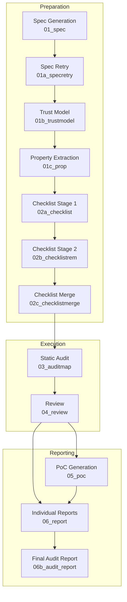

# Security Audit Agent

An automated security analysis system using LLMs for comprehensive Bug Bounty research and vulnerability assessment.

## Requirement

Before using this agent locally, please verify you have the following tools installed/configured:

- **Claude Code** (Currently, only this is supported)
- **[Serena MCP](https://github.com/oraios/serena)** (for web crawling and research)
- **Web Search** API (or MCP capability)

## Getting Started

Please Install Claude Code CLI if you haven't already.

```bash
npm install -g @anthropic-ai/claude-code
claude # and login with your Anthropic account
```

Install `make` if not already available:

```bash
# Ubuntu/Debian
sudo apt-get install make

# macOS (via Homebrew)
brew install make

# Windows (via Chocolatey)
choco install make
```

First, clone the repository and checkout the target branch.

```bash
git clone https://github.com/NyxFoundation/security-agent.git
cd security-agent
# Create a new branch for your specific audit target
git checkout -b audit/geth
```

### Option 1: Run Locally

Use the provided Makefile to run the audit pipeline.


(example: https://github.com/NyxFoundation/security-agent/pull/12)

#### Step 1: Clone Target Repository
Clone the target repository into the `target_workspace` folder.
```bash
git clone https://github.com/ethereum/go-ethereum.git target_workspace
```

#### Step 2: Configure Variables
Edit the configuration variables at the top of the `Makefile`:
```makefile
TARGET_REPO ?= ethereum/go-ethereum
TARGET_REF ?= master
KEYWORDS ?= "geth,ethereum client,execution specs,EIP"
SPEC_URLS ?= "https://ethereum.github.io/execution-specs/src/,https://geth.ethereum.org/docs"
```

Or override them via command line:
```bash
make preparation TARGET_REPO=myorg/myrepo KEYWORDS="my,keywords"
```

#### Step 3: Preparation Phase
Run the preparation phase (Spec → Trust Model → Properties → Checklist):
```bash
make preparation
```

#### Step 4: Audit Phase
Run the audit phase (Static Audit → Review):
```bash
make audit
```

You can also run individual steps:
```bash
make 01     # Specification Extraction
make 01b    # Trust Model Generation
make 01c    # Property Extraction
make 02a    # Checklist Boundaries
make 02b    # Checklist Remaining (run iteratively)
make 02c    # Checklist Merge
make 03     # Static Audit Map
make 04     # Audit Review
```

Run `make help` for a full list of available targets.

Results will be saved to the `outputs/` directory.

---

### Option 2: Run on GitHub Actions

You can automate the audit using GitHub Actions.

#### Step 1: Configure Workflows
Edit `.github/workflows/audit.yml` (and `preparation.yml` if needed) to configure your target repository.

```yaml
name: Security Audit - Execution (GitOps)

permissions:
  contents: write
  pull-requests: write

on:
  workflow_dispatch:
  schedule:
    - cron: '0 0 * * *'
  push:
    branches: 
      - 'audit/*'

jobs:
  audit_gitops:
    runs-on: ubuntu-latest
    if: "!startsWith(github.event.head_commit.message, 'Merge')"
    env:
      # --- CONFIGURATION (Override these in your branch) ---
      TARGET_REPO: "ethereum/go-ethereum" # Default (to be overridden)
      TARGET_REF: "master"                          # Default (HEAD of default branch)
      # -----------------------------------------------------
      ANTHROPIC_API_KEY: ${{ secrets.ANTHROPIC_API_KEY }}
      GH_TOKEN: ${{ secrets.GITHUB_TOKEN }}
      CLAUDE_CODE_PERMISSIONS: "bypassPermissions"

...
```

#### Step 2: Push Changes
Push your changes to your `audit/*` branch to trigger the pipeline.
```bash
git push origin audit/geth
```

#### Step 3: CI Execution
The CI pipeline will start automatically.


(example: https://github.com/NyxFoundation/security-agent/actions/runs/20120334544)


(example: https://github.com/NyxFoundation/security-agent/pull/10)

#### Step 4: Review Results
Once completed, a **Pull Request** will be created with the generated JSON results.


(example: https://github.com/NyxFoundation/security-agent/actions/runs/20127092838)


(example: https://github.com/NyxFoundation/security-agent/pull/11)

#### Step 5: Save Snapshot
Merge the PR to save the snapshot of the audit to your repository.

## Agent Specification

### Security Agent Approach

The Security Agent reconstructs the thought processes and procedures of professional white-hat hackers into an automated pipeline. It supports a continuous flow from specification understanding to vulnerability hypothesis formulation, checklist creation, code auditing, and reporting.

**Features / Approach**
- **Program Graph-Based:** Models the system as a formal Program Graph (nodes = states/actions, edges = transitions), enabling rigorous formal analysis and verification.
- **Property-Centric:** Generates security properties with 100% coverage of all graph nodes and edges, performing formal reachability analysis for each property.
- **Automated Checklist:** Generates audit checklists in three stages: trust boundary checks (Stage 1), remaining property checks (Stage 2), and final merge (Stage 3).
- **Five Attack Vector Analysis:** Every checklist item is analyzed through Input Validation Bypass, State Transition Violation, Resource Exhaustion, Faulty Error Handling, and Race Conditions.
- **Formal Review:** Six-category verdict system (CONFIRMED_VULNERABILITY, LIKELY_VULNERABILITY, VERIFIED_SAFE, FALSE_POSITIVE, CODE_QUALITY_ISSUE, REQUIRES_MANUAL_REVIEW) with mandatory counterexample evaluation and proof traces.

The audit pipeline consists of the following stages:



#### 1. Preparation Stage
**Goal:** Establish the specification information and safety requirements that form the foundation of the audit, creating a common context for subsequent steps.

##### 1-a. Spec Generation (`/01_spec`)
**Goal:** Model the system's behavior as a formal **Program Graph** consisting of nodes (states/actions) and directed edges (transitions).
**Input:** `KEYWORDS`, `SPEC_URLS` for web research and specification retrieval.
**Output:** `outputs/01_SPEC.json`
```json
{
  "metadata": { ... },
  "trusted_entities": [
    { "id": "ACTOR-...", "entity": "...", "description": "..." }
  ],
  "data_structures": [
    { "id": "DATA-...", "name": "...", "description": "..." }
  ],
  "program_graph": {
    "id": "GRAPH-...",
    "title": "...",
    "nodes": [
      { "id": "STATE-...", "label": "...", "actor_id": "...", "type": "State|Action", "sub_graph_id": "..." }
    ],
    "edges": [
      { "id": "EDGE-...", "source": "...", "target": "...", "label": "...", "data_involved": ["..."] }
    ]
  },
  "sub_graphs": [ ... ],
  "pending_sub_graphs": [ { "id": "...", "title": "...", "source": "...", "reason": "..." } ]
}
```
**Algorithm:**
1. Performs keyword research and specification retrieval (recursively follows links).
2. Defines graph nodes (states and actions) and edges (transitions).
3. Models complex logic as sub-graphs; lists pending items in `pending_sub_graphs` if length limits are reached.

##### 1-a2. Spec Retry (`/01a_specretry`)
**Goal:** Process pending sub-graphs from the initial specification output.
**Input:** `outputs/01_SPEC.json` (with `pending_sub_graphs`).
**Output:** `outputs/01_SPEC.json` (updated with new sub-graphs).
**Algorithm:**
1. Loads existing specification and extracts pending items.
2. Generates detailed sub-graphs for each pending item.
3. Performs diff-only merge: appends new sub-graphs, updates `pending_sub_graphs`.
4. Repeat until `pending_sub_graphs` is empty.

##### 1-b. Trust Model Construction (`/01b_trustmodel`)
**Goal:** Build a formal trust model by assigning trust levels to actors and mapping trust boundaries to specific **edges** in the program graph.
**Input:** `outputs/01_SPEC.json`.
**Output:** `outputs/01b_TRUSTMODEL.json`
```json
{
  "metadata": { ... },
  "actors": [
    { "id": "ACTOR-...", "name": "...", "trust_level": "TRUSTED|SEMI_TRUSTED|UNTRUSTED", "rationale": "..." }
  ],
  "boundary_edges": [
    {
      "edge_id": "EDGE-...",
      "description": "...",
      "source_id": "...", "source_trust_level": "...",
      "target_id": "...", "target_trust_level": "...",
      "data_flows_across": ["DATA-..."],
      "security_assumption": "..."
    }
  ]
}
```
**Algorithm:**
1. Classifies each actor's trust level (TRUSTED, SEMI_TRUSTED, UNTRUSTED).
2. Iterates through all edges; identifies trust boundary crossings where source and target trust levels differ.
3. Documents security assumptions for each boundary edge.

##### 1-c. Property Extraction (`/01c_prop`)
**Goal:** Generate a comprehensive catalog of formal security properties with **100% coverage** of all nodes and edges in the Program Graph.
**Input:** `outputs/01_SPEC.json`, `outputs/01b_TRUSTMODEL.json`.
**Output:** `outputs/01c_PROP.json`
```json
{
  "metadata": { ... },
  "coverage_summary": {
    "total_nodes_in_graph": 10,
    "total_edges_in_graph": 15,
    "nodes_with_properties": 10,
    "edges_with_properties": 15,
    "node_coverage_percent": 100,
    "edge_coverage_percent": 100
  },
  "properties": [
    {
      "property_id": "PROP-...",
      "covers": { "primary_element": "...", "element_type": "node|edge", "is_boundary_edge": false },
      "property": "Formal invariant statement",
      "anti_property": "Formal negation (attacker scenario)",
      "graph_elements": ["..."],
      "status": "in_scope",
      "reachability": "REACHABLE|UNREACHABLE",
      "reachability_rationale": "...",
      "cryptographic_guarantee": "..."
    }
  ]
}
```
**Algorithm:**
1. Generates at least one property for every node (state invariants, reachability constraints) and every edge (transition security, input validation).
2. Performs formal reachability analysis: BFS from untrusted nodes to check anti-property reachability.
3. Prioritizes boundary edges with additional high-priority properties.

##### 1-d. Checklist Generation (Three Stages)

###### Stage 1: Trust Boundaries (`/02a_checklist`)
**Goal:** Generate high-fidelity audit checklist for properties covering trust boundary edges.
**Input:** `outputs/01c_PROP.json`, `outputs/01_SPEC.json`, `outputs/01b_TRUSTMODEL.json`.
**Output:** `outputs/02a_CHECKLIST_BOUNDARIES.json`
```json
{
  "metadata": {
    "boundary_properties_processed": ["PROP-..."],
    "boundary_edges_covered": ["EDGE-..."],
    "total_checks": 38
  },
  "checklist": [ ... ]
}
```

###### Stage 2: Remaining Properties (`/02b_checklistrem`)
**Goal:** Iteratively generate checklist items for all non-boundary properties.
**Input:** `outputs/01c_PROP.json`, `outputs/02a_CHECKLIST_BOUNDARIES.json`, `outputs/02b_STATE.json`.
**Output:** `outputs/02b_CHECKLIST_PARTIAL_<N>.json`, `outputs/02b_STATE.json`
**Algorithm:**
1. Maintains a work queue in `02b_STATE.json`.
2. Processes 20 properties per run, generating one check per property.
3. Repeat until `unprocessed_property_ids` is empty.

###### Stage 3: Merge (`/02c_checklistmerge`)
**Goal:** Merge all partial checklists into a single comprehensive checklist.
**Input:** `outputs/02a_CHECKLIST_BOUNDARIES.json`, `outputs/02b_CHECKLIST_PARTIAL_*.json`.
**Output:** `outputs/02_CHECKLIST.json`
```json
{
  "metadata": { "title": "...", "version": "1.0.0", "generated": "YYYY-MM-DD" },
  "checklist_summary": { "total_checks": 195, "boundary_checks": 15, "remaining_checks": 180 },
  "checklist": [ ... ]
}
```

#### 2. Execution Stage
**Goal:** Detect vulnerabilities through static analysis with formal verification methods.

##### 2-a. Static Audit (`/03_auditmap`)
**Goal:** Perform comprehensive static audit using formal predicates and five attack vector analysis.
**Input:** `outputs/02_CHECKLIST.json` (or merged from `02*.json`), Target Codebase.
**Output:** `outputs/03_AUDITMAP_PARTIAL_<N>.json`, `outputs/03_STATE.json`
```json
{
  "metadata": { "run_id": 1, "batch_size": 20 },
  "audit_items": [
    {
      "check_id": "...",
      "file": "...", "line": 123,
      "classification": "potential-vulnerability|code-quality-issue|needs-verification|audit-gap",
      "attack_vector": "Input Validation Bypass|State Transition Violation|Resource Exhaustion|Faulty Error Handling|Race Conditions",
      "severity": "Critical|High|Medium|Low",
      "confidence": "High|Medium|Low",
      "counterexample": { "preconditions": "...", "attack_sequence": ["..."], "expected_outcome": "..." },
      "evidence": { "phase1_static": "...", "phase2_counterexample_attempts": "...", "phase3_guard_search": "..." }
    }
  ],
  "verified_items": [
    { "check_id": "...", "classification": "PASS", "evidence": { ... } }
  ]
}
```
**Algorithm:**
1. **Batch Processing:** Processes exactly 20 checklist items per run.
2. **Five-Phase Analysis per item:**
   - Phase 1: Static analysis through all 5 attack vectors.
   - Phase 2: Mandatory counterexample construction (boundary values, type confusion, timing, combination, edge cases).
   - Phase 3: Guard/invariant search with strict evaluation (STRONG/MODERATE/WEAK).
   - Phase 4: Classification decision.
   - Phase 5: Confidence assessment.
3. Updates state file after writing output file.

##### 2-b. Review (`/04_review`)
**Goal:** Rigorously evaluate audit findings using a six-category verdict system.
**Input:** `outputs/03_AUDITMAP_PARTIAL_*.json`.
**Output:** `outputs/04_REVIEW_PARTIAL_<N>.json`, `outputs/04_STATE.json`
```json
{
  "metadata": { "run_id": 1, "batch_size": 10, "verdicts": { ... } },
  "reviewed_items": [
    {
      "original_item": { ... },
      "verdict": "CONFIRMED_VULNERABILITY|LIKELY_VULNERABILITY|VERIFIED_SAFE|FALSE_POSITIVE|CODE_QUALITY_ISSUE|REQUIRES_MANUAL_REVIEW",
      "security_impact": "Critical|High|Medium|Low|None",
      "exploitability": "High|Medium|Low|None",
      "reasoning": "...",
      "counterexample_evaluation": { "plausibility": "High|Medium|Low", "assessment": "..." },
      "guard_analysis": { "guards_found": [...], "bypass_possible": true|false },
      "proof_trace": ["file:line - description", ...],
      "recommendation": "..."
    }
  ]
}
```
**Algorithm:**
1. **Batch Processing:** Processes 10 audit items per run.
2. **Formal Review per item:**
   - Phase 1: Counterexample evaluation (plausibility assessment).
   - Phase 2: Guard/invariant search (effectiveness, bypass resistance).
   - Phase 3: Exploitability assessment.
   - Phase 4: Verdict decision using decision tree.
   - Phase 5: Proof trace construction.
3. Avoids false positive bias with balanced review guidelines.

#### 3. Reporting Stage
**Goal:** Synthesize confirmed findings into professional reports and actionable artifacts.

##### 3-a. PoC Generation (`/05_poc`)
**Goal:** Create minimal, self-verifying Proof-of-Concept tests in the project's native stack.
**Input:** `VULN_ID` from `03_AUDITMAP.json`, `TYPE` (`unit`|`it`|`e2e`), `OUTPUT_PATH`.
**Output:** PoC test file, updated `03_AUDITMAP.json` entry.
**Algorithm:**
1. Auto-detects project language and test framework.
2. Generates Arrange-Act-Assert test that passes only while vulnerability exists.
3. Self-repair loop (up to 4 attempts) for build/test failures.
4. Appends test metadata to the vulnerability entry.

##### 3-b. Individual Report Generation (`/06_report`)
**Goal:** Generate a markdown bug-bounty report tailored to specific platforms.
**Input:** `VULN_ID`, `REPORT_TYPE` (CANTINA|CODE4RENA|ETHEREUM|IMMUNEFI|SHERLOCK), optional `SEVERITY`.
**Output:** `outputs/report_{slug}.md`
**Algorithm:**
1. Loads platform-specific template.
2. Fills placeholders with sanitized data (no internal paths or IDs).
3. Embeds PoC code with explicit run commands.
4. Derives severity from bounty guidelines if not specified.

##### 3-c. Final Audit Report (`/06b_audit_report`)
**Goal:** Compile a publication-ready security assessment report for the entire project.
**Input:** All `outputs/` artifacts (`SPEC`, `PROP`, `CHECKLIST`, `AUDITMAP`, etc.).
**Output:** `outputs/AUDIT_REPORT.md`
**Algorithm:**
1. **Sanitization:** Replaces all internal IDs with generic labels (e.g., `Finding-01`, `Gap-02`).
2. **Structured Sections:** Cover Page, Executive Summary, Scope, System Overview, Methodology, Specification Traceability, Finding Classification, Findings Summary, Detailed Findings, Re-Verification, Operational Recommendations, Appendix.
3. **No Repository Exposure:** Final document contains no internal paths, file names, or IDs.
