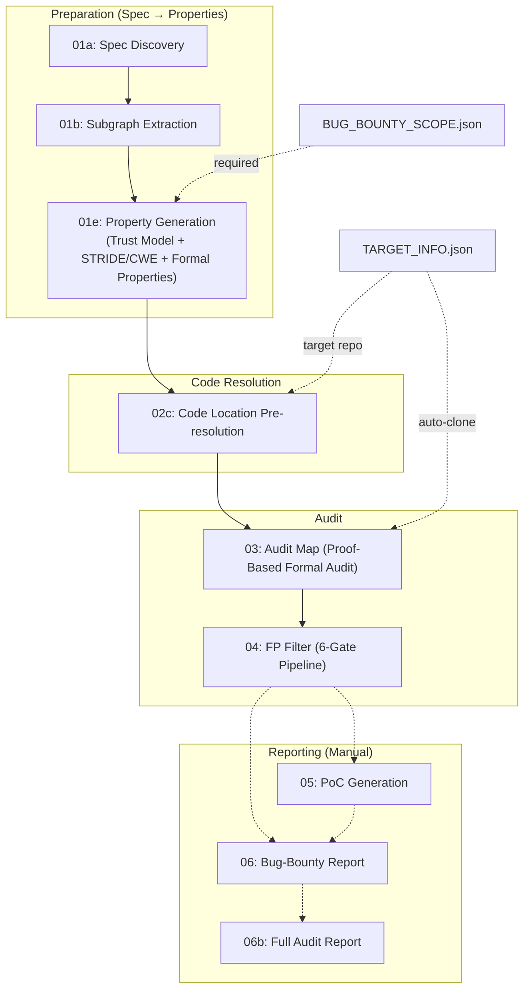

# SPECA: Specification-to-Checklist Agentic Auditing

[SPECA: Specification-to-Checklist Agentic Auditing for Multi-Implementation Systems -- A Case Study on Ethereum Clients
](https://arxiv.org/abs/2602.07513)

An automated security analysis system powered for comprehensive vulnerability Discovery.

## Demo

See past and ongoing audit runs on the **GitHub Actions** page:

**[View Actions Runs](https://github.com/NyxFoundation/security-agent/actions)**

Each workflow step (01a through 04) can be triggered independently via `workflow_dispatch`. Results are committed to audit branches and can be reviewed as Pull Requests.

## Architecture

The pipeline is driven by a Python-based **orchestrator** (`scripts/orchestrator/`) that manages queue distribution, parallel worker execution, batching, resume, cost tracking, and circuit-breaker logic. Each phase invokes Claude Code CLI with a dedicated worker prompt, processing items in parallel across configurable workers.

```
scripts/
├── run_phase.py            # Entry point
├── setup_mcp.sh            # MCP server registration
└── orchestrator/
    ├── config.py            # Phase definitions (PhaseConfig)
    ├── base.py              # BaseOrchestrator (async pipeline)
    ├── runner.py            # ClaudeRunner + CircuitBreaker
    ├── batch.py             # Token/count-based batching
    ├── queue.py             # Queue splitting & state
    ├── collector.py         # Result parsing & aggregation
    ├── resume.py            # Resume & cleanup manager
    ├── watchdog.py          # LogWatcher + CostTracker
    ├── schemas.py           # Pydantic data contracts
    └── factory.py           # create_orchestrator()
```

### Pipeline Overview



## Phases

### Phase 01a: Specification Discovery

| | |
|---|---|
| **Prompt** | `prompts/01a_crawl.md` |
| **Skill** | `/spec-discovery` |
| **Input** | Seed URLs (via `SPEC_URLS` env var) |
| **Output** | `outputs/01a_STATE.json` |

Crawls seed URLs to discover all relevant technical specification documents. Uses the `mcp__fetch__fetch` tool to recursively follow links and build a catalog of specification pages.

### Phase 01b: Subgraph Extraction

| | |
|---|---|
| **Prompt** | `prompts/01b_extract_worker.md` |
| **Skill** | `/subgraph-extractor` |
| **Input** | `outputs/01a_STATE.json` |
| **Output** | `outputs/01b_PARTIAL_*.json` + `outputs/graphs/*/*.mmd` |

Extracts formal **Program Graphs** (following Nielson & Nielson's definition) from each specification document. Each subgraph is output as an enriched Mermaid state diagram (`.mmd`) with YAML frontmatter and inline invariant annotations. PARTIAL JSON files reference the `.mmd` paths for downstream consumption.

### Phase 01e: Property Generation

| | |
|---|---|
| **Prompt** | `prompts/01e_prop_worker.md` (inlined — no skill fork) |
| **Input** | `outputs/01b_PARTIAL_*.json` + `outputs/BUG_BOUNTY_SCOPE.json` (required) |
| **Output** | `outputs/01e_PARTIAL_*.json` |

Performs inline trust model analysis and generates formal security properties from subgraphs. Combines former phases 01d (Trust Model) and property generation into a single inlined prompt. Key features:

- **Domain-agnostic STRIDE + CWE Top 25**: General STRIDE thinking framework augmented with CWE Top 25 patterns (CWE-22/78/89/94/200/502/639/770/862). No domain-specific hardcoding.
- **Reachability classification**: `external-reachable`, `internal-only`, `api-only`
- **Bug bounty scope determination**: Uses `severity_classification` from `BUG_BOUNTY_SCOPE.json` as authoritative severity definitions
- **Slim output**: `covers` is a string (primary element ID), `reachability` has 4 fields only (`classification`, `entry_points`, `attacker_controlled`, `bug_bounty_scope`)

The orchestrator **requires** `outputs/BUG_BOUNTY_SCOPE.json` and aborts if the file is missing.

### Phase 02c: Code Location Pre-resolution

| | |
|---|---|
| **Prompt** | `prompts/02c_codelocation_worker.md` (inlined — no skill fork) |
| **Input** | `outputs/01e_PARTIAL_*.json` + `outputs/TARGET_INFO.json` + `outputs/01b_SUBGRAPH_INDEX.json` |
| **Output** | `outputs/02c_PARTIAL_*.json` |
| **Model** | Sonnet |

Pre-resolves code locations for each property against the target repository using Tree-sitter MCP (primary) with Glob/Grep fallback. Records file paths, symbol names, and line ranges without extracting code. Applies severity gating (drops `Informational` properties by default). Builds `outputs/01b_SUBGRAPH_INDEX.json` from 01b partials for spec-level context. Reads `outputs/TARGET_INFO.json` (created by 02c workflow before phase runs).

Reduces token consumption in Phase 03 by ~40-60%.

### Phase 03: Audit Map (Formal Audit)

| | |
|---|---|
| **Prompt** | `prompts/03_auditmap_worker_inline.md` (inlined — no skill fork) |
| **Input** | `outputs/02c_PARTIAL_*.json` + Target codebase (auto-cloned from `TARGET_INFO.json`) |
| **Output** | `outputs/03_PARTIAL_*.json` |
| **Model** | Sonnet |

Performs a proof-based 3-phase formal audit for each property against the target codebase. The core method: **try to prove the property holds; where the proof breaks, that is the bug.**

1. **Phase 1 (Map):** Identify exactly how the codebase enforces the property — guards, locks, type constraints, trust boundaries, spec-mandated behavior.
2. **Phase 2 (Prove):** Construct a proof that the property holds. Checks input coverage, path coverage, concurrency safety, temporal validity, and implementation pattern obligations (cache keys, dedup keys, derived state, multi-path construction, return value completeness).
3. **Phase 3 (Stress-Test):** Challenge the proof or verify the finding — list and validate all assumptions, re-read cited code, check for intentional design, construct concrete attack paths.

Compact 6-field output per item: `property_id`, `classification`, `code_path`, `proof_trace`, `attack_scenario`, `checklist_id`.

### Phase 04: Audit Review

| | |
|---|---|
| **Prompt** | `prompts/04_review_worker.md` (inlined — no skill fork) |
| **Input** | `outputs/03_PARTIAL_*.json` + `outputs/BUG_BOUNTY_SCOPE.json` + `outputs/TARGET_INFO.json` + `outputs/01e_PARTIAL_*.json` |
| **Output** | `outputs/04_PARTIAL_*.json` |
| **Model** | Sonnet |

Filters false positives from Phase 03 findings via a priority-ordered 6-gate pipeline with early exit:

1. **Gate 1 (Dead Code):** Grep for callers — zero non-test callers → DISPUTED_FP.
2. **Gate 2 (Trust Boundary):** Cross-reference `trust_assumptions` from BUG_BOUNTY_SCOPE.json — attack path requires compromised trusted component → DISPUTED_FP.
3. **Gate 3 (Code Verification):** Re-read code at flagged location — Phase 03's description factually wrong, or validation exists elsewhere → DISPUTED_FP.
4. **Gate 4 (Exploitability):** Attacker causation check — code-intrinsic correctness bug (exception: protocol violations still pass) or mitigated by defensive mechanism → DISPUTED_FP.
5. **Gate 5 (Spec Cross-Reference):** Look up 01e property — code is spec-compliant or 01e doesn't require the flagged behavior → DISPUTED_FP.
6. **Gate 6 (Scope Check):** Out-of-scope categories from BUG_BOUNTY_SCOPE.json → DISPUTED_FP.

Items that pass all gates undergo severity calibration against `severity_classification` thresholds. Non-findings (not-a-vulnerability, out-of-scope, informational) early-exit as PASS_THROUGH. Verdicts: CONFIRMED_VULNERABILITY, CONFIRMED_POTENTIAL, DISPUTED_FP, DOWNGRADED, NEEDS_MANUAL_REVIEW, PASS_THROUGH.

### Phase 05: PoC Generation (Manual)

| | |
|---|---|
| **Prompt** | `prompts/05_poc.md` |
| **Usage** | `/05_poc TYPE=unit VULN_ID=... OUTPUT_PATH=...` |

Generates minimal, self-verifying Proof-of-Concept tests in the project's native stack (auto-detected language and test framework). Supports unit / integration / e2e scopes. Includes a self-repair loop (up to 4 attempts) and false-positive mitigation via guard assertions.

### Phase 06: Bug-Bounty Report (Manual)

| | |
|---|---|
| **Prompt** | `prompts/06_report.md` |
| **Usage** | `/06_report VULN_ID=... REPORT_TYPE=ETHEREUM` |

Generates a platform-tailored Markdown bug-bounty report (CANTINA, CODE4RENA, ETHEREUM, IMMUNEFI, SHERLOCK). Fills template placeholders with sanitized data, embeds PoC code with run commands, and derives severity from bounty guidelines when not specified.

### Phase 06b: Full Audit Report (Manual)

| | |
|---|---|
| **Prompt** | `prompts/06b_audit_report.md` |
| **Usage** | `/07_audit_report OUTPUT_PATH=outputs/AUDIT_REPORT.md` |

Compiles a publication-ready security assessment report covering all findings. Includes: Cover Page, Executive Summary, Scope, System Overview, Methodology, Specification Traceability, Finding Classification, Findings Summary, Detailed Findings, Re-Verification, Operational Recommendations, and Appendix. All internal IDs are sanitized to sequential labels (e.g., Finding-01, Gap-02).

## Running on GitHub Actions

All pipeline phases are executed via **GitHub Actions workflows** with `workflow_dispatch` triggers:

| Workflow | File | Description |
|---|---|---|
| 01a. Discovery | `01a-discovery.yml` | Crawl specification URLs |
| 01b. Subgraph Extraction | `01b-subgraph.yml` | Extract program graphs |
| 01e. Properties | `01e-properties.yml` | Trust model + property generation |
| 02c. Code Resolution | `02c-enrich-code.yml` | Pre-resolve code locations |
| 03. Audit Map | `03-audit-map.yml` | Proof-based 3-phase formal audit |
| 04. Audit Review | `04-audit-review.yml` | 6-gate FP filter + severity calibration |

Each workflow:
1. Checks out the repository and syncs the latest `scripts/`, `prompts/`, `.claude/` from the base branch.
2. Installs Claude Code CLI and registers MCP servers via `scripts/setup_mcp.sh`.
3. Runs the orchestrator: `uv run python3 scripts/run_phase.py --phase <ID> --workers N`.
4. Commits results to an audit branch and uploads logs as artifacts.

### Running Locally

```bash
# Install prerequisites
npm install -g @anthropic-ai/claude-code
pip install uv

# Register MCP servers
bash scripts/setup_mcp.sh

# Run a single phase
uv run python3 scripts/run_phase.py --phase 01a

# Run all phases up to a target
uv run python3 scripts/run_phase.py --target 04 --workers 4

# Force re-execution (ignore resume state)
uv run python3 scripts/run_phase.py --phase 03 --force --workers 4 --max-concurrent 64
```

### MCP Servers

The following MCP servers are registered by `scripts/setup_mcp.sh`:

| Server | Command | Used In |
|---|---|---|
| `tree_sitter` | `uvx mcp-server-tree-sitter` | 02c |
| `filesystem` | `npx -y @modelcontextprotocol/server-filesystem` | 01b, 02c |
| `fetch` | `uvx mcp-server-fetch` | 01a |

Note: Phases 01e, 03, and 04 use inlined prompts with no MCP servers (only built-in Read/Write/Grep/Glob tools).

## Benchmarks

See [benchmarks page](./benchmarks/README.md)
