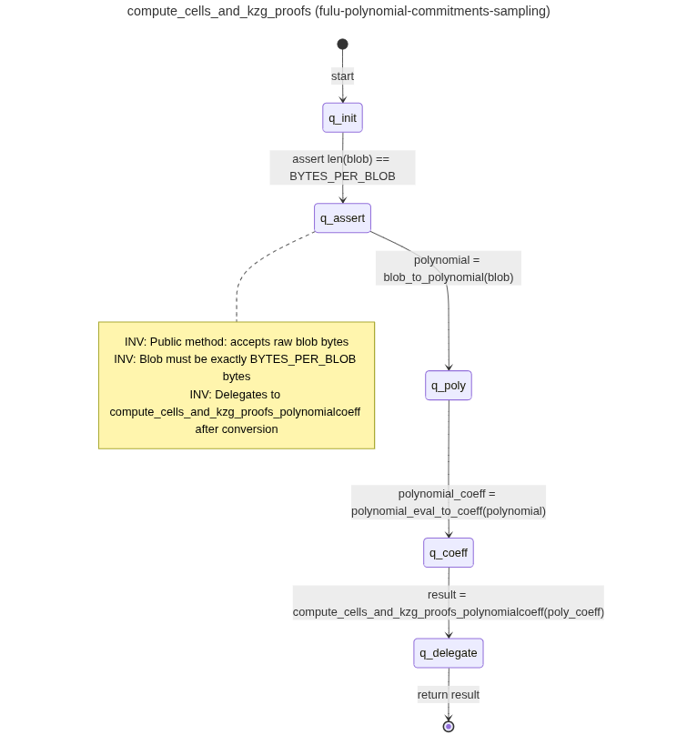
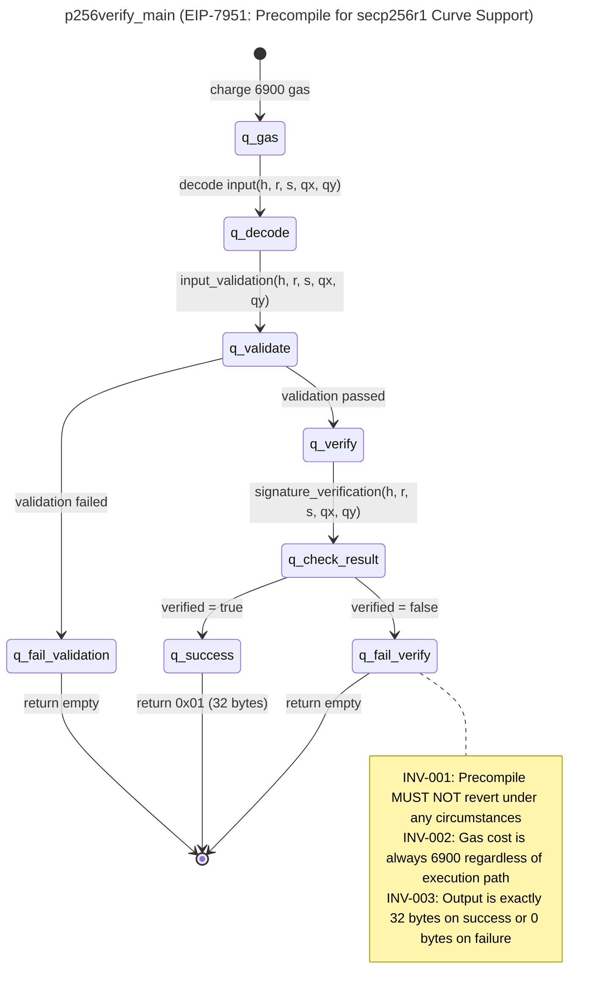

<p align="center">
  
</p>

<h1 align="center">SPECA: A Specification-to-Checklist Agentic Auditing Framework</h1>

<p align="center">
  <a href="https://arxiv.org/abs/2604.26495"></a>
  <a href="LICENSE"></a>
  <a href="https://github.com/NyxFoundation/speca/actions"></a>
  
</p>

> **Paper:** *SPECA: Specification-to-Checklist Agentic Auditing for Multi-Implementation Systems — A Case Study on Ethereum Clients.* arXiv preprint [arXiv:2604.26495](https://arxiv.org/abs/2604.26495).

**SPECA** is an automated, end-to-end security audit framework that turns natural-language **specifications** into a formal program graph, derives **machine-checkable security properties**, and then runs a **proof-based agentic audit** against a target codebase — finishing with a recall-safe false-positive filter. The pipeline is implemented as an asynchronous orchestrator over the [Claude Code CLI](https://docs.claude.com/en/docs/claude-code) and runs both locally and on GitHub Actions.

In a real-world evaluation against the [Sherlock Ethereum Fusaka Audit Contest](https://audits.sherlock.xyz/contests/787), SPECA achieved **100% recall** (15/15 ground-truth issues), **66% precision**, and **F1 = 0.80** — see [Vulnerability Discovery Examples](#vulnerability-discovery-examples) below.

## Table of Contents

- [Why SPECA?](#why-speca)
- [Quick Start](#quick-start)
- [Demo](#demo)
- [Architecture](#architecture)
- [Phases](#phases)
- [Running on GitHub Actions](#running-on-github-actions)
- [Configuration](#configuration)
- [Vulnerability Discovery Examples](#vulnerability-discovery-examples)
- [Benchmarks](#benchmarks)
- [Contributing](#contributing)
- [Citation](#citation)
- [License](#license)

## Why SPECA?

Most LLM-based auditors prompt a model to "find bugs" in a diff, which conflates *recall* with *precision* and tends to hallucinate. SPECA instead decomposes auditing into pipeline stages that mirror how human auditors work:

1. **Read the spec → build a program graph.** Specifications are turned into Mermaid state diagrams with explicit invariants.
2. **Derive properties from the graph.** Each subgraph yields formal pre/post-conditions and invariants under a domain-agnostic STRIDE + CWE Top 25 threat model.
3. **Audit each property by *trying to prove* it.** Where the proof breaks, that gap is the bug. This *proof-based* mindset replaces "find bugs" pattern-matching.
4. **Filter false positives with a recall-safe 3-gate pipeline.** Only Dead-Code, Trust-Boundary, and Scope gates may dispute a finding — preventing precision-driven recall loss.

Because the pipeline is fully *spec-driven*, the same engine works on consensus protocols, smart contracts, or any well-specified software system — no domain hard-coding.

## Quick Start

### Prerequisites

- **Python 3.11+** and [`uv`](https://github.com/astral-sh/uv) (`pip install uv`)
- **Node.js 20+** (for the Claude Code CLI and MCP servers)
- **Anthropic API access** — `ANTHROPIC_API_KEY` exported in your shell, or a logged-in [Claude Code](https://docs.claude.com/en/docs/claude-code) session
- **`git`** — Phase 03 auto-clones the target repository at the commit pinned in `outputs/TARGET_INFO.json`

### Install

```bash
# 1. Clone
git clone https://github.com/NyxFoundation/speca.git
cd speca

# 2. Install Claude Code CLI (used as the worker runtime)
npm install -g @anthropic-ai/claude-code

# 3. Install Python deps via uv (creates an isolated env)
uv sync

# 4. Register MCP servers (tree_sitter / filesystem / fetch)
bash scripts/setup_mcp.sh
bash scripts/setup_mcp.sh --verify
```

### Run a single phase

```bash
# Smoke-test: discover specs from a seed URL
SPEC_URLS="https://github.com/ethereum/EIPs/blob/master/EIPS/eip-7594.md" \
  uv run python3 scripts/run_phase.py --phase 01a
```

### End-to-end audit

```bash
# Place these two files first:
#   outputs/BUG_BOUNTY_SCOPE.json   # required by Phase 01e
#   outputs/TARGET_INFO.json        # required by Phase 02c/03

uv run python3 scripts/run_phase.py --target 04 --workers 4 --max-concurrent 64
```

Outputs are written to `outputs/<phase_id>_PARTIAL_*.json`. See the [Configuration](#configuration) section below for `BUG_BOUNTY_SCOPE.json` / `TARGET_INFO.json` formats.

### Run the test suite

```bash
uv run python3 -m pytest tests/ -v --tb=short
```

## Demo

See past and ongoing audit runs on the **GitHub Actions** page:

**[View Actions Runs](https://github.com/NyxFoundation/speca/actions)**

Each workflow step (01a through 04) can be triggered independently via `workflow_dispatch`. Results are committed to audit branches and can be reviewed as Pull Requests.

## Architecture

The pipeline is driven by a Python-based **orchestrator** (`scripts/orchestrator/`) that manages queue distribution, parallel worker execution, batching, resume, cost tracking, and circuit-breaker logic. Each phase invokes Claude Code CLI with a dedicated worker prompt, processing items in parallel across configurable workers.

```
scripts/
├── run_phase.py            # Entry point
├── setup_mcp.sh            # MCP server registration
└── orchestrator/
    ├── config.py            # Phase definitions (PhaseConfig)
    ├── base.py              # BaseOrchestrator (async pipeline)
    ├── runner.py            # ClaudeRunner + CircuitBreaker
    ├── batch.py             # Token/count-based batching
    ├── queue.py             # Queue splitting & state
    ├── collector.py         # Result parsing & aggregation
    ├── resume.py            # Resume & cleanup manager
    ├── watchdog.py          # LogWatcher + CostTracker
    ├── schemas.py           # Pydantic data contracts
    └── factory.py           # create_orchestrator()
```

### Pipeline Overview


## Phases

### Phase 01a: Specification Discovery

| | |
|---|---|
| **Prompt** | `prompts/01a_crawl.md` |
| **Skill** | `/spec-discovery` |
| **Input** | Seed URLs (via `SPEC_URLS` env var) |
| **Output** | `outputs/01a_STATE.json` |

Crawls seed URLs to discover all relevant technical specification documents. Uses the `mcp__fetch__fetch` tool to recursively follow links and build a catalog of specification pages.

<details>
<summary>Output example (<code>outputs/01a_STATE.json</code>, from <code>ethereum-fusaka-20260220</code>)</summary>

```json
{
  "start_url": "https://github.com/ethereum/EIPs/blob/master/EIPS/eip-7594.md",
  "found_specs": [
    {
      "url": "https://github.com/ethereum/EIPs/blob/master/EIPS/eip-7594.md",
      "title": "EIP-7594: PeerDAS - Peer Data Availability Sampling",
      "category": "EIP",
      "type": "Standards Track / Core",
      "status": "Final",
      "layer": "consensus+networking",
      "description": "Introducing simple DAS utilizing gossip distribution and peer requests..."
    },
    {
      "url": "https://github.com/ethereum/EIPs/blob/master/EIPS/eip-7823.md",
      "title": "EIP-7823: Set Upper Bounds for MODEXP",
      "category": "EIP",
      "type": "Standards Track / Core",
      "status": "Final",
      "layer": "execution",
      "description": "Restricts each MODEXP precompile input field to a maximum of 8192 bits..."
    }
  ],
  "metadata": {
    "timestamp": "2026-02-05T12:00:00Z",
    "keywords": ["ethereum", "fusaka", "fulu", "osaka", "..."],
    "total_specs": 28,
    "breakdown": { "eips": 11, "consensus_specs": 7, "execution_specs": 9 }
  }
}
```
</details>

### Phase 01b: Subgraph Extraction

| | |
|---|---|
| **Prompt** | `prompts/01b_extract_worker.md` |
| **Skill** | `/subgraph-extractor` |
| **Input** | `outputs/01a_STATE.json` |
| **Output** | `outputs/01b_PARTIAL_*.json` + `outputs/graphs/*/*.mmd` |

Extracts formal **Program Graphs** (following Nielson & Nielson's definition) from each specification document. Each subgraph is output as an enriched Mermaid state diagram (`.mmd`) with YAML frontmatter and inline invariant annotations. PARTIAL JSON files reference the `.mmd` paths for downstream consumption.



<details>
<summary>Output example — PARTIAL JSON (<code>outputs/01b_PARTIAL_W0B1_*.json</code>, from <code>ethereum-fusaka-20260220</code>)</summary>

```json
{
  "specs": [
    {
      "source_url": "https://github.com/ethereum/EIPs/blob/master/EIPS/eip-7951.md",
      "title": "EIP-7951: Precompile for secp256r1 Curve Support",
      "sub_graphs": [
        {
          "id": "SG-001",
          "name": "p256verify_main",
          "mermaid_file": "outputs/graphs/W0B1_1770278556/EIP-7951/SG-001_p256verify_main.mmd"
        },
        {
          "id": "SG-002",
          "name": "input_validation",
          "mermaid_file": "outputs/graphs/W0B1_1770278556/EIP-7951/SG-002_input_validation.mmd"
        },
        {
          "id": "SG-003",
          "name": "signature_verification",
          "mermaid_file": "outputs/graphs/W0B1_1770278556/EIP-7951/SG-003_signature_verification.mmd"
        }
      ]
    }
  ],
  "metadata": {
    "phase": "01b",
    "worker_id": 0,
    "batch_index": 1,
    "item_count": 2,
    "timestamp": 1770278944,
    "processed_ids": ["https://github.com/ethereum/EIPs/blob/master/EIPS/eip-7951.md"]
  }
}
```
</details>

<details>
<summary>Output example — enriched Mermaid file (<code>.mmd</code>)</summary>


</details>

### Phase 01e: Property Generation

| | |
|---|---|
| **Prompt** | `prompts/01e_prop_worker.md` (inlined — no skill fork) |
| **Input** | `outputs/01b_PARTIAL_*.json` + `outputs/BUG_BOUNTY_SCOPE.json` (required) |
| **Output** | `outputs/01e_PARTIAL_*.json` |

Performs inline trust model analysis and generates formal security properties from subgraphs. Combines former phases 01d (Trust Model) and property generation into a single inlined prompt. Key features:

- **Domain-agnostic STRIDE + CWE Top 25**: General STRIDE thinking framework augmented with CWE Top 25 patterns (CWE-22/78/89/94/200/502/639/770/862). No domain-specific hardcoding.
- **Reachability classification**: `external-reachable`, `internal-only`, `api-only`
- **Bug bounty scope determination**: Uses `severity_classification` from `BUG_BOUNTY_SCOPE.json` as authoritative severity definitions
- **Slim output**: `covers` is a string (primary element ID), `reachability` has 4 fields only (`classification`, `entry_points`, `attacker_controlled`, `bug_bounty_scope`)

The orchestrator **requires** `outputs/BUG_BOUNTY_SCOPE.json` and aborts if the file is missing.

<details>
<summary>Output example (<code>outputs/01e_PARTIAL_W0B1_*.json</code>, from <code>ethereum-fusaka-20260220</code>)</summary>

```json
{
  "properties": [
    {
      "property_id": "PROP-56ad1eb2-inv-001",
      "text": "P256VERIFY must accept valid secp256r1 signatures and reject all invalid ones deterministically.",
      "type": "invariant",
      "assertion": "forall (h,r,s,qx,qy): p256verify(h,r,s,qx,qy) == true iff ECDSA_verify(h,r,s,(qx,qy)) == true",
      "severity": "CRITICAL",
      "covers": "SG-003",
      "reachability": {
        "classification": "external-reachable",
        "entry_points": ["Transaction", "P2P"],
        "attacker_controlled": true,
        "bug_bounty_scope": "in-scope"
      },
      "bug_bounty_eligible": true,
      "exploitability": "external-attack"
    },
    {
      "property_id": "PROP-56ad1eb2-pre-001",
      "text": "Execution payload parent_hash must chain to state.latest_execution_payload_header.block_hash.",
      "type": "pre-condition",
      "assertion": "forall payload p: p.parent_hash == state.latest_execution_payload_header.block_hash",
      "severity": "HIGH",
      "covers": "SG-002",
      "reachability": {
        "classification": "external-reachable",
        "entry_points": ["P2P"],
        "attacker_controlled": true,
        "bug_bounty_scope": "in-scope"
      },
      "bug_bounty_eligible": true,
      "exploitability": "external-attack"
    }
  ],
  "metadata": {
    "timestamp": "1771748647",
    "total_properties": 45,
    "by_severity": { "CRITICAL": 9, "HIGH": 18, "MEDIUM": 16, "INFORMATIONAL": 2 },
    "by_scope": { "in_scope": 35, "out_of_scope": 10 },
    "bug_bounty_eligible_count": 30
  }
}
```
</details>

### Phase 02c: Code Location Pre-resolution

| | |
|---|---|
| **Prompt** | `prompts/02c_codelocation_worker.md` (inlined — no skill fork) |
| **Input** | `outputs/01e_PARTIAL_*.json` + `outputs/TARGET_INFO.json` + `outputs/01b_SUBGRAPH_INDEX.json` |
| **Output** | `outputs/02c_PARTIAL_*.json` |
| **Model** | Sonnet |

Pre-resolves code locations for each property against the target repository using Tree-sitter MCP (primary) with Glob/Grep fallback. Records file paths, symbol names, and line ranges without extracting code. Applies severity gating (drops `Informational` properties by default). Builds `outputs/01b_SUBGRAPH_INDEX.json` from 01b partials for spec-level context. Reads `outputs/TARGET_INFO.json` (created by 02c workflow before phase runs).

Reduces token consumption in Phase 03 by ~40-60%.

<details>
<summary>Output example — resolved (<code>outputs/02c_PARTIAL_W0B1_*.json</code>)</summary>

```json
{
  "properties_with_code": [
    {
      "property_id": "PROP-56ad1eb2-inv-001",
      "text": "P256VERIFY must accept valid secp256r1 signatures and reject all invalid ones deterministically.",
      "type": "invariant",
      "assertion": "forall (h,r,s,qx,qy): p256verify(h,r,s,qx,qy) == true iff ECDSA_verify(h,r,s,(qx,qy)) == true",
      "severity": "CRITICAL",
      "covers": "SG-003",
      "reachability": { "classification": "external-reachable", "entry_points": ["Transaction", "P2P"], "attacker_controlled": true, "bug_bounty_scope": "in-scope" },
      "exploitability": "external-attack",
      "code_scope": {
        "locations": [
          {
            "file": "core/vm/contracts.go",
            "symbol": "p256Verify.Run",
            "line_range": { "start": 1433, "end": 1449 },
            "role": "primary"
          },
          {
            "file": "crypto/secp256r1/verifier.go",
            "symbol": "Verify",
            "line_range": { "start": 27, "end": 27 },
            "role": "callee"
          }
        ],
        "resolution_status": "resolved",
        "resolution_error": "",
        "resolution_method": "grep_fallback"
      }
    }
  ]
}
```
</details>

<details>
<summary>Output example — out-of-scope / not-found</summary>

```json
{
  "property_id": "PROP-56ad1eb2-inv-004",
  "text": "Blob commitment count in block must not exceed get_blob_parameters(epoch).max_blobs_per_block.",
  "code_scope": {
    "locations": [],
    "resolution_status": "out_of_scope",
    "resolution_error": "Property references get_blob_parameters (consensus-layer function). Target is ethereum/go-ethereum (execution client) with no consensus-layer logic."
  }
}
```
</details>

### Phase 03: Audit Map (Formal Audit)

| | |
|---|---|
| **Prompt** | `prompts/03_auditmap_worker_inline.md` (inlined — no skill fork) |
| **Input** | `outputs/02c_PARTIAL_*.json` + Target codebase (auto-cloned from `TARGET_INFO.json`) |
| **Output** | `outputs/03_PARTIAL_*.json` |
| **Model** | Sonnet |

Performs a proof-based 3-phase formal audit for each property against the target codebase. The core method: **try to prove the property holds; where the proof breaks, that is the bug.**

1. **Phase 1 (Map):** Identify exactly how the codebase enforces the property — guards, locks, type constraints, trust boundaries, spec-mandated behavior.
2. **Phase 2 (Prove):** Construct a proof that the property holds. Checks input coverage, path coverage, concurrency safety, temporal validity, and implementation pattern obligations (cache keys, dedup keys, derived state, multi-path construction, return value completeness).
3. **Phase 3 (Stress-Test):** Challenge the proof or verify the finding — list and validate all assumptions, re-read cited code, check for intentional design, construct concrete attack paths.

Compact 6-field output per item: `property_id`, `classification`, `code_path`, `proof_trace`, `attack_scenario`, `checklist_id`.

<details>
<summary>Output example — vulnerability found (Sherlock #190: Prysm inclusion proof cache poisoning)</summary>

```json
{
  "audit_items": [
    {
      "property_id": "PROP-6a4369e9-inv-042",
      "classification": "vulnerability",
      "code_path": "beacon-chain/verification/data_column.go::inclusionProofKey::L527-547",
      "proof_trace": "The cache key omits KzgCommitments (the data being proven), including only the inclusion proof and header hash. Two data columns with identical proofs/headers but different commitments produce the same cache key, causing the second to skip verification and reuse the first's cached result.",
      "attack_scenario": "Attacker sends valid DataColumnSidecar A, then sends forged DataColumnSidecar M with same inclusion proof and header but malicious KzgCommitments. Cache lookup succeeds on M's key, bypassing full Merkle verification and accepting invalid commitments.",
      "checklist_id": "PROP-6a4369e9-inv-042"
    }
  ],
  "metadata": {
    "phase": "03",
    "worker_id": 0,
    "batch_index": 81,
    "item_count": 1,
    "timestamp": 1771777036,
    "processed_ids": ["PROP-6a4369e9-inv-042"]
  }
}
```
</details>

<details>
<summary>Output example — not-a-vulnerability (proof succeeded)</summary>

```json
{
  "audit_items": [
    {
      "property_id": "PROP-6a4369e9-inv-047",
      "classification": "not-a-vulnerability",
      "code_path": "eip_7594/src/lib.rs::get_custody_groups::L52",
      "proof_trace": "The loop at L67 is guarded by validation at L52 (ensure! custody_group_count <= number_of_custody_groups). All call paths use local custody_group_count (validator-computed or config-derived), not peer-reported values.",
      "attack_scenario": "",
      "checklist_id": "PROP-6a4369e9-inv-047"
    }
  ]
}
```
</details>

### Phase 04: Audit Review

| | |
|---|---|
| **Prompt** | `prompts/04_review_worker.md` (inlined — no skill fork) |
| **Input** | `outputs/03_PARTIAL_*.json` + `outputs/BUG_BOUNTY_SCOPE.json` + `outputs/TARGET_INFO.json` |
| **Output** | `outputs/04_PARTIAL_*.json` |
| **Model** | Sonnet |

Filters false positives from Phase 03 findings via a recall-safe 3-gate pipeline with early exit. **Only these 3 gates may produce DISPUTED_FP** — no other reasoning may dispute a finding:

1. **Gate 1 (Dead Code):** Grep for callers — zero non-test callers → DISPUTED_FP. Public/exported API exception: passes gate regardless of internal caller count. Skipped for "missing validation" findings.
2. **Gate 2 (Trust Boundary):** Look up the attack path's data source in `trust_assumptions` from BUG_BOUNTY_SCOPE.json — if trust level is TRUSTED/SEMI_TRUSTED and no untrusted path also reaches the code → DISPUTED_FP. No code analysis; purely a lookup.
3. **Gate 3 (Scope Check):** Check `out_of_scope`, `conditional_scope`, and `in_scope.scope_restriction` in BUG_BOUNTY_SCOPE.json — finding falls under an excluded category → DISPUTED_FP.

Items that pass all gates undergo severity calibration against `severity_classification` thresholds (with optional network-share-based severity cap from `deployment_context.client_diversity`). Non-findings (not-a-vulnerability, out-of-scope, informational) early-exit as PASS_THROUGH. Verdicts: CONFIRMED_VULNERABILITY, CONFIRMED_POTENTIAL, DISPUTED_FP, DOWNGRADED, NEEDS_MANUAL_REVIEW, PASS_THROUGH.

<details>
<summary>Output example — CONFIRMED_VULNERABILITY</summary>

```json
{
  "reviewed_items": [
    {
      "property_id": "PROP-6a4369e9-pre-009",
      "review_verdict": "CONFIRMED_VULNERABILITY",
      "original_classification": "vulnerability",
      "adjusted_severity": "Medium",
      "reviewer_notes": "Spec requires: 'data_column_sidecars_by_root must reject requests exceeding MAX_REQUEST_DATA_COLUMN_SIDECARS'. Code reading verified: codec.rs:562-570 validates number of identifiers <=128, each identifier can have <=128 columns, enabling 128x128=16384 total columns. Handler rpc_methods.rs:408-460 lacks total column validation. Severity calibrated to Medium per BUG_BOUNTY_SCOPE.json: client market share <5%.",
      "spec_reference": "01e property PROP-6a4369e9-pre-009: 'data_column_sidecars_by_root must reject requests exceeding MAX_REQUEST_DATA_COLUMN_SIDECARS'"
    }
  ],
  "metadata": { "phase": "04", "worker_id": 1, "batch_index": 2, "item_count": 1, "timestamp": 1771818928, "processed_ids": ["PROP-6a4369e9-pre-009"] }
}
```
</details>

<details>
<summary>Output example — DISPUTED_FP (Gate triggered)</summary>

```json
{
  "reviewed_items": [
    {
      "property_id": "PROP-6a4369e9-inv-010",
      "review_verdict": "DISPUTED_FP",
      "original_classification": "vulnerability",
      "adjusted_severity": "Informational",
      "reviewer_notes": "Phase 03 misunderstood the validation architecture. The array length validation DOES exist and IS enforced on all paths (gossip, RPC, and database loads). The claim of 'out-of-bounds panic' is false — the length check at kzg_utils.rs:84-89 prevents any indexing operation.",
      "spec_reference": "01e property: 'Column, kzg_commitments, and kzg_proofs arrays must all have equal length.' Code enforces this on all paths via kzg_utils.rs:84-89."
    }
  ]
}
```
</details>

<details>
<summary>Output example — DOWNGRADED (severity cap)</summary>

```json
{
  "reviewed_items": [
    {
      "property_id": "PROP-57888860-inv-006",
      "review_verdict": "CONFIRMED_POTENTIAL",
      "original_classification": "vulnerability",
      "adjusted_severity": "Low",
      "reviewer_notes": "Code reading verified: reconstruction.go:79 iterates Go map (sidecarByIndex) which has randomized iteration order, building cellsIndices without sorting before passing to RecoverCellsAndKZGProofs (line 86). Spec SG-024 explicitly requires 'assert cell_indices == sorted(cell_indices)'. Downgraded from Medium to Low: single-client bug affecting Prysm (31% CL share), below the 33% threshold for Medium severity.",
      "spec_reference": "Fulu Polynomial Commitments Sampling SG-024: INV requires cell indices unique and in ascending order"
    }
  ]
}
```
</details>

### Phase 05: PoC Generation (Manual)

| | |
|---|---|
| **Prompt** | `prompts/05_poc.md` |
| **Usage** | `/05_poc TYPE=unit VULN_ID=... OUTPUT_PATH=...` |

Generates minimal, self-verifying Proof-of-Concept tests in the project's native stack (auto-detected language and test framework). Supports unit / integration / e2e scopes. Includes a self-repair loop (up to 4 attempts) and false-positive mitigation via guard assertions.

### Phase 06: Bug-Bounty Report (Manual)

| | |
|---|---|
| **Prompt** | `prompts/06_report.md` |
| **Usage** | `/06_report VULN_ID=... REPORT_TYPE=ETHEREUM` |

Generates a platform-tailored Markdown bug-bounty report (CANTINA, CODE4RENA, ETHEREUM, IMMUNEFI, SHERLOCK). Fills template placeholders with sanitized data, embeds PoC code with run commands, and derives severity from bounty guidelines when not specified.

### Phase 06b: Full Audit Report (Manual)

| | |
|---|---|
| **Prompt** | `prompts/06b_audit_report.md` |
| **Usage** | `/07_audit_report OUTPUT_PATH=outputs/AUDIT_REPORT.md` |

Compiles a publication-ready security assessment report covering all findings. Includes: Cover Page, Executive Summary, Scope, System Overview, Methodology, Specification Traceability, Finding Classification, Findings Summary, Detailed Findings, Re-Verification, Operational Recommendations, and Appendix. All internal IDs are sanitized to sequential labels (e.g., Finding-01, Gap-02).

## Running on GitHub Actions

All pipeline phases are executed via **GitHub Actions workflows** with `workflow_dispatch` triggers:

| Workflow | File | Description |
|---|---|---|
| 01a. Discovery | `01a-discovery.yml` | Crawl specification URLs |
| 01b. Subgraph Extraction | `01b-subgraph.yml` | Extract program graphs |
| 01e. Properties | `01e-properties.yml` | Trust model + property generation |
| 02c. Code Resolution | `02c-enrich-code.yml` | Pre-resolve code locations |
| 03. Audit Map | `03-audit-map.yml` | Proof-based 3-phase formal audit |
| 04. Audit Review | `04-audit-review.yml` | 3-gate FP filter + severity calibration |

Each workflow:
1. Checks out the repository and syncs the latest `scripts/`, `prompts/`, `.claude/` from the base branch.
2. Installs Claude Code CLI and registers MCP servers via `scripts/setup_mcp.sh`.
3. Runs the orchestrator: `uv run python3 scripts/run_phase.py --phase <ID> --workers N`.
4. Commits results to an audit branch and uploads logs as artifacts.

For local execution, see [Quick Start](#quick-start) above.

### MCP Servers

The following MCP servers are registered by `scripts/setup_mcp.sh`:

| Server | Command | Used In |
|---|---|---|
| `tree_sitter` | `uvx mcp-server-tree-sitter` | 02c |
| `filesystem` | `npx -y @modelcontextprotocol/server-filesystem` | 01b, 02c |
| `fetch` | `uvx mcp-server-fetch` | 01a |

Note: Phases 01e, 03, and 04 use inlined prompts with no MCP servers (only built-in Read/Write/Grep/Glob tools).

## Configuration

SPECA expects two JSON files in `outputs/` before running the audit phases:

### `outputs/BUG_BOUNTY_SCOPE.json` — *required by Phase 01e and Phase 04*

Defines the trust model and severity rubric for the target. Phase 01e aborts (`sys.exit(1)`) if it is missing. Minimal shape:

```json
{
  "in_scope":   { "components": ["..."], "scope_restriction": "..." },
  "out_of_scope": ["..."],
  "conditional_scope": ["..."],
  "trust_assumptions": {
    "p2p_input":      { "trust_level": "UNTRUSTED",   "rationale": "..." },
    "consensus_state":{ "trust_level": "TRUSTED",     "rationale": "..." },
    "rpc_input":      { "trust_level": "SEMI_TRUSTED","rationale": "..." }
  },
  "severity_classification": {
    "CRITICAL": "Loss of funds / consensus split / mass DoS",
    "HIGH":     "...",
    "MEDIUM":   "...",
    "LOW":      "..."
  },
  "deployment_context": {
    "type": "multi-implementation",
    "target_share": { "value": 0.31, "metric": "validator-share" }
  }
}
```

`deployment_context.target_share.value` ∈ [0, 1] is used by Phase 04 as an optional severity cap (e.g. a single-client bug below a 33% network-share threshold gets downgraded).

### `outputs/TARGET_INFO.json` — *required by Phase 02c / 03 / 04*

Pins the target repository and commit. Phase 03 will `git clone` to this exact ref:

```json
{
  "name":   "go-ethereum",
  "repo":   "https://github.com/ethereum/go-ethereum",
  "commit": "abc1234deadbeef...",
  "language": "go"
}
```

### Environment Variables

| Variable | Used By | Purpose |
|---|---|---|
| `ANTHROPIC_API_KEY` | All phases | Claude Code authentication |
| `SPEC_URLS` | 01a | Comma-separated seed URLs to crawl |
| `KEYWORDS` | 01a | Optional crawl keyword filter |
| `FORCE_EXECUTE=1` | All phases | Bypass resume state (set automatically by `--force`) |
| `CLAUDE_CODE_PERMISSIONS=bypassPermissions` | CI | Skip interactive permission prompts |
| `CLAUDE_CODE_MAX_OUTPUT_TOKENS=100000` | CI | Raise output cap for long audit traces |
| `GITHUB_PERSONAL_ACCESS_TOKEN` | Optional | Used by GitHub MCP server when enabled |

## Vulnerability Discovery Examples

The following are real vulnerabilities discovered by SPECA during the [Sherlock Ethereum Fusaka Audit Contest](https://audits.sherlock.xyz/contests/787), validated against contest ground-truth findings.

| Severity | Target | Issue | Sherlock # |
|---|---|---|---|
| HIGH | Prysm | Inclusion proof cache key omits KzgCommitments — cache poisoning bypasses Merkle verification | #190 |
| HIGH | Nethermind | Mismatched loop bounds between `BlobVersionedHashes` and `wrapper.Blobs` — extra hashes bypass commitment validation | #210 |
| HIGH | c-kzg-4844 | Fiat-Shamir challenge hash uses original array instead of deduplicated commitments — selective forgery | #203 |
| HIGH | Lighthouse | `get_beacon_proposer_indices` recomputes from active validators instead of reading `proposer_lookahead` — consensus split | #40 |
| MEDIUM | Nimbus | `handle_custody_groups` loop terminates only when HashSet size equals `custody_group_count` — infinite loop DoS via P2P metadata | #15 |
| MEDIUM | Nimbus | 30-minute metadata refresh timer with no fork-aware acceleration — stale `custody_group_count=0` blocks data column sync | #216 |
| LOW | Grandine | `verify_kzg_proofs` returns `Ok(false)` but boolean is discarded by `.map_err()?` — invalid KZG proofs accepted | #376 |
| LOW | Grandine | `get_blob_schedule_entry` assumes descending order but named network constructors define ascending — wrong epoch match causes chain split | #319 |
| LOW | Lighthouse | `retry_partial_batch` catches `NoPeer` error but only logs it — batch stuck in `Downloading` state permanently | #343 |
| LOW | Lodestar | Cache key `(blockRootHex, index)` excludes signature — attacker rebroadcasts invalid-signature sidecars via cache hit | #381 |
| LOW | Reth/alloy-evm | `next_block_excess_blob_gas_osaka()` receives child's base fee instead of parent's — invalid block proposals | #371 |

**Aggregate results:** 100% recall (15/15 ground-truth issues matched), 66% precision, F1 = 0.80. 5 findings independently confirmed by developer fix commits.

| Metric | Phase 03 (Audit) | Phase 04 (Review) |
|---|---|---|
| Items | 647 findings | 550 reviews |
| Tokens/item | 2,917,937 | 393,277 |
| Secs/item | 119.6s | 22.0s |

## Benchmarks

See [benchmarks page](./benchmarks/README.md)

## Contributing

We welcome issues and pull requests from the community.

- **Bugs / feature requests:** open a [GitHub issue](https://github.com/NyxFoundation/speca/issues) with a minimal reproducer or a concrete use-case.
- **Pull requests:**
  1. Fork the repo and create a topic branch off `master`.
  2. Run the test suite: `uv run python3 -m pytest tests/ -v --tb=short`.
  3. Keep changes focused — pipeline phases are deliberately decoupled, so a PR should usually touch one phase at a time.
  4. Open the PR with a brief description of *what* changed and *why*. If the change affects an inter-phase data contract, update `scripts/orchestrator/schemas.py` and the relevant prompt under `prompts/` together.
- **New target domains:** SPECA is domain-agnostic by design. To onboard a new target, you typically only need to write a `BUG_BOUNTY_SCOPE.json` and a `TARGET_INFO.json` — no code change required.

## Citation

If you use SPECA in academic work, please cite the accompanying paper:

```bibtex
@misc{speca2026,
  title         = {SPECA: Specification-to-Checklist Agentic Auditing for Multi-Implementation Systems --- A Case Study on Ethereum Clients},
  author        = {Nyx Foundation and SPECA Contributors},
  year          = {2026},
  eprint        = {2604.26495},
  archivePrefix = {arXiv},
  primaryClass  = {cs.CR},
  url           = {https://arxiv.org/abs/2604.26495}
}
```

## License

SPECA is released under the [MIT License](LICENSE). See the `LICENSE` file for full terms.

> **Disclaimer.** SPECA is a research artifact. Findings produced by the pipeline are *candidate* vulnerabilities and **must** be validated by a human auditor before being reported to a vendor or bug-bounty program. The maintainers make no warranty as to the completeness or correctness of any audit produced by this software.
