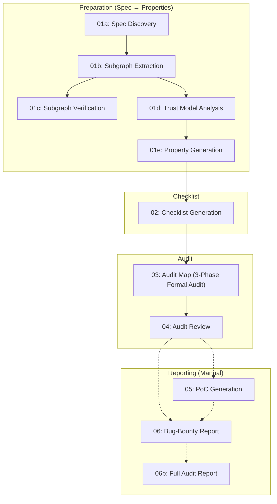

# SPECA: Specification-to-Checklist Agentic Auditing

[SPECA: Specification-to-Checklist Agentic Auditing for Multi-Implementation Systems -- A Case Study on Ethereum Clients
](https://arxiv.org/abs/2602.07513)

An automated security analysis system powered for comprehensive vulnerability Discovery.

## Demo

See past and ongoing audit runs on the **GitHub Actions** page:

**[View Actions Runs](https://github.com/NyxFoundation/security-agent/actions)**

Each workflow step (01a through 04) can be triggered independently via `workflow_dispatch`. Results are committed to audit branches and can be reviewed as Pull Requests.

## Architecture

The pipeline is driven by a Python-based **orchestrator** (`scripts/orchestrator/`) that manages queue distribution, parallel worker execution, batching, resume, cost tracking, and circuit-breaker logic. Each phase invokes Claude Code CLI with a dedicated skill and prompt, processing items in parallel across configurable workers.

```
scripts/
├── run_phase.py            # Entry point (replaces Makefile)
├── setup_mcp.sh            # MCP server registration
└── orchestrator/
    ├── config.py            # Phase definitions (PhaseConfig)
    ├── base.py              # BaseOrchestrator (async pipeline)
    ├── runner.py            # ClaudeRunner + CircuitBreaker
    ├── batch.py             # Token/count-based batching
    ├── queue.py             # Queue splitting & state
    ├── collector.py         # Result parsing & aggregation
    ├── resume.py            # Resume & cleanup manager
    ├── watchdog.py          # LogWatcher + CostTracker
    ├── schemas.py           # Pydantic data contracts
    └── factory.py           # create_orchestrator()
```

### Pipeline Overview



## Phases

### Phase 01a: Specification Discovery

| | |
|---|---|
| **Prompt** | `prompts/01a_crawl.md` |
| **Skill** | `/spec-discovery` |
| **Input** | Seed URLs (via `SPEC_URLS` env var) |
| **Output** | `outputs/01a_STATE.json` |

Crawls seed URLs to discover all relevant technical specification documents. Uses the `mcp__fetch__fetch` tool to recursively follow links and build a catalog of specification pages.

### Phase 01b: Subgraph Extraction

| | |
|---|---|
| **Prompt** | `prompts/01b_extract_worker.md` |
| **Skill** | `/subgraph-extractor` |
| **Input** | `outputs/01a_STATE.json` |
| **Output** | `outputs/graphs/*/index.json` + `.mmd` Mermaid files |

Extracts formal **Program Graphs** (PG = (Q, q&#9655;, q&#9668;, Act, E), following Nielson & Nielson's definition) from each specification document. Each subgraph is output as a Mermaid state diagram (`.mmd`) alongside an aggregated `index.json`.

### Phase 01c: Subgraph Verification

| | |
|---|---|
| **Prompt** | `prompts/01c_verify_worker.md` |
| **Skill** | `/subgraph-verifier` |
| **Input** | `outputs/01b_PARTIAL_*.json` |
| **Output** | `outputs/01c_VERIFIED_PARTIAL_*.json` |

Validates extracted subgraphs for structural completeness and consistency. Checks node/edge integrity, initial/final state presence, and cross-references between subgraphs.

### Phase 01d: Trust Model Analysis

| | |
|---|---|
| **Prompt** | `prompts/01d_trustmodel_worker.md` |
| **Skill** | `/trust-model-analyst` |
| **Input** | `outputs/01b_PARTIAL_*.json` |
| **Output** | `outputs/01d_TRUSTMODEL_PARTIAL_*.json` |

Analyzes trust boundaries and security assumptions from the program graphs. Classifies actors by trust level (TRUSTED / SEMI_TRUSTED / UNTRUSTED), identifies trust boundary edges, and documents security assumptions for each boundary crossing.

### Phase 01e: Property Generation

| | |
|---|---|
| **Prompt** | `prompts/01e_prop_worker.md` |
| **Skill** | `/property-generator` |
| **Input** | `outputs/01d_PARTIAL_*.json` |
| **Output** | `outputs/01e_PROP_PARTIAL_*.json` |

Generates formal security properties from trust models and subgraphs. Each property includes a formal invariant statement, its negation (anti-property / attacker scenario), reachability analysis, and bug bounty scope classification.

### Phase 02: Checklist Generation

| | |
|---|---|
| **Prompt** | `prompts/02_checklist_worker.md` |
| **Skill** | `/checklist-specialist` |
| **Input** | `outputs/01e_PARTIAL_*.json` |
| **Output** | `outputs/02_CHECKLIST_PARTIAL_*.json` |

Generates security audit checklist items from formal properties. Each item includes severity, mindset (Boundary Guard / Formal Verification Engineer), reachability classification, test procedure, bug class, and risk category. Boundary-edge properties generate critical boundary checks; internal properties generate falsification checks.

### Phase 03: Audit Map (Formal Audit)

| | |
|---|---|
| **Prompt** | `prompts/03_auditmap_worker.md` |
| **Skill** | `/formal-audit-phase1`, `/formal-audit-phase2`, `/formal-audit-phase3` |
| **Input** | `outputs/02_PARTIAL_*.json` + Target codebase |
| **Output** | `outputs/03_AUDITMAP_PARTIAL_*.json` |

Performs a three-phase formal audit for each checklist item against the target codebase:

1. **Phase 1 (Abstract Interpretation):** Static analysis identifying potential violation patterns.
2. **Phase 2 (Symbolic Execution + Reachability):** Counterexample construction with boundary values, type confusion, timing, and edge cases.
3. **Phase 3 (Invariant Proving + Scope Filtering):** Guard/invariant search with strict STRONG/MODERATE/WEAK evaluation.

Uses Tree-sitter MCP for code symbol resolution and Filesystem MCP for efficient partial reads.

### Phase 04: Audit Review

| | |
|---|---|
| **Prompt** | `prompts/04_review_worker.md` |
| **Skill** | `/audit-reviewer` |
| **Input** | `outputs/03_PARTIAL_*.json` |
| **Output** | `outputs/04_REVIEW_PARTIAL_*.json` |

Reviews and validates audit findings with a six-category verdict system: CONFIRMED_VULNERABILITY, LIKELY_VULNERABILITY, VERIFIED_SAFE, FALSE_POSITIVE, CODE_QUALITY_ISSUE, REQUIRES_MANUAL_REVIEW. Includes counterexample evaluation, guard analysis, exploitability assessment, and proof trace construction.

### Phase 05: PoC Generation (Manual)

| | |
|---|---|
| **Prompt** | `prompts/05_poc.md` |
| **Usage** | `/05_poc TYPE=unit VULN_ID=... OUTPUT_PATH=...` |

Generates minimal, self-verifying Proof-of-Concept tests in the project's native stack (auto-detected language and test framework). Supports unit / integration / e2e scopes. Includes a self-repair loop (up to 4 attempts) and false-positive mitigation via guard assertions.

### Phase 06: Bug-Bounty Report (Manual)

| | |
|---|---|
| **Prompt** | `prompts/06_report.md` |
| **Usage** | `/06_report VULN_ID=... REPORT_TYPE=ETHEREUM` |

Generates a platform-tailored Markdown bug-bounty report (CANTINA, CODE4RENA, ETHEREUM, IMMUNEFI, SHERLOCK). Fills template placeholders with sanitized data, embeds PoC code with run commands, and derives severity from bounty guidelines when not specified.

### Phase 06b: Full Audit Report (Manual)

| | |
|---|---|
| **Prompt** | `prompts/06b_audit_report.md` |
| **Usage** | `/07_audit_report OUTPUT_PATH=outputs/AUDIT_REPORT.md` |

Compiles a publication-ready security assessment report covering all findings. Includes: Cover Page, Executive Summary, Scope, System Overview, Methodology, Specification Traceability, Finding Classification, Findings Summary, Detailed Findings, Re-Verification, Operational Recommendations, and Appendix. All internal IDs are sanitized to sequential labels (e.g., Finding-01, Gap-02).

## Running on GitHub Actions

All pipeline phases are executed via **GitHub Actions workflows** with `workflow_dispatch` triggers:

| Workflow | File | Description |
|---|---|---|
| 01a. Discovery | `01a-discovery.yml` | Crawl specification URLs |
| 01b. Subgraph Extraction | `01b-subgraph.yml` | Extract program graphs |
| 01c. Verification | `01c-verify.yml` | Verify subgraph consistency |
| 01d. Trust Model | `01d-trustmodel.yml` | Analyze trust boundaries |
| 01e. Properties | `01e-properties.yml` | Generate formal properties |
| 02. Checklist | `02-checklist.yml` | Generate audit checklist |
| 03. Audit Map | `03-audit-map.yml` | Formal 3-phase code audit |
| 04. Audit Review | `04-audit-review.yml` | Review and validate findings |

Each workflow:
1. Checks out the repository and syncs the latest `scripts/`, `prompts/`, `.claude/` from the base branch.
2. Installs Claude Code CLI and registers MCP servers via `scripts/setup_mcp.sh`.
3. Runs the orchestrator: `uv run python3 scripts/run_phase.py --phase <ID> --workers N`.
4. Commits results to an audit branch and uploads logs as artifacts.

### Running Locally

```bash
# Install prerequisites
npm install -g @anthropic-ai/claude-code
pip install uv

# Register MCP servers
bash scripts/setup_mcp.sh

# Run a single phase
uv run python3 scripts/run_phase.py --phase 01a

# Run all phases up to a target
uv run python3 scripts/run_phase.py --target 04 --workers 4

# Force re-execution (ignore resume state)
uv run python3 scripts/run_phase.py --phase 03 --force --workers 4 --max-concurrent 64
```

### MCP Servers

The following MCP servers are registered by `scripts/setup_mcp.sh`:

| Server | Command | Used In |
|---|---|---|
| `tree_sitter` | `uvx mcp-server-tree-sitter` | 01b, 03 |
| `serena` | `uvx --from git+https://github.com/oraios/serena serena start-mcp-server` | Development workflow |
| `semgrep` | `uvx semgrep-mcp` | Static analysis |
| `filesystem` | `npx -y @modelcontextprotocol/server-filesystem` | 01b-04 |
| `fetch` | `uvx mcp-server-fetch` | 01a |
| `github` | `npx -y @modelcontextprotocol/server-github` | 02 |

## Benchmarks

See [benchmarks page](./benchmarks/README.md)