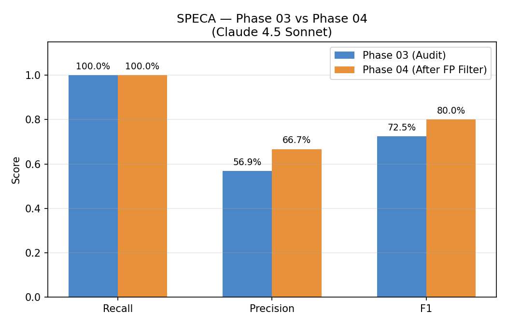
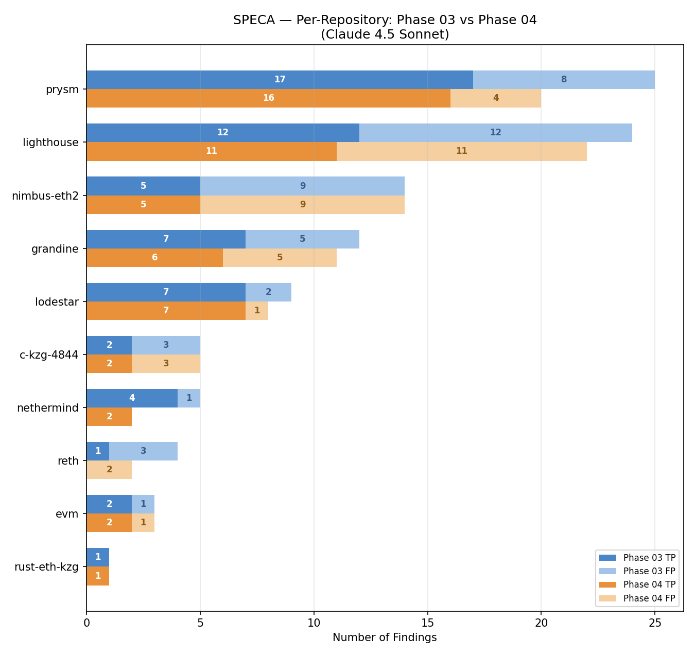

# RQ1 Evaluation Report

- Generated at (UTC): 2026-02-24T12:03:05.612576+00:00
- Dataset: /home/gohan/runners/security-agent-1/_work/security-agent/security-agent/benchmarks/data/rq1/sherlock_contest_1140_issues_1766639267091.csv (366 issues in CSV)
- Severity filter: high, low, medium
- Audit classifications: potential-vulnerability, vulnerability
- Branches: 10
- Audit findings: 102
- LLM calls: 15

## Experiment Environment
- AI model: Claude 4.5 Sonnet (CLI: 2.1.39 (Claude Code))
| Branch | Commit | Phase 03 Runtime | Tokens (in/out/total) | Turns | Files |
| --- | --- | --- | --- | --- | --- |
| alloy_evm_fusaka | a3ee030 | 2.4m | 23121/435014/105879944 | 1389 | 82 |
| c_kzg_4844_fusaka | 0aa3a1a | 4.4m | 12755/341389/70238622 | 779 | 36 |
| grandine_fusaka | f1d757971d | 3.7m | 34661/772778/213896986 | 2027 | 75 |
| lighthouse_fusaka | b8178515c | 8.1m | 56363/1281488/495273141 | 3222 | 134 |
| lodestar_fusaka | 598c1ec54e | 3.3m | 14907/332079/84123324 | 817 | 38 |
| nethermind_fusaka | 7d34bdd47a | 4.4m | 8998/224051/102757416 | 583 | 19 |
| nimbus_fusaka | da9305a98 | 3.9m | 30275/645510/171841072 | 1739 | 56 |
| prysm_fusaka | 238d5c07df | 4.2m | 54387/1356380/462839722 | 3437 | 149 |
| reth_fusaka | 8e65a1d1a2 | 4.3m | 24723/500683/144696898 | 1401 | 48 |
| rust_eth_kzg_fusaka | 853bd4d | 3.1m | 7031/179632/36358051 | 421 | 20 |

## Recall
**15/15 = 100.0%**

| Severity | Total | Matched | Recall |
| --- | --- | --- | --- |
| High | 5 | 5 | 100.0% |
| Medium | 2 | 2 | 100.0% |
| Low | 8 | 8 | 100.0% |

## Matched Issues
| Issue # | Finding | Confidence |
| --- | --- | --- |
| #109 | PROP-6a4369e9-inv-047 | 0.95 |
| #15 | PROP-6a4369e9-inv-047 | 0.95 |
| #176 | PROP-5a6a79d5-inv-059 | 0.95 |
| #190 | PROP-6a4369e9-inv-042 | 0.95 |
| #203 | PROP-57888860-inv-001 | 0.85 |
| #210 | PROP-5a6a79d5-inv-059 | 0.95 |
| #216 | PROP-6a4369e9-inv-049 | 0.95 |
| #308 | PROP-6a4369e9-inv-009 | 0.95 |
| #319 | PROP-56ad1eb2-inv-029 | 0.95 |
| #343 | PROP-6a4369e9-inv-050 | 0.92 |
| #371 | PROP-5a6a79d5-inv-036 | 0.99 |
| #376 | PROP-6a4369e9-pre-003 | 0.95 |
| #381 | PROP-56ad1eb2-inv-032 | 0.95 |
| #40 | PROP-56ad1eb2-inv-018 | 0.95 |
| #48 | PROP-57888860-inv-051 | 0.95 |

## Precision
**Precision (labeled): 56.9%** | Conservative (unknown=FP): 56.9%

| Category | Count | Precision role |
| --- | --- | --- |
| Total findings | 102 | |
| TP — H/M/L match (auto) | 19 | TP |
| TP — info match (auto) | 26 | TP |
| FP — invalid match (auto) | 40 | FP |
| TP (human) | 0 | TP |
| FP (human) | 0 | FP |
| Unknown (unlabeled) | 0 | — |

## F1 Score
**F1 = 0.725** (recall=100.0%, precision=56.9%)

## Phase 04 FP Filter Comparison

| Metric | Phase 03 | Phase 04 | Delta |
| --- | --- | --- | --- |
| Findings | 102 | 72 | +30 removed |
| Recall | 100.0% | 100.0% | +0.0000 |
| Precision | 56.9% | 66.7% | +0.0980 |
| F1 | 0.725 | 0.800 | +0.0750 |

## Ground Truth Analysis

**102 labeled findings**

| Label | Count |
| --- | --- |
| fixed | 5 |
| fp_invalid | 40 |
| fp_review | 4 |
| partially_fixed | 2 |
| potential-info | 6 |
| tp | 19 |
| tp_info | 26 |

### DISPUTED_FP Filter Effectiveness

- Total filtered: 30
- Correct (true FP): 20
- Wrong (true TP filtered): 10
- Other: 0
- **Filter precision: 66.7%**

### Confusion Matrix (Verdict x Ground Truth)

| Verdict | fixed | fp_invalid | fp_review | partially_fixed | potential-info | tp | tp_info | Total |
| --- | --- | --- | --- | --- | --- | --- | --- | --- |
| CONFIRMED_POTENTIAL | 1 | 11 | 0 | 0 | 3 | 5 | 4 | 24 |
| CONFIRMED_VULNERABILITY | 3 | 10 | 0 | 1 | 1 | 14 | 10 | 39 |
| DISPUTED_FP | 0 | 17 | 3 | 1 | 1 | 0 | 8 | 30 |
| DOWNGRADED | 0 | 2 | 1 | 0 | 1 | 0 | 4 | 8 |
| NEEDS_MANUAL_REVIEW | 1 | 0 | 0 | 0 | 0 | 0 | 0 | 1 |

### Per-Verdict TP Rate

| Verdict | Total | TP | TP Rate |
| --- | --- | --- | --- |
| CONFIRMED_POTENTIAL | 24 | 13 | 54.2% |
| CONFIRMED_VULNERABILITY | 39 | 29 | 74.4% |
| DISPUTED_FP | 30 | 10 | 33.3% |
| DOWNGRADED | 8 | 5 | 62.5% |
| NEEDS_MANUAL_REVIEW | 1 | 1 | 100.0% |

### Per-Label Filter Rate

| Ground Truth | Total | Filtered | Filter Rate |
| --- | --- | --- | --- |
| fixed | 5 | 0 | 0.0% |
| fp_invalid | 40 | 17 | 42.5% |
| fp_review | 4 | 3 | 75.0% |
| partially_fixed | 2 | 1 | 50.0% |
| potential-info | 6 | 1 | 16.7% |
| tp | 19 | 0 | 0.0% |
| tp_info | 26 | 8 | 30.8% |

## Token Efficiency

| Metric | Phase 03 (Audit) | Phase 04 (Review) |
| --- | --- | --- |
| Total tokens | 1,887,905,176 | 216,302,441 |
| Total time (sum of batches) | 77409s | 12126s |
| Items | 647 findings | 550 reviews |
| **Tokens/item** | **2,917,937** | **393,277** |
| **Secs/item** | **119.6s** | **22.0s** |

## Data Files

- Evaluation summary: `evaluation_summary.json`
- Collection summary: `collection_summary.json`
- Phase comparison: `phase_comparison.json`
- Findings labels: `findings_labels.csv`
- Run metadata: `run_metadata.json`

## Charts

### Phase 03 vs Phase 04 — Recall / Precision / F1

### Per-Repository Findings Breakdown

