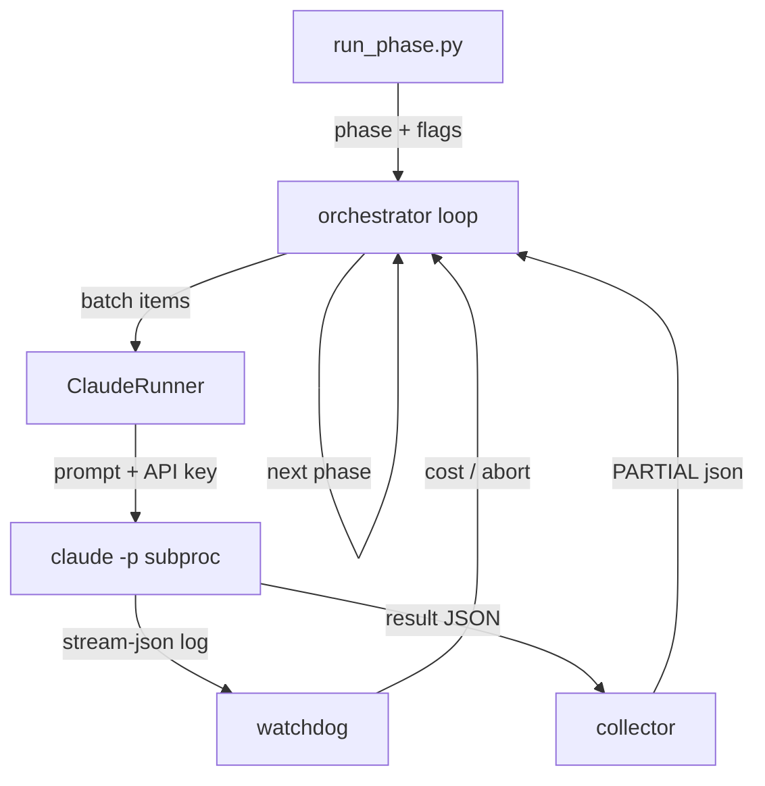
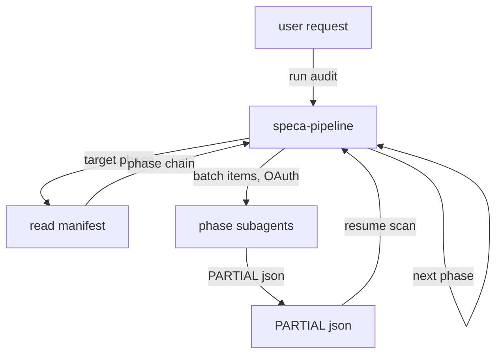

[← Back](README.md) | [English](changelog.md) | [Japanese](changelog-ja.md)

# 変更履歴 — オーケストレーションのモダン化

このブランチ（`make-it-modern-orchestration`）は、SPECA 本来の Python オーケストレータを
**Claude Code の agent teams** 構成へ置き換え、認証を **API キー** から **OAuth** へ切り替えます。
監査ロジック（フェーズ 01a → 01b → 01e → 02c → 03 → 04）の挙動は変わりません。変わるのは
*処理をどう駆動し、どう認証するか* だけです。

## サマリー

| 観点 | 変更前 | 変更後 |
| --- | --- | --- |
| 駆動方式 | Python 非同期オーケストレータ（`scripts/run_phase.py` + `scripts/orchestrator/`） | ユーザーの Claude Code セッション内で動く `/speca-pipeline` skill |
| ワーカー起動 | Python がバッチごとに `claude -p` サブプロセスを起動 | オーケストレータが Agent ツールで **サブエージェント**（＝「チーム」）を起動 |
| 認証 | `ANTHROPIC_API_KEY` を各サブプロセスへ渡す | **OAuth** セッション認証（`claude login` / `claude setup-token`）をサブエージェントが継承 |
| フェーズ設定 | `config.py` の `PHASE_CONFIGS`（Pydantic） | `pipeline/pipeline.json`（Claude が読む宣言的マニフェスト） |
| フェーズ別ロジック | `prompts/<phase>_worker.md` + fork する skill 2 つ | `.claude/agents/speca-*.md`（フェーズごとに 1 サブエージェント） |
| 再開 / バッチ / 収集 | `resume.py` / `batch.py` / `collector.py` | オーケストレータ skill のロジック（PARTIAL を glob、処理済み ID をスキップ、Agent 並列ウェーブ） |
| 予算 / サーキットブレーカー | `watchdog.py`（`CostTracker`, `LogWatcher`） | skill 内の軽量な「系統的失敗で停止」ルール |
| 結果の受け渡し | サブプロセス stdout の stream-json をパース | サブエージェントが `outputs/*_PARTIAL_*.json` を直接書き込み |
| 外部ツール | `setup_mcp.sh` 経由の MCP サーバ（`fetch`, `filesystem`, `tree_sitter` …） | **MCP なし** — 組み込みの `WebFetch` + `Read`/`Write`/`Glob`/`Grep` のみ |
| 言語 | 約 2,500 行の Python | Markdown のエージェント + JSON マニフェスト 1 つ（Python なし） |

フェーズ間の **データ契約は維持** されます。各フェーズは同じ `outputs/*.json` ファイル
（`BUG_BOUNTY_SCOPE.json`, `TARGET_INFO.json`, `01a_STATE.json`, `{phase}_PARTIAL_*.json` …）を
読み書きし、`schemas/` の不変な JSON スキーマで検証されます。

## 認証: API キー → OAuth

- **変更前:** ランナーが環境変数 `ANTHROPIC_API_KEY` を読み、すべての `claude -p` 子プロセスへ渡していました。CI ではキーをシークレットとして注入。
- **変更後:** パイプラインは既に認証済みの Claude Code セッションのサブエージェントとして動作します。`claude login`（対話）または `claude setup-token`（ヘッドレス/CI）で一度だけ認証すれば十分。オーケストレーション経路のどこでも `ANTHROPIC_API_KEY` は読まれず、不要です。

## 外部ツール: MCP サーバの全廃

- **変更前:** `scripts/setup_mcp.sh` が MCP サーバ（`fetch`, `filesystem`, `tree_sitter`、加えて未使用の `serena`/`semgrep`/`github`）を `uvx`/`npx` 経由で登録。コアフェーズは `fetch`（01a/01b）、`filesystem`（01b–04）、`tree_sitter`（02c）を使用。
- **変更後:** MCP サーバは一切なし。Web アクセスは組み込みの **`WebFetch`**、ファイル/コードアクセスは組み込みの **`Read`/`Write`/`Glob`/`Grep`**。MCP のセットアップ手順も外部サーバプロセスも不要で、必要なのは `claude` CLI のみです。
- **トレードオフ:** フェーズ 02c のコード位置解決が、AST 精度の Tree-sitter シンボル検索からテキストベースの `Grep`/`Glob` に変わります。02c エージェントは元々「`not_found` とする前に 3 語以上試す」多段フォールバックを持つため、失敗ではなく緩やかに精度が落ちる形になります。

## ローカル仕様書

仕様書は Web 越しに配信されるのではなく、すでにディスク上にある（ダウンロード済み、あるいはターゲットリポジトリ内にある）ことが多々あります。仕様書を読む両フェーズは、これを矛盾なく扱います。

- **01a** — 探索の *シード* はリモート URL（`WebFetch` でクロール）でも、ローカルのディレクトリ/ファイル（`Glob` で列挙、Web アクセスなし）でも構いません。すべての仕様書がすでにローカルにある場合、`outputs/01a_STATE.json` を直接用意して 01a を丸ごとスキップできます。
- **01b** — 各 `found_spec` は必須の `url` に加えて任意の `local_path` を持ちます。抽出器は `local_path` / `file://` のソースを組み込み `Read` で読み、`http(s)://` のソースだけ `WebFetch` で取得します。

したがって完全ローカル実行では **Web アクセスは一切不要**（`Read`/`Glob`/`Write` のみ）であり、MCP なし・OAuth のみの設計にリモートの場合よりさらに綺麗に適合します。`schemas/DiscoveredSpec` の契約は不変です（`url` は必須のまま、`local_path` は許容される追加フィールド）。

## ブロック図

計算は矩形、データはラベル付きの矢印で表します。

### 変更前



### 変更後



**変更後** の設計では、1 フェーズ = 1 サブエージェント定義、1 バッチ = 1 つの並列 Agent 起動です。1 ウェーブ分のバッチを 1 メッセージ内の複数の Agent 呼び出しとして起動するため、Python オーケストレータが並列サブプロセスを走らせていたのと同じように「チーム」が並行動作します。

## ディレクトリ構成

### 変更前

```
speca/
├── scripts/
│   ├── run_phase.py                  # CLI エントリ（Makefile の代替）
│   └── orchestrator/                 # Python 非同期オーケストレータ
│       ├── base.py                   # バッチ化・再開・並列実行
│       ├── runner.py                 # ClaudeRunner: `claude -p` を起動
│       ├── api_runner.py             # Anthropic API 直叩きランナー
│       ├── copilot_runner.py         # 別のエージェント型ランナー
│       ├── runtime_registry.py       # ランタイム選択
│       ├── watchdog.py               # CostTracker + LogWatcher
│       ├── resume.py                 # ResumeManager
│       ├── collector.py              # ResultCollector
│       ├── config.py                 # PHASE_CONFIGS（Pydantic）
│       ├── batch.py / queue.py       # バッチ化 + キューファイル
│       ├── factory.py / paths.py     # オーケストレータ配線
│       ├── archiver.py               # 実行ごとのアーカイブ
│       ├── json_events.py / event_models.py
│       ├── schemas.py                # Pydantic データ契約
│       └── phase0_runner.py          # 0a/0b/0c セットアップ
├── prompts/
│   ├── 01a_crawl.md                  # フェーズ別ワーカープロンプト
│   ├── 01b_extract_worker.md
│   ├── 01e_prop_worker.md
│   ├── 02c_codelocation_worker.md
│   ├── 03_auditmap_worker_inline.md
│   ├── 04_review_worker.md
│   └── 05_poc.md / 06_report.md / 06b_audit_report.md
├── .claude/
│   └── skills/
│       ├── spec-discovery/           # fork する skill（01a）
│       └── subgraph-extractor/       # fork する skill（01b）
├── schemas/                          # JSON データ契約
└── tests/                            # オーケストレータの単体テスト
```

### 変更後

```
speca/
├── pipeline/
│   └── pipeline.json                 # 宣言的フェーズマニフェスト（旧 config.py）
├── .claude/
│   ├── agents/                       # サブエージェント「チーム」（フェーズごと）
│   │   ├── speca-scope.md            # 0a  バグバウンティ・スコープ抽出
│   │   ├── speca-spec-discovery.md   # 01a 仕様書探索
│   │   ├── speca-subgraph-extractor.md # 01b プログラムグラフ抽出
│   │   ├── speca-property-generator.md # 01e 信頼モデル + プロパティ生成
│   │   ├── speca-code-resolver.md    # 02c コード位置の事前解決
│   │   ├── speca-auditor.md          # 03  証明ベースの形式監査
│   │   └── speca-reviewer.md         # 04  3 ゲートの FP フィルタ
│   └── skills/
│       ├── speca-pipeline/           # オーケストレータ（旧 run_phase.py + base.py）
│       │   └── SKILL.md
│       ├── spec-discovery/           # 維持; 01a サブエージェントが利用
│       └── subgraph-extractor/       # 維持; 01b サブエージェントが利用
├── prompts/
│   └── 05_poc.md / 06_report.md / 06b_audit_report.md  # 手動フェーズのみ
└── schemas/                          # JSON データ契約（不変）
```

（`scripts/setup_mcp.sh` は削除 — MCP サーバはもう使いません。）

## 削除したもの

- `scripts/run_phase.py` と `scripts/orchestrator/` パッケージ全体。
- オーケストレーション対象の 6 つのワーカープロンプト（`prompts/01a_crawl.md`, `01b_extract_worker.md`, `01e_prop_worker.md`, `02c_codelocation_worker.md`, `03_auditmap_worker_inline.md`, `04_review_worker.md`）— ロジックは対応する `.claude/agents/*.md` に移行。
- `tests/` のオーケストレータ専用単体テスト（16 ファイル: runner, watchdog, resume, collector, config, phase0, runtime registry, archiver, severity gate …）。残り 232 件のテストは収集・パスします。
- `scripts/export_schemas.py` — Pydantic→JSON スキーマ生成器（`orchestrator.schemas` を import）。生成済みの `schemas/*.json` 契約は **維持** し、今後は手動メンテナンス。
- `scripts/setup_mcp.sh` と全 MCP 利用 — 組み込みツールで置換。
- オーケストレーション経路における `ANTHROPIC_API_KEY` 依存のすべて。

## 追加したもの

- `pipeline/pipeline.json` — 宣言的フェーズマニフェスト。
- `.claude/skills/speca-pipeline/SKILL.md` — オーケストレータ。
- `.claude/agents/speca-*.md` — フェーズ別サブエージェント 7 つ（チーム）。

## 維持したもの（挙動変更なし）

- `schemas/` の JSON データ契約と `outputs/` のファイル規約。
- `.claude/skills/spec-discovery` と `subgraph-extractor`（各サブエージェントから呼ばれる）。
- `prompts/05_poc.md`, `06_report.md`, `06b_audit_report.md`（手動・非オーケストレーションのフェーズ）。

## 実行方法（変更後）

```bash
# 1. 一度だけ認証（API キー不要）
claude login            # 対話
# またはヘッドレス / CI:
claude setup-token

# 2. Claude Code セッションからパイプラインを実行（MCP セットアップ不要）
/speca-pipeline --target 04
# または特定のフェーズ:
/speca-pipeline 01a 01b
```

## レガシーなフロントエンド（`web/`, `cli/`） — 削除

新設計では **ユーザーインターフェースは Claude Code 自身**（`/speca-pipeline` を実行）なので、Python オーケストレータ向けに作られた専用フロントエンドは削除しました。

- `web/` — `orchestrator` モジュールを直接 import し、`run_phase.py` を駆動していた FastAPI 管理 UI。削除に伴い `pyproject.toml` を更新（`speca-web` エントリポイントと `web` wheel ターゲットを除去し、プロジェクトを `[tool.uv]` で `package = false` に）。
- `cli/` — `run_phase.py --json` を起動していた TypeScript 製 TUI。削除。

この後も `uv run python3 -m pytest tests/` は通ります（232 件）。

## 残課題（CI & 依存）

- `.github/workflows/` の CI は依然として削除済みのオーケストレータ / `cli/` / `web/` / `setup_mcp.sh` を参照しています（例: `01a-discovery.yml` … `04-audit-review.yml`, `full-audit.yml`, `cli-ci.yml`, `release.yml`, `tests-on-push.yml`）。`/speca-pipeline` を呼ぶ形への配線変更と、`ANTHROPIC_API_KEY` シークレットから保存済み OAuth トークン（`claude setup-token`）への切り替えが必要です。
- `pyproject.toml` には現在使われていない web 専用ランタイム依存（`fastapi`, `uvicorn`, `sse-starlette`）が残っています。後日のクリーンアップで安全に削除できます。
