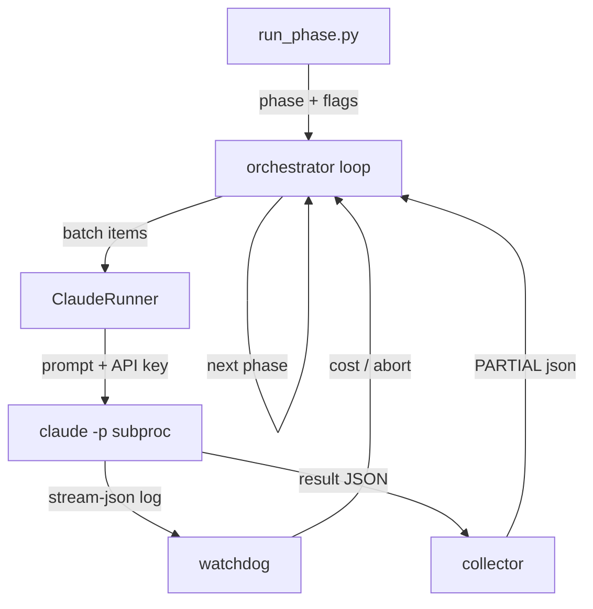
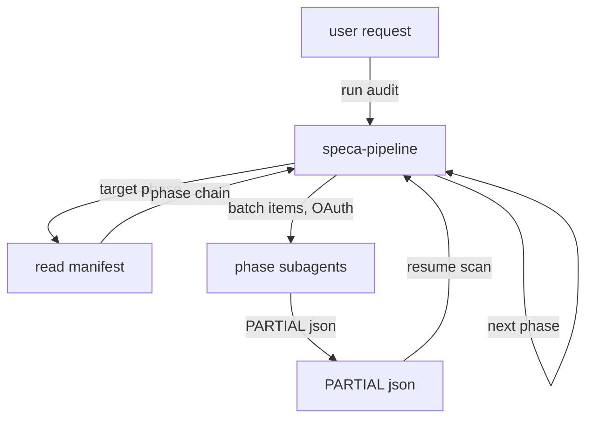

[← Back](README.md) | [English](changelog.md) | [Japanese](changelog-ja.md)

# Changelog — Orchestration Modernization

This branch (`make-it-modern-orchestration`) replaces SPECA's original Python orchestrator
with a **Claude Code agent-teams** design and switches authentication from an
**API key** to **OAuth**. The audit logic (phases 01a → 01b → 01e → 02c → 03 → 04) is
unchanged in behavior; only *how the work is driven and authenticated* changes.

## Summary

| Aspect | Before | After |
| --- | --- | --- |
| Driver | Python async orchestrator (`scripts/run_phase.py` + `scripts/orchestrator/`) | `/speca-pipeline` skill running inside the user's Claude Code session |
| Worker invocation | Python spawns `claude -p` subprocesses per batch | Orchestrator dispatches **subagents** (the "team") via the Agent tool |
| Auth | `ANTHROPIC_API_KEY` passed to each subprocess | **OAuth** session credentials (`claude login` / `claude setup-token`), inherited by subagents |
| Phase config | `config.py` `PHASE_CONFIGS` (Pydantic) | `pipeline/pipeline.json` (declarative manifest read by Claude) |
| Per-phase logic | `prompts/<phase>_worker.md` + 2 forked skills | `.claude/agents/speca-*.md` (one subagent per phase) |
| Resume / batching / collection | `resume.py` / `batch.py` / `collector.py` | Orchestrator skill logic (glob PARTIALs, skip processed IDs, parallel Agent waves) |
| Budget / circuit breaker | `watchdog.py` (`CostTracker`, `LogWatcher`) | Lightweight "stop on systemic failure" rule in the skill |
| Result transport | stream-json parsed from subprocess stdout | Subagents write `outputs/*_PARTIAL_*.json` directly |
| External tools | MCP servers (`fetch`, `filesystem`, `tree_sitter`, …) via `setup_mcp.sh` | **No MCP** — built-in `WebFetch` + `Read`/`Write`/`Glob`/`Grep` only |
| Language | ~2,500 lines of Python | Markdown agents + one JSON manifest (no Python) |

The inter-phase **data contracts are preserved**: every phase still reads and writes the same
`outputs/*.json` files (`BUG_BOUNTY_SCOPE.json`, `TARGET_INFO.json`, `01a_STATE.json`,
`{phase}_PARTIAL_*.json`, …), validated against the unchanged JSON schemas in `schemas/`.

## Authentication: API key → OAuth

- **Before:** the runner read `ANTHROPIC_API_KEY` from the environment and passed it to every
  `claude -p` child process; CI injected the key as a secret.
- **After:** the pipeline runs as subagents of an already-authenticated Claude Code session.
  Authenticate once with `claude login` (interactive) or `claude setup-token` (headless/CI).
  No `ANTHROPIC_API_KEY` is read or required anywhere in the orchestration path.

## External tools: MCP servers removed

- **Before:** `scripts/setup_mcp.sh` registered MCP servers (`fetch`, `filesystem`,
  `tree_sitter`, plus unused `serena`/`semgrep`/`github`) launched through `uvx`/`npx`. The
  core phases used `fetch` (01a/01b), `filesystem` (01b–04), and `tree_sitter` (02c).
- **After:** no MCP servers at all. Web access uses the built-in **`WebFetch`** tool; file and
  code access use the built-in **`Read`/`Write`/`Glob`/`Grep`** tools. There is no MCP setup
  step and no external server processes — the only requirement is the `claude` CLI itself.
- **Trade-off:** phase 02c's code-location resolution moves from AST-precise Tree-sitter
  symbol lookup to text-based `Grep`/`Glob`. The 02c agent already used a multi-tier
  Grep/Glob fallback ("try ≥3 search terms before `not_found`"), so resolution degrades
  gracefully rather than failing.

## Local specifications

Specs are frequently already on disk (downloaded, or living inside the target repo) rather
than served over the web. Both spec-reading phases handle this without contradiction:

- **01a** — a discovery *seed* may be a remote URL (crawled via `WebFetch`) **or** a local
  directory/file (enumerated via `Glob`, no web access). When every spec is already local,
  01a can be skipped entirely by providing `outputs/01a_STATE.json` directly.
- **01b** — each `found_spec` carries the required `url` plus an optional `local_path`. The
  extractor reads `local_path` / `file://` sources with the built-in `Read` tool and only
  fetches `http(s)://` sources with `WebFetch`.

A fully-local run therefore uses **no web access at all** — only `Read`/`Glob`/`Write` —
which fits the no-MCP, OAuth-only design even more cleanly than the remote case. The
`schemas/DiscoveredSpec` contract is unchanged (`url` stays required; `local_path` is an
allowed extra field).

## Block diagram

Computation is shown as rectangles; data is shown as labeled arrows.

### before



### after



In the **after** design, one phase = one subagent definition, and one batch = one parallel
Agent dispatch. A wave of batches is launched as several Agent calls in a single message, so
the "team" runs concurrently the same way the Python orchestrator ran parallel subprocesses.

## Directory structure

### before

```
speca/
├── scripts/
│   ├── run_phase.py                  # CLI entry (Makefile replacement)
│   └── orchestrator/                 # async Python orchestrator
│       ├── base.py                   # batching, resume, parallel exec
│       ├── runner.py                 # ClaudeRunner: spawns `claude -p`
│       ├── api_runner.py             # direct Anthropic API runner
│       ├── copilot_runner.py         # alternative agentic runner
│       ├── runtime_registry.py       # runtime selection
│       ├── watchdog.py               # CostTracker + LogWatcher
│       ├── resume.py                 # ResumeManager
│       ├── collector.py              # ResultCollector
│       ├── config.py                 # PHASE_CONFIGS (Pydantic)
│       ├── batch.py / queue.py       # batching + queue files
│       ├── factory.py / paths.py     # orchestrator wiring
│       ├── archiver.py               # per-run archive
│       ├── json_events.py / event_models.py
│       ├── schemas.py                # Pydantic data contracts
│       └── phase0_runner.py          # 0a/0b/0c setup
├── prompts/
│   ├── 01a_crawl.md                  # per-phase worker prompts
│   ├── 01b_extract_worker.md
│   ├── 01e_prop_worker.md
│   ├── 02c_codelocation_worker.md
│   ├── 03_auditmap_worker_inline.md
│   ├── 04_review_worker.md
│   └── 05_poc.md / 06_report.md / 06b_audit_report.md
├── .claude/
│   └── skills/
│       ├── spec-discovery/           # forked skill (01a)
│       └── subgraph-extractor/       # forked skill (01b)
├── schemas/                          # JSON data contracts
└── tests/                            # orchestrator unit tests
```

### after

```
speca/
├── pipeline/
│   └── pipeline.json                 # declarative phase manifest (was config.py)
├── .claude/
│   ├── agents/                       # the subagent "team" (one per phase)
│   │   ├── speca-scope.md            # 0a  bug-bounty scope extraction
│   │   ├── speca-spec-discovery.md   # 01a spec discovery
│   │   ├── speca-subgraph-extractor.md # 01b program-graph extraction
│   │   ├── speca-property-generator.md # 01e trust model + properties
│   │   ├── speca-code-resolver.md    # 02c code-location pre-resolution
│   │   ├── speca-auditor.md          # 03  proof-based formal audit
│   │   └── speca-reviewer.md         # 04  3-gate FP filter
│   └── skills/
│       ├── speca-pipeline/           # orchestrator (was run_phase.py + base.py)
│       │   └── SKILL.md
│       ├── spec-discovery/           # kept; used by the 01a subagent
│       └── subgraph-extractor/       # kept; used by the 01b subagent
├── prompts/
│   └── 05_poc.md / 06_report.md / 06b_audit_report.md  # manual phases only
└── schemas/                          # JSON data contracts (unchanged)
```

(`scripts/setup_mcp.sh` is removed — no MCP servers are used anymore.)

## Removed

- `scripts/run_phase.py` and the entire `scripts/orchestrator/` package.
- The six orchestrated worker prompts (`prompts/01a_crawl.md`, `01b_extract_worker.md`,
  `01e_prop_worker.md`, `02c_codelocation_worker.md`, `03_auditmap_worker_inline.md`,
  `04_review_worker.md`) — their logic now lives in the corresponding `.claude/agents/*.md`.
- Orchestrator-specific unit tests under `tests/` (16 files: runner, watchdog, resume,
  collector, config, phase0, runtime registry, archiver, severity gate, …). The remaining 232
  tests collect and pass.
- `scripts/export_schemas.py` — the Pydantic→JSON schema generator (it imported
  `orchestrator.schemas`). The generated `schemas/*.json` contracts are **kept** and are now
  hand-maintained.
- `scripts/setup_mcp.sh` and all MCP usage — replaced by built-in tools.
- All reliance on `ANTHROPIC_API_KEY` in the orchestration path.

## Added

- `pipeline/pipeline.json` — the declarative phase manifest.
- `.claude/skills/speca-pipeline/SKILL.md` — the orchestrator.
- `.claude/agents/speca-*.md` — seven phase subagents (the team).

## Kept (unchanged behavior)

- `schemas/` JSON data contracts and `outputs/` file conventions.
- `.claude/skills/spec-discovery` and `subgraph-extractor` (now invoked by their subagents).
- `prompts/05_poc.md`, `06_report.md`, `06b_audit_report.md` (manual, non-orchestrated phases).

## How to run (after)

```bash
# 1. Authenticate once (no API key)
claude login            # interactive
# or, headless / CI:
claude setup-token

# 2. Run the pipeline from a Claude Code session (no MCP setup needed)
/speca-pipeline --target 04
# or specific phases:
/speca-pipeline 01a 01b
```

## Legacy front-ends (`web/`, `cli/`) — removed

In the new design the **user interface is Claude Code itself** (run `/speca-pipeline`), so the
bespoke front-ends built around the Python orchestrator were removed:

- `web/` — the FastAPI management UI that imported `orchestrator` modules directly and drove
  `run_phase.py`. Deleted; `pyproject.toml` was updated accordingly (dropped the `speca-web`
  entry point and the `web` wheel target; the project is now `package = false` under `[tool.uv]`).
- `cli/` — the TypeScript TUI that spawned `run_phase.py --json`. Deleted.

After this, `uv run python3 -m pytest tests/` still passes (232 tests).

## Follow-up (CI & deps)

- CI workflows under `.github/workflows/` still reference the removed orchestrator / `cli/` /
  `web/` / `setup_mcp.sh` (e.g. `01a-discovery.yml` … `04-audit-review.yml`, `full-audit.yml`,
  `cli-ci.yml`, `release.yml`, `tests-on-push.yml`). They need rewiring to invoke
  `/speca-pipeline` and a switch from the `ANTHROPIC_API_KEY` secret to a stored OAuth token
  (`claude setup-token`).
- `pyproject.toml` still lists web-only runtime deps (`fastapi`, `uvicorn`, `sse-starlette`)
  that are now unused — safe to prune in a later cleanup.
