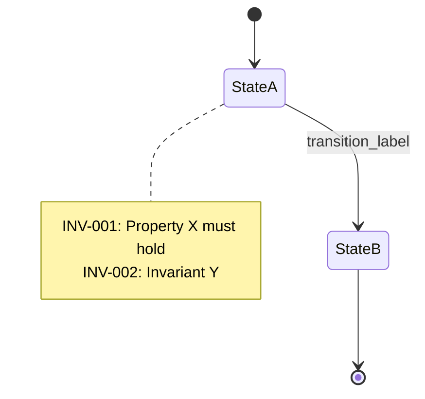

# Phase 01b: サブグラフ抽出

仕様書をプログラムグラフに分解し、Mermaid 状態図と RFC 2119 由来の不変式を導出します。

## 入力

Phase 01a の出力 `outputs/01a_STATE.json`

## 処理

Nielson & Nielson の形式的プログラムグラフ定義に従い:

1. 各仕様セクションを**状態**として抽出
2. 状態遷移を**エッジ**として特定
3. RFC 2119 キーワード (MUST / SHOULD / MAY) から**不変式**を導出
4. 各不変式に INV-* ラベルを付与

## 出力

### Mermaid ファイル (`outputs/graphs/*.mmd`)



### パーシャル JSON (`outputs/01b_PARTIAL_*.json`)

```json
{
  "spec_section_id": "FN-001",
  "spec_text": "...",
  "subgraph": {
    "states": ["state_a", "state_b"],
    "transitions": [{"from": "state_a", "to": "state_b", "label": "event"}],
    "invariants": ["INV-001", "INV-002"]
  },
  "mermaid_file": "outputs/graphs/FN-001.mmd"
}
```

このファイルは Phase 01e (プロパティ生成) の入力として使用されます。
