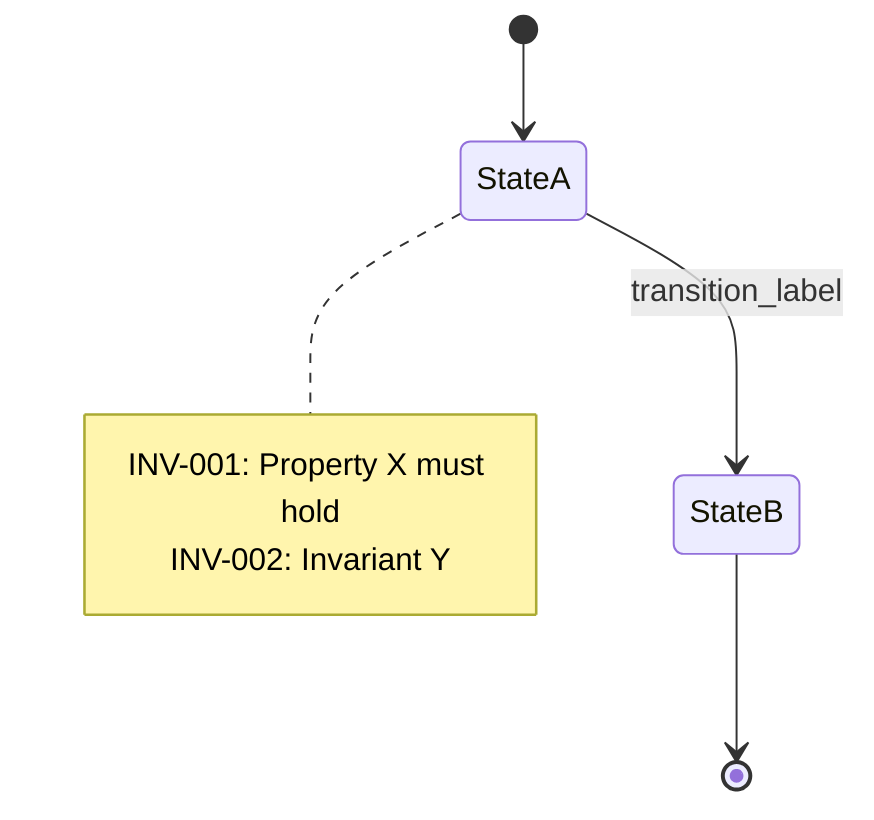

# Phase 01b: Subgraph Extraction

Decomposes specification documents into program graphs and derives Mermaid state diagrams together with invariants drawn from RFC 2119.

## Input

The output of Phase 01a, `outputs/01a_STATE.json`.

## Processing

Following Nielson & Nielson's formal definition of a program graph:

1. Extract each spec section as a **state**.
2. Identify state transitions as **edges**.
3. Derive **invariants** from RFC 2119 keywords (MUST / SHOULD / MAY).
4. Assign an `INV-*` label to each invariant.

## Output

### Mermaid file (`outputs/graphs/*.mmd`)



### Partial JSON (`outputs/01b_PARTIAL_*.json`)

```json
{
  "spec_section_id": "FN-001",
  "spec_text": "...",
  "subgraph": {
    "states": ["state_a", "state_b"],
    "transitions": [{"from": "state_a", "to": "state_b", "label": "event"}],
    "invariants": ["INV-001", "INV-002"]
  },
  "mermaid_file": "outputs/graphs/FN-001.mmd"
}
```

This file is consumed as input by Phase 01e (property generation).
