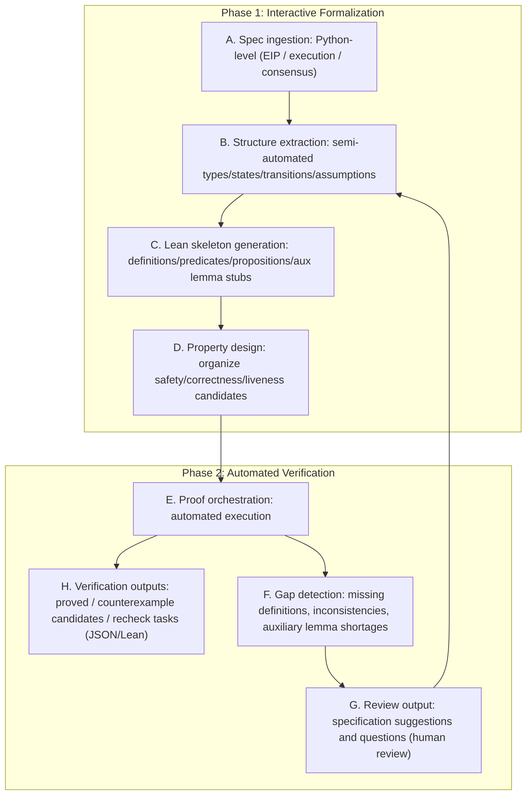
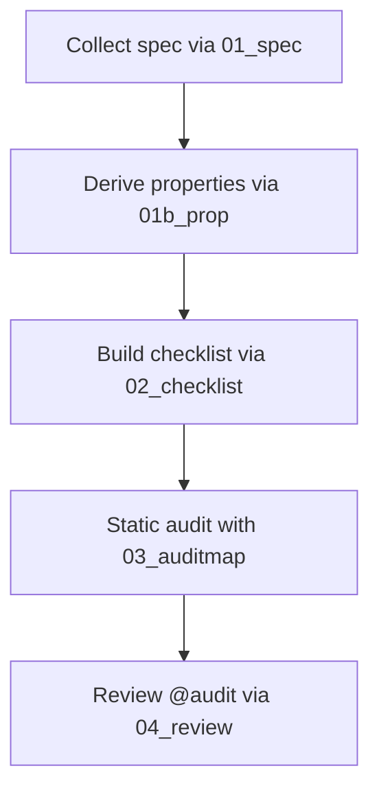
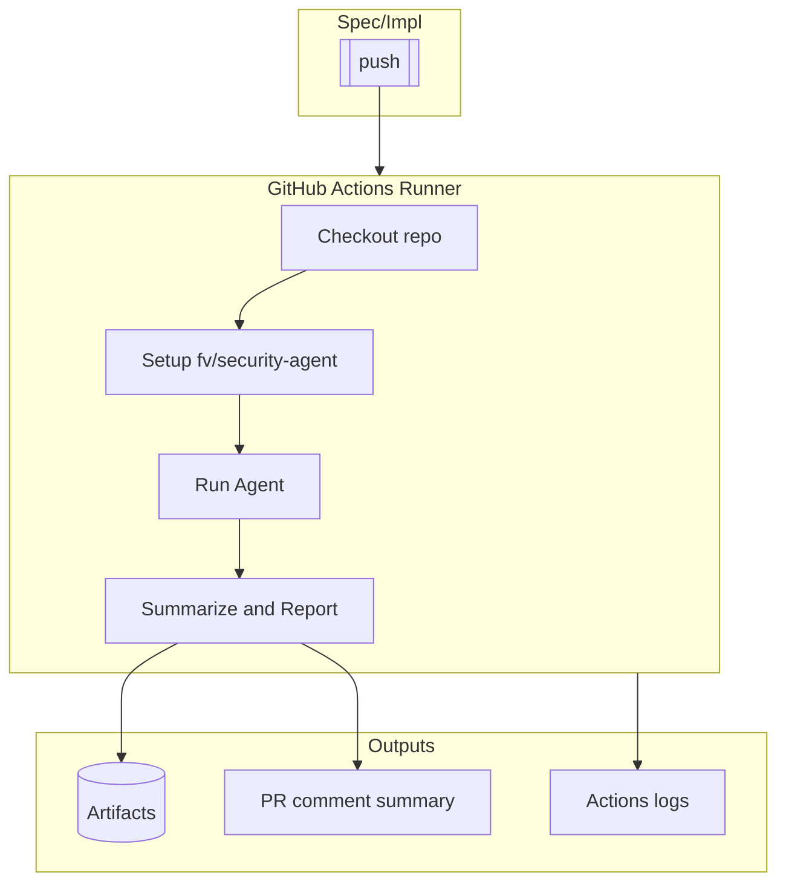

# Research Proposal: Ethereum Protocol Security Agents

This document is the research proposal for [Integrating Large Language Models (LLMs) into Ethereum Protocol Security Research](https://notes.ethereum.org/NhqWcKi1R1ure-eA8EfGsQ).

## 1. Vendor Background

Nyx Foundation is a non-profit research organization dedicated to improving the security of the Ethereum protocol.

We operate auditing agents and formal verification agents centered on LLMs, building a pipeline that mechanically detects drift between the specifications (EIPs and consensus specs) and the implementations (each client). In recent years we have reported more than 15 valid bugs through the Fusaka audit contest.

We also pursue reporting to Erigon and Nimbus, submitting PRs to Geth and Reth, and contributing bug reports to SP1 zkVM, Intmax zkRollup, and related projects to prove the production readiness of LLM-assisted auditing.

For formal verification, we develop a Lean-based formal verification agent and have formalized part of the security proofs for the TSL encoding used in lean Consensus. The work was presented and discussed at PQ InterOp in Cambridge, and we continue to incorporate feedback from the EF formal verification team.

Website: https://nyx.foundation

---

## 2. Technical Approach

### Agent Workflow Overview

The proposed agent stack uses a two-layer structure that uncovers bugs hiding in both specifications and implementations.

**Layer 1: Lean Formal Verification Agent**

* Takes EIPs, execution specs, and consensus specs as inputs and formalizes safety properties in Lean.
* Outputs: Lean source files and proof logs.

**Layer 2: Auditing Agent**

* Runs code analysis across each client implementation.
* Consumes the EIP spec to support an end-to-end flow from specification comprehension through hypothesis generation, checklist creation, code auditing, and review completion.
* Outputs: audit comments embedded in code.

**Workflow Characteristics**

* Responsiveness: robust to specification changes. Updating the machine-readable SPEC/PROP automatically regenerates downstream checklists and audits.
* Reproducibility: detection evidence persists as JSON plus minimal PoCs or diffs, enabling automatic re-verification in CI.
* False-positive control: trust-boundary presets (e.g., EL trusted/untrusted), reverse checklists ("if this passes, we are safe"), and double checks suppress noise.
* Knowledge propagation: even non-experts can surface bugs, and findings spread immediately across clients.
* Ease of integration: runs inside CLI-first models such as Codex, Claude Code, and Cursor, so GitHub Actions integration is straightforward.
* Explainability: preserves a linear audit trace `SPEC -> PROP -> CHECKLIST -> AUDITMAP -> PoC/Patch`.

This combination strengthens the system against both "protocol specification drift" and "implementation deltas," delivering high recall with low noise on short timelines.

---

### 2.1 Lean Formal Verification Agent Approach

We assume the EIP author has finished writing the Python-level execution or consensus specification.

The Lean agent lifts that specification into a machine-readable substrate for safety verification and bridges it into Lean-based formal proofs. Its functionality is organized into two phases:

- **Phase 1: Interactive Specification Formalization** -- parses the Python spec, generates skeletons for Lean definitions, predicates, propositions, and auxiliary lemmas, and fills the gaps through human-in-the-loop dialogue.
- **Phase 2: Automated Formal Verification** -- runs automatic or semi-automatic proofs and counterexample searches in Lean against the defined predicates and invariants.

Whereas the auditing agent operates inside each Ethereum client implementation repository, the Lean agent runs independently on the execution-spec / consensus-spec repositories. The two systems exchange JSON artifacts to stay loosely coupled.

#### Design Principles (Abstract Rules)
1. **Keep the primary specification as the sole reference point**  
   Treat EIPs and official specs as the only sources of truth and declare the minimal assumption set in Lean explicitly ("what is assumed" vs. "what is proven").
2. **Lock the level of abstraction through dialogue**  
   Leave intentional gaps in the auto-generated Lean skeletons, present definition candidates and boundary conditions, and raise fidelity through human review.
3. **Record a machine-readable verification trail**  
   Store proof logs, failure logs, counterexample candidates, and undefined points in JSON so CI runs can replay identical steps.
4. **Hand off artifacts in a loosely coupled manner**  
   Persist `SPEC -> PROP -> PROOF` as separated outputs so the Lean and auditing sides can evolve independently.
5. **Optimize automation per phase**  
   Keep the formalization phase semi-automatic and dialogue-driven, while maximizing automation ratios (proof search and counterexample generation) during the proof phase to isolate human bottlenecks.

#### Workflow (Specification -> Formalization -> Proof -> Integration)



#### Phase 1: Interactive Specification Formalization

##### Objective

Lift the Python-level execution/consensus specification into a mathematically checkable domain (types, predicates, invariants, transition rules) and, through dialogue, finalize the Lean skeleton (propositions plus auxiliary lemmas). The process aligns formal correctness with the intended meaning via semi-automatic LLM assistance plus iterative human review.

##### Challenges and Policies

- Always expose ambiguities (boundary conditions, failure behavior, timing or fork triggers) and leave them as unresolved points. Visualize ambiguity as "verification cost."
- Avoid over-lifting implementation details. Model with the minimal abstractions (state, transitions, observable quantities) and leave additional phenomena as extension hooks.
- Fix security assumptions (trust boundaries, adversary capabilities) up front and track them as global premises that influence every subsequent definition or proposition.

##### Iterative Cycle

1. **Extract specification structure (dialogue-driven).**
   - Types and state: project major records, arrays, maps, and cryptographic primitives into abstract types.
   - Events and transitions: organize protocol steps (e.g., validation, approval, update) as transition rules.
   - Assumptions and boundaries: enumerate trust boundaries, fork conditions, resource ceilings, and rollback behavior on failure.
2. **Property design (candidate generation -> review).**
   - Propose safety and correctness properties.
   - Draft state predicates/invariants for each property and attach template counterexample scenarios.
3. **Auto-generate Lean skeletons (with gaps).**
   - Produce formalization skeletons for types, states, and transitions via `def/structure/inductive`.
   - Fix only the proposition signatures (theorem/lemma) and record proof bodies as explicit gaps (`sorry`).
   - Auto-generate informal Markdown so the mathematical intent sits alongside the Lean definition.
4. **Visualize gaps and review (human decision).**
   - Aggregate undefined points, inconsistencies, and boundary uncertainties into JSON (e.g., `gaps.json`) with prioritized resolution order.
   - During review, decide whether each point is acceptable as specification behavior and, if necessary, bounce issues back to the spec authors.
5. **Convergence criteria and handoff to automation.**
   - Once the core types, transitions, and invariants are stable and the proposition premises are agreed upon, hand the artifacts to Phase 2 for automated formal verification.

#### Phase 2: Automated Formal Verification Approach

##### Overview

This phase automates safety and correctness proofs for the formalized propositions. Successful proofs are emitted as certified artifacts, while failures are exported as counterexample candidates or unresolved items in JSON so CI can rerun them.

Key characteristics:

- Combines informal and formal proofs so each side contributes its strengths.
- Improves proof success by decomposing propositions into small auxiliary lemmas under divide-and-conquer principles.
- Includes an explicit review phase to raise the fidelity of both formalization and proofs.
- Uses a TypeScript management layer to control agents via rule-based workflows.
- Adopts a DDD-inspired module structure to preserve extensibility.

##### Technology Stack

- LLM agent: OpenAI Codex CLI
    - model: gpt-5
    - reasoning: high
- Formal proof language: Lean with Mathlib, VCV-io, ArkLib
- Informal proof language: Markdown
- State management tool: TypeScript with Prisma, SQLite

##### End-to-End Flow


##### 1. Informal Proof Authoring Phase
Task: Extract auxiliary lemmas when necessary and author the informal proof of the focal theorem.

Sample prompt:
```markdown
Please rigorously and precisely review the informal proof of the Focal (Artifact) Theorem written in the previous turn.

Finally, summarize the results and what you did in a report, and update the progress as well.

- Informal focal theorem file to review: {informal focal theorem file}
- Newly created Focal Stub Lemma informal files: {informal focal lemma files}
- Report output location: `metas/exploration/r{{round num}}/t{{turn num}}-report.md`
  Lead with the verdict and list specific edits/risks.

The report must start with the conclusion and clearly state which of the following it is:

- accept
- minor revision
- major revision

### Commands You Must Run

Apply the verdict consistently to the focal theorem and all focal lemmas:

- `pnpm -s focal:informal:review --review <accepted|minor_revision|major_revision>`
- `pnpm -s turn:finish:ir`

Do not edit any DOT/graph files; TopSingleLayer Lean/Markdown files are authoritative and the dependency graph is derived from their imports. The DB stores minimal state only.
```

##### 2. Informal Proof Review Phase
Task: Review the informal proof from the previous turn, decide on accept/revise, and, if revisions are required, specify concrete fixes.

Sample prompt:
```markdown
Please rigorously and precisely review the informal proof of the Focal (Artifact) Theorem written in the previous turn.

Finally, summarize the results and what you did in a report, and update the progress as well.

- Informal focal theorem file to review: {informal focal theorem file}
- Newly created Focal Stub Lemma informal files: {informal focal lemma files}
- Report output location: `metas/exploration/r{{round num}}/t{{turn num}}-report.md`
  Lead with the verdict and list specific edits/risks.

The report must start with the conclusion and clearly state which of the following it is:

- accept
- minor revision
- major revision

### Commands You Must Run

Apply the verdict consistently to the focal theorem and all focal lemmas:

- `pnpm -s focal:informal:review --review <accepted|minor_revision|major_revision>`
- `pnpm -s turn:finish:ir`

Do not edit any DOT/graph files; TopSingleLayer Lean/Markdown files are authoritative and the dependency graph is derived from their imports. The DB stores minimal state only.
```

##### 3. Formal Proof Authoring Phase
Task: Reference the informal proof to formalize the focal theorem and the necessary auxiliary lemmas.

Sample prompt:
```markdown
Apply the Divide-and-Conquer method to the Focal (Artifact) Theorem and carry out the formal proof.

Goal

- Complete the focal theorem proof (no `sorry` in the focal file) while allowing Focal Stub Lemmas to remain as stubs (`sorry`).
- `lake build` must pass.

Guidelines

- If helpers are needed, introduce them as separate lemmas (Focal Stub Lemmas) that correspond to the informal side.
- Keep lemma statements minimal; proofs can be `sorry` until later rounds.

File naming and paths

- Never invent ad-hoc names. Lemmas are numbered and map to `TopSingleLayer/LemNN.lean`.
- You can compute the path from the lemma key: `Lem${nn}.lean` where `nn` is the zero-padded key.
- For the focal theorem, use `TopSingleLayer/Thm.lean`.

Single-lemma-per-file policy

- Each `LemNN.lean` must define exactly one top-level lemma. Put additional helpers in their own numbered files.

Build rule

- Whenever you create a new Lean file under `TopSingleLayer/`, add `import TopSingleLayer.<NewModule>` to `TopSingleLayer.lean`.

Report

- Summarize what was formalized, what remains as stubs, any deviations from the informal text, and build status.
- Output: `metas/exploration/r{{round num}}/t{{turn num}}-report.md`

### Commands You Must Run

Minimal sequence for this turn:

- `pnpm -s focal:formal:writing`
- `pnpm -s turn:finish:fw`

Do not edit any DOT/graph files; TopSingleLayer Lean/Markdown files are authoritative and the dependency graph is derived from their imports. The DB stores minimal state only.
```

##### 4. Formal Proof Review Phase
Task: Review the prior turn's result, decide on acceptance or required changes, and spell out concrete modification instructions when revisions are needed.

Sample prompt:
```markdown
Please rigorously and precisely review the formal proof of the Focal (Artifact) Theorem written in the previous turn.

Finally, summarize the results and what you did in a report, and update the progress as well.

- Formal focal theorem file to review: `TopSingleLayer/Thm.lean`
- Newly created Focal Stub Lemma files: `TopSingleLayer/LemNN.lean` as needed (use lemma keys)
- Informal focal theorem file: `TopSingleLayer/thm.md`
- Informal lemma files: `TopSingleLayer/lemNN.md`
- Report output location: `metas/exploration/r{{round num}}/t{{turn num}}-report.md`
  Apply state transitions via the DDD CLI (see below).

The report must start with the conclusion and clearly state which of the following it is:

- accept
- minor revision
- major revision

Build check

- If any new Lean files were added in the previous turn, verify that they are also imported in `TopSingleLayer.lean` via `import TopSingleLayer.<NewModule>` so that Lake compiles them.
- Enforce single-lemma-per-file: each lemma file (`TopSingleLayer/LemNN.lean`) must define exactly one top-level lemma. If a reviewed file defines two or more lemmas, treat this as a required modification and explicitly state in the report how to split them (proposed new files, updated imports, and which lemma remains in the original file).

### Commands You Must Run

Apply the verdict consistently to the focal theorem and all focal lemmas:

- `pnpm -s focal:formal:review --review <accepted|minor_revision|major_revision>`
- `pnpm -s turn:finish:fr`

Do not edit any DOT/graph files; TopSingleLayer Lean/Markdown files are authoritative and the dependency graph is derived from their imports. The DB stores minimal state only.
```

##### 5. Formal Proof Synchronization Phase
Task: Align the informal artifacts with the accepted formal results, clean up obsolete Markdown, and close the round.

Sample prompt:
```markdown
Update the informal proof by referring to the accepted formal proof of the Focal (Artifact) Theorem.

Since the formal proof guarantees greater rigor, the goal is to refine the informal proof based on it.

However, in the Informal Proof Subphase, some parts that were not broken down into smaller proofs may later be divided and proven separately in the Formal Proof Writing Stage.

In such cases, even if certain items in the Informal Proof are still in a Pending or Approved state, refine them based on the latest formal result. Only finalize the informal side if the formal side is approved; Formal Sync synchronizes them to completed.

Finally, summarize the results and what you did in a report, and update progress accordingly (finalize the informal side only if the formal side is finalized).

- Informal files to update:
  - Focal theorem: `TopSingleLayer/thm.md`
  - Lemmas: `TopSingleLayer/lemNN.md`
- Formal files to reference:
  - Focal theorem: `TopSingleLayer/Thm.lean`
  - Lemmas: `TopSingleLayer/LemNN.lean`
- Report output location: `metas/exploration/r{{round num}}/t{{turn num}}-report.md`
  State transitions are applied via the DDD CLI (see below).

Build note

- If any new Lean files were created earlier in the round, ensure they are imported in `TopSingleLayer.lean` (`import TopSingleLayer.<NewModule>`) so `lake build` compiles them.

Mapping cleanup (formal vs informal)

In some rounds, the Informal Writing phase may have introduced more focal stub lemmas than the final formal structure actually uses (e.g., two informal stubs but only one formal lemma was ultimately created). During Formal Sync, prune the informal Markdown to match the accepted formal result:

- Compare `TopSingleLayer/LemNN.lean` and `TopSingleLayer/lemNN.md` for the current focal batch.
- For any `lemNN.md` that has no corresponding `LemNN.lean`, delete the extra Markdown file and remove references to it (e.g., from `TopSingleLayer/thm.md`).
- If multiple informal stubs are subsumed by a single formal lemma, consolidate the informal exposition under the surviving lemma's `lemNN.md` (or fold brief notes into `thm.md` when more natural), then remove the extras.
- Perform this cleanup before running the commands below so finalization reflects the correct mapping.
- Briefly record the cleanup (files removed/renamed and rationale) in the FS report.

### Commands You Must Run

Minimal sequence for this turn:

- Perform mapping cleanup (if needed), then:
- `pnpm -s focal:formal:sync`
- `pnpm -s turn:finish:fs`

Do not edit any DOT/graph files; TopSingleLayer Lean/Markdown files are authoritative and the dependency graph is derived from their imports. The DB stores minimal state only.
```

---

### 2.2 Auditing Agent Approach

The auditing agent rebuilds the reasoning path and procedures professional white-hat hackers follow during security reviews and encodes them as an automated pipeline. It supports a continuous flow from understanding the spec, through drafting vulnerability hypotheses, checklist creation, code auditing, and closing the review.

**Characteristics / Approach**
- **Specification-driven:** extracts trust boundaries, user flows, and algorithms precisely from primary sources such as EIPs and official documents, clarifying the audit scope.
- **Property-centric:** defines normal-case properties alongside anti-properties and maps them to known bug classes to enumerate attack scenarios.
- **Automated checklists:** links each property to static/dynamic analysis steps, observability cues, and anticipated attack chains to produce reproducible audit tasks.
- **Static audit with feedback:** scans the source code against each checklist item, storing `@audit` comments and JSON logs with evidence; reviewers then vet results, flip them to `@audit-ok`, and update the audit map.
- **Continuous adaptation:** every stage exchanges JSON artifacts, keeping the system loosely coupled so it can follow spec changes or divergent file layouts.

The auditing pipeline consists of the following stages:



#### 1. Preparation
Objective: organize the specification information and security requirements that ground the audit, establishing a shared context for downstream stages.

##### 1-a. Spec Generation
Objective: structure the project specification and fully capture trust boundaries, user flows, and primary algorithms.
`input`: `Target project source directory, domain requirements designated by CATEGORY, and primary references such as URLs.`
`output`: `security-agent/outputs/01_SPEC.json (metadata records collection conditions, while domains/user_flows/algorithms define trust relationships and procedures per domain).`
```json
{
  "metadata": {
    "project_name": "string",
    "spec_generated_at": "RFC3339 timestamp",
    "source_directory": "string",
    "reference_urls": ["string"],
    "notes": "string"
  },
  "domains": [
    {
      "id": "string",
      "name": "string",
      "trusted_entities": ["string"],
      "user_flows": ["FLOW_REF"],
      "algorithms": ["ALGO_REF"],
      "metadata": {
        "sources": ["string"],
        "notes": "string"
      }
    }
  ],
  "user_flows": [
    {
      "id": "string",
      "title": "string",
      "actors": ["string"],
      "preconditions": ["string"],
      "steps": ["string"],
      "postconditions": ["string"],
      "sources": ["string"]
    }
  ],
  "algorithms": [
    {
      "id": "string",
      "title": "string",
      "inputs": ["string"],
      "procedure": ["string"],
      "trust_dependencies": ["string"],
      "outputs": ["string"],
      "sources": ["string"]
    }
  ]
}
```
This JSON stores crawl conditions, citations, and timestamps in metadata; trust actors plus related flows/algorithms per domain in domains; and normative procedural details inside user_flows and algorithms.

Algorithm:
1. Enumerate the specified TARGET_DIRECTORY and reference URLs as crawl targets, extracting only the domains allowed by CATEGORY.
2. Normalize trusted_entities, user_flows, and algorithms from the collected materials and build a primary dataset with citations.
3. For each user flow, organize actors, preconditions, steps, and postconditions in order and assign IDs.
4. For each algorithm, break down inputs, procedure, trust_dependencies, and outputs at the procedural level and attach domain references.
5. Record crawl roots, acquisition timestamps, reference URLs, and notes inside metadata, and validate referential integrity between domains and user_flows/algorithms.
6. Write every element to `security-agent/outputs/01_SPEC.json` with RFC3339 timestamps, replacing any prior file.

##### 1-b. Security Property Generation
Objective: convert the behaviors defined in the specification into safety properties and anti-patterns to form a verifiable security catalog.
`input`: `Latest 01_SPEC.json domain specifications plus supporting architecture documents and reference URLs.`
`output`: `security-agent/outputs/01_PROP.json (metadata captures generation metadata, properties stores property/anti-property tuples, and coverage tracks coverage indices).`
```json
{
  "metadata": {
    "project_name": "string",
    "spec_generated_at": "RFC3339 timestamp",
    "prop_generated_at": "RFC3339 timestamp",
    "stale": "boolean",
    "sources": ["string"],
    "notes": "string"
  },
  "properties": [
    {
      "property_id": "string",
      "property": "string",
      "anti_property": "string",
      "state_predicate": "string",
      "enforcement_scope": ["string"],
      "falsification": {
        "static": ["string"],
        "dynamic": ["string"],
        "expected_counterexample_signal": "string",
        "budget": {
          "timeout_s": "number",
          "max_cases": "number",
          "seed": "string"
        }
      },
      "observability": {
        "signals": ["string"],
        "alert_rules": ["string"],
        "thresholds": ["string"]
      },
      "testing_hooks": [
        {
          "command": "string",
          "env": {
            "KEY": "value"
          }
        }
      ],
      "parity_vectors": ["PARITY_VECTOR_REF"],
      "spec_refs": ["string"],
      "trust_scope": "trusted|conditionally_trusted|untrusted",
      "criticality": {
        "impact": "low|medium|high|critical",
        "likelihood": "low|medium|high"
      },
      "confidence": "low|medium|high",
      "status": "verified|pending-detail|needs-refresh|error",
      "notes": "string"
    }
  ],
  "coverage": {
    "summary": {
      "domains_total": "integer",
      "flows_total": "integer",
      "flows_covered": "integer",
      "algorithms_total": "integer",
      "algorithms_covered": "integer",
      "state_machines_total": "integer",
      "state_machines_covered": "integer"
    },
    "gaps": [
      {
        "type": "domain|flow|algorithm|state_machine",
        "id": "string",
        "reason": "string",
        "status": "pending-detail|needs-refresh"
      }
    ]
  }
}
```
This JSON aggregates generation timestamps and references in metadata, verification conditions and priorities per safety property in properties, and the coverage status of specification elements in coverage.

Algorithm:
1. Load `security-agent/outputs/01_SPEC.json` and enumerate property candidates from domains, user_flows, and algorithms.
2. For each candidate, define property/anti_property plus state_predicate/enforcement_scope, and link spec_refs with trust_scope.
3. Design static-analysis queries and dynamic test procedures within the falsification section, setting expected_counterexample_signal and budget.
4. Specify observability, testing_hooks, and parity_vectors per property, documenting verification commands and evidence cues.
5. Compute the stale flag in metadata by comparing with spec_generated_at, and assign criticality, confidence, and status per evaluation criteria.
6. Calculate coverage.summary, append uncovered domains/flows/algorithms to gaps, and output `security-agent/outputs/01_PROP.json`.

#### 2. Checklist Generation
Objective: expand the property catalog into actionable audit tasks, producing comprehensive and reproducible verification procedures.
`input`: `Safety properties defined in the property catalog, specification data, historical incidents, and existing checklists.`
`output`: `security-agent/outputs/02_CHECKLIST.json (metadata logs generation status; checklist_items stores property-specific verification steps and observability conditions).`
```json
{
  "metadata": {
    "project_name": "string",
    "generated_at": "RFC3339 timestamp",
    "mode": "create|append",
    "schema_version": "string",
    "property_catalog_generated_at": "RFC3339 timestamp",
    "sources": ["string"],
    "coverage_summary": {
      "total_properties": "integer",
      "covered_properties": "integer",
      "missing_properties": ["PROPERTY_ID"],
      "property_id_mismatches": [
        {
          "check_id": "string",
          "seen_property_id": "string",
          "canonical_property_id": "string"
        }
      ]
    },
    "gaps": "string"
  },
  "checklist_items": [
    {
      "id": "string",
      "property_id": "string",
      "title": "string",
      "bug_class": "string",
      "risk_category": "integrity|availability|confidentiality|economic|compliance",
      "severity_hint": "low|medium|high|critical",
      "trust_scope": "trusted|conditionally_trusted|untrusted",
      "domains": ["string"],
      "languages": ["string"],
      "file_globs": ["string"],
      "attack_playbook_tags": ["string"],
      "attack_chain": {
        "prerequisites": ["string"],
        "combinators": ["string"]
      },
      "static_detectors": [
        {
          "tool": "string",
          "rule": "string",
          "command": "string",
          "notes": "string"
        }
      ],
      "patterns": ["string"],
      "detection_procedure": ["string"],
      "executable_checks": [
        {
          "command": "string",
          "expected_signal": "string"
        }
      ],
      "evidence_probes": [
        {
          "source": "string",
          "signal": "string",
          "expectation": "string"
        }
      ],
      "ok_if": ["string"],
      "not_ok_if": ["string"],
      "parity_vectors": ["PARITY_VECTOR_REF"],
      "bad_path_library": ["string"],
      "notes": "string",
      "version": "string",
      "revision_notes": "string",
      "references": ["string"],
      "status": "todo|in-progress|done"
    }
  ]
}
```
This JSON keeps generation metadata and coverage statistics in metadata, while checklist_items retains verification patterns, attack chains, executable commands, and evidence conditions mapped to each property.

Algorithm:
1. Enumerate property_id values from the property catalog, determining the verification goals and risk categories tied to each ID.
2. For every property_id, design static detection rules, detection_procedure, executable_checks, and evidence_probes, and fill in trust_scope plus ok_if/not_ok_if.
3. Reinforce attack_playbook_tags and attack_chain using historical incidents and known attack patterns, building the bad_path_library.
4. If `security-agent/outputs/02_CHECKLIST.json` already exists, merge on `(id, property_id)` and update version and revision_notes.
5. Compute metadata.coverage_summary, recording missing_properties and property_id_mismatches to preserve consistency.
6. Describe blockers or needed collateral inside metadata.gaps and persist the finished object to `security-agent/outputs/02_CHECKLIST.json`.

#### 3. Static Audit
Objective: run static inspections across the codebase using the checklist and systematically gather potential vulnerabilities and investigation items.
`input`: `Checklist-defined procedures, properties/anti-properties, and the entire target codebase (PATH).`
`output`: `security-agent/outputs/03_AUDITMAP.json (audit_items logs findings, summary tracks risk statistics; matching @audit comments such as // @audit Reentrancy: external call before state lock are inserted in code).`
```json
{
  "audit_items": [
    {
      "id": "string",
      "check_id": "string",
      "file": "string",
      "line": "integer",
      "snippet": "string",
      "risk_category": "integrity|availability|confidentiality|economic|compliance",
      "severity": "low|medium|high|critical",
      "property": "string",
      "anti_property": "string",
      "static_detector": "string",
      "executable_property": "string",
      "evidence_probe": "string",
      "attack_chain": ["string"],
      "attack_chain_score": "number",
      "observability": "string",
      "status": "vuln|needs-investigation",
      "round": "integer",
      "call_stack": ["string"],
      "evidence": "string",
      "notes": "string",
      "tags": ["string"]
    }
  ],
  "summary": {
    "path": "string",
    "audit_items_total": "integer",
    "vuln_count": "integer",
    "needs_investigation_count": "integer",
    "high_risk_hotspots": ["string"],
    "next_focus": "string"
  }
}
```
This JSON appends per-round evidence to audit_items (basis, attack chain, observability) and tracks the target path plus statistics in summary.

Algorithm:
1. Traverse the target PATH recursively and, using checklist_items file_globs/languages, decide which files to analyze.
2. Apply relevant checks to each file and evaluate how detected snippets relate to the property/anti_property pair.
3. For every finding, compute attack_chain, attack_chain_score, and observability, extracting evidence and call_stack data.
4. Insert `@audit` comments for each finding, deduplicating via `<check_id>|<file>|<line>|hash(snippet)>`.
5. Update summary, recomputing vuln_count, needs_investigation_count, and high_risk_hotspots, then append to the JSON.
6. When parity_vectors or executable_property entries exist, run the associated tests and record outcomes in notes and evidence.

#### 4. Review Audits
Objective: examine the collected audit results, solidify or clear risks, codify follow-ups, and feed the outcomes back into the audit map.
`input`: `Existing audit-map entries, checklist acceptance criteria, specifications, source code, and supporting external intel.`
`output`: `Updated security-agent/outputs/03_AUDITMAP.json plus @audit / @audit-ok comments in code (audit_items records review verdicts, summary tracks review statistics; resolved sites get comments such as // @audit-ok Reentrancy: guarded by nonReentrant).`
```json
{
  "audit_items": [
    {
      "id": "string",
      "check_id": "string",
      "file": "string",
      "line": "integer",
      "snippet": "string",
      "risk_category": "string",
      "severity": "string",
      "property": "string",
      "anti_property": "string",
      "status": "vuln|needs-investigation|ok",
      "proof_trace": ["string"],
      "review_round": "integer",
      "notes": "string"
    }
  ],
  "summary": {
    "rounds": "integer",
    "total_audit_flags": "integer",
    "high_risk_hotspots": ["string"],
    "next_focus": "string"
  }
}
```
This JSON summarizes post-review status and evidence under audit_items and keeps review rounds plus priority focus in summary to reflect the latest state.

Algorithm:
1. Load `security-agent/outputs/03_AUDITMAP.json` and iterate audit_items in file/line order.
2. Open each item's source location, re-check guard conditions and execution paths, and reference the checklist's ok_if/not_ok_if.
3. When a risk is deemed resolved, update the source comment to `@audit-ok` and remove the corresponding audit_item.
4. For ongoing risks, refresh proof_trace with the current call path and strengthen severity or notes accordingly.
5. Recompute summary.rounds and total_audit_flags, updating high_risk_hotspots and next_focus.
6. For entries requiring more investigation, keep `status=needs-investigation`, append observation plans to notes, and save the updated JSON.

---

## 3. System Architecture

The workflow runs on GitHub Actions (via the [Codex GitHub Action](https://github.com/openai/codex-action)) and executes the Lean formal-verification agent and the auditing agent in parallel.

The Lean agent operates on the execution-specs / consensus-specs repositories.

The auditing agent operates on client implementation repositories such as Geth and Lighthouse.

Outputs are surfaced as artifacts and PR comments, and bots commit to the repositories when needed.



---

## 4. Deliverables
1. **Technical Architecture & Design**
   - An overview of how the proposed system ingests specifications, analyzes code, and reports discrepancies.
2. **Prototype / Proof of Concept**
   - Demonstrate the end-to-end workflow on at least one Ethereum client.
3. **Integration Guidelines**
   - Documentation on how to integrate the solution into a GitHub CI/CD pipeline.
5. **Documentation**
   - Clear instructions for setup, maintenance, and extension.

---

## 5. Project Plan & Timeline

- **Phase 0 (~Nov 15)**: Produce the technical architecture and design.
- **Phase 1 (~Nov 30)**: Build and run a prototype of the auditing agent locally.
- **Phase 2 (~Dec 31)**: Implement data integration, GitHub Actions automation, and interfaces to achieve an end-to-end prototype.
- **Phase 3 (~Jan 31)**: Integrate the formal verification agent.
- **Phase 4 (~Feb 28)**: Tune each agent for higher accuracy, finalize documentation, and deliver the final artifacts.

---

## 6. Team

| Name            | Affiliation                      | Specialty / Degree                 | Key Achievements                                                                 | Role in This Grant                                  |
| --------------- | -------------------------------- | ---------------------------------- | -------------------------------------------------------------------------------- | -------------------------------------------------- |
| Masato Tsutsumi | Nyx Foundation                   | M.S. in Cryptography               | Co-led MPC research with the EF, zkVM benchmarking study accepted at ZKProof7, 10+ valid findings via the AI auditing agent | Auditing-agent implementation, interface design, CI integration, team management |
| Banri Yanahama  | Nyx Foundation                   | M.S. in Machine Learning           | 5+ years as an ML engineer and Ethereum researcher                               | Implements the formal verification agent          |
| Akiyoshi Sannai | Nyx Foundation / Kyoto University | Associate Professor (LLM/program verification) | Developer of ProverAgent                                                           | Technical advisor for boosting LLM performance     |

---

## 7. Budget & Cost Structure

* Development (3 people): 10k USD / month
* LLM usage: 200 USD / month
* GitHub Actions: ~5 USD / month

Total (4 months): 42.4k USD

---

## 8. References or Case Studies

### 1. Fusaka Audit Contest ([Sherlock #1140](https://audits.sherlock.xyz/contests/1140?filter=judging))

By deploying the auditing agent, we joined the September-October Fusaka contest and found more than 20 valid bugs covering specification drift, boundary conditions, availability (DoS), and compatibility (fork and version transitions).

The updates derived from that participation underpin the auditing-agent approach proposed here.

**Context / Approach (Three Security-Agent Policies)**

* **Policy A: code analysis** -- starting from the specification, boundary conditions, and trust assumptions, we focus static/semi-static reading on reachability, exceptional flows, input validation (length/upper bound/range), signature/proof checks, and fork conditions to identify missing guards or quota misconfigurations (slots/columns/blobs).
* **Policy B: fuzz testing** -- we run property-based, differential, and boundary-value fuzzing across ByRange/ByRoot handlers/decoders plus retention and advertisement paths, monitoring size ceilings, rate limiting, and OOM/CPU spikes to derive minimal reproducible PoCs.
* **Policy C: similar-issue-based code analysis** -- we template known bug archetypes (retention-boundary update misses, missing range checks, skipped signature validation, absent fork guards, stale-format reuse) and mechanically match them to relevant paths. Following the checklist lets even non-technical contributors surface candidates, paving the way for automation scripts.

**Representative Bugs Discovered**

* **Retention-boundary inconsistencies:** misuse of `earliest_available_slot` as an end pointer or stale advertisements after updates.
* **Missing boundary checks on range requests:** ByRange/ByRoot handlers failed to reject requests beyond retention or limits, wasting bandwidth/CPU.
* **Quota misdesign:** slot/column/blob limits were not separated, allowing cumulative overflow.
* **Skipped signature verification:** relying solely on KZG checks omitted proposer signatures, leaving room for forged data.
* **Fork-boundary guard gaps / compatibility slips:** insufficient early returns for fork conditions and reuse of old-format caches, breaking consistency.

**Primary Characteristics of False Positives**

* **Threat-boundary mismatches:** the agent warned under an "EL untrusted" assumption while reviewers operated under an "EL trusted" policy.
* **Evaluation of unreachable code:** the checklist triggered on paths excluded from builds, surfacing non-impacting cases.
* **Duplication with known issues/fixes:** weak auto-correlation against Issues/PRs/commits caused repeat reports.
* **Mock-dependent misjudgment:** production guards only visible in tests led to overestimating mock behavior.

**Insights**

- Most code-analysis findings mapped directly to security requirements or attack paths already written in the SPEC files, suggesting that comprehensive code-to-bug mapping checklists can reliably recover those bugs.
- The similar-issue exploration method yielded numerous valid bugs even with non-technical operators. With 11 Ethereum client implementations, database-izing known bug patterns and scanning other clients early proved highly effective.

**Resulting Agent Improvements**

* **Trust-boundary presets:** encode assumptions such as "messages from EL are trusted" in `/01_spec` and require human review before proceeding.
* **Checklist completeness:** construct "if this code appears, suspect that bug" checklists based on known bugs and architectures, and pair them with reverse checklists ("if this guard exists, we are safe") to suppress false positives.

---

### 2. Client Contributions (PRs / Reports)

Even before Fusaka, we used the auditing agent to identify, fix, and report bugs.

* Geth ([PR #32344](https://github.com/ethereum/go-ethereum/pull/32344)): proposed GraphQL message-depth limits.
* Erigon ([PR #16255](https://github.com/erigontech/erigon/pull/16255)): proposed WebSocket packet limit checks.
* Erigon (Bug Bounty): reported the NEW_POOLED_TRANSACTION_HASHES_66 OOM issue.
* Nimbus (Bug Bounty): reported the blob sidecar backlog bug.

---

### 3. Formalizing the TSL Encoding with the Formal Verification Agent

We auto-generated a Lean formal verification of the TSL encoding used by the XMSS hash-based signature scheme under consideration in leanConsensus.

Repository: https://github.com/NyxFoundation/tsl-formal-verification

We presented the work at PQ InterOp in Cambridge in October, received feedback from the EF formal verification team, and continue to iterate with them.

Among the two phases of the formal verification agent, Phase 2 (automated verification) already has a proven record here, and we can reproduce similar safety checks quickly.

Phase 1 (interactive specification formalization) centers on lifting the existing Python specification into a mathematical formalization, which still contains uncertainties. However, our expertise in Ethereum specifications, cryptographic protocols, and computer science--together with the dialogue-first, evidence-heavy, loosely coupled principles from the auditing agent--makes this a challenge worth pursuing.
