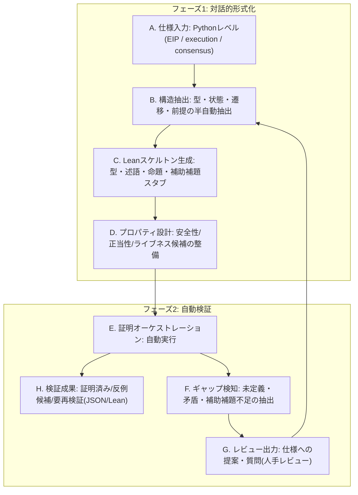
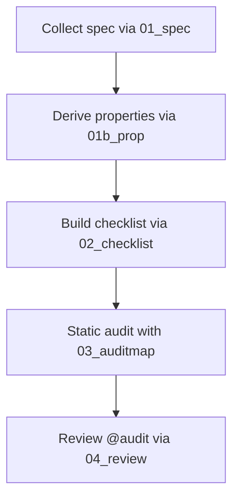
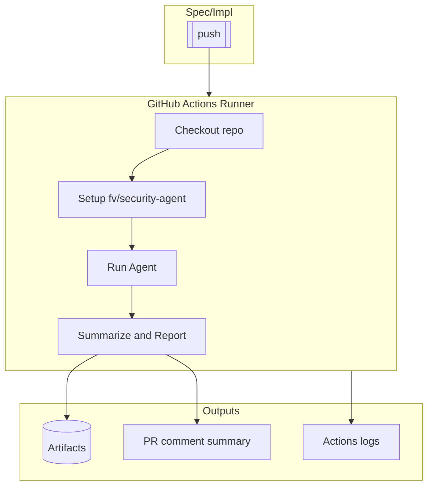

# Proposal: Ethereum Protocol Security Agents

This is the Proposal for: [Integrating Large Language Models (LLMs) into Ethereum Protocol Security Research](https://notes.ethereum.org/NhqWcKi1R1ure-eA8EfGsQ).

## Vendor Background

Nyx Foundation は、Ethereum プロトコルの安全性向上に特化した非営利リサーチ組織です。

LLM を中核に据えた 監査エージェントと形式検証エージェントを運用し、仕様（EIP/consensus spec）と実装（各クライアント）のズレを機械的に検出するパイプラインを構築しています。近年は Fusaka 監査コンテストで 15件超の有効バグを報告しました。

あわせて Erigon/Nimbus などへの報告、Geth/Reth への PR、SP1 zkVM・Intmax zkRollup 等でのバグ報告にも取り組み、LLM×監査の実務適合性を高めています。

形式検証では、Lean ベースの検証エージェントを開発し、lean Consensus で用いられる TSLエンコーディングの一部安全性証明を形式化。Cambridge大学で開かれたPQ InterOpで発表・議論し、EF 形式検証チームからのフィードバックを取り込み継続改良中です。

Website: https://nyx.foundation

---

## Technical Approarch

### Agent Workflow Overview

本提案のエージェントは、仕様と実装の両方に潜むバグを発見するための二層構成です。

**レイヤー1：Lean 形式検証エージェント**

* 仕様(EIP/execution spec/consensus spec)を入力に、安全性プロパティをLeanで定式化。
* 成果物: Lean ソース、証明ログ。

**レイヤー2：監査エージェント**

* 各クライアント実装に対してコード解析を走査。
* EIPスペックを入力として、仕様の理解から脆弱性仮説の立案、チェックリスト化、コード監査、レビュー完了までを連続したフローで支援。
* 成果物: コードへの監査コメント。

**ワークフローの特性**

* 追従性: 仕様変更に強い。機械可読な SPEC/PROP を更新すれば、下流のチェックリストと監査が自動で再構成。
* 再現性: 検出根拠は JSON と最小 PoC／差分で残るため、CI で自動再検証が可能。
* 誤検知抑制: 信頼境界プリセット（例：EL を信頼/非信頼）、逆チェックリスト（“ここが通っていればOK”）、ダブルチェックでノイズを削減。
* 横展開: 非専門家でもバグ抽出が可能。複数クライアント間で知見を即時伝播。
* 統合容易性: Codex / Claude Code / Cursor 等のCLIモデルで動作するため、GitHub Actions にも容易に統合可能。
* 説明可能性：`SPEC → PROP → CHECKLIST → AUDITMAP → PoC/パッチ`の一気通貫な監査線形を維持。

この構成により、「プロトコル仕様の変更」と「実装側の差分」の双方に強く、短時間での高再現・低ノイズな検出を実現します。

---

### Lean形式検証エージェントのアプローチ

前提として、EIP 提案者が Python レベル(execution spec / consensus spec)の仕様を書き終えた段階を想定します。

本エージェントは、その仕様を機械可読な安全性検証の土台に持ち上げ、Lean による形式検証へ橋渡しします。機能は次の二つのフェーズで構成されます。

- **フェーズ1: 対話的仕様形式化** — Python 仕様を読み取り、Lean の定義・述語・命題・補助補題のスケルトンを生成し、人間との対話で穴を詰める。
- **フェーズ2: 自動的形式検証** — 定義済みの述語や不変量に対して、Lean で自動/半自動に証明や反例探索を行う。


監査エージェントは各 Ethereum クライアント実装リポジトリで動作する一方、本エージェントは execution spec / consensus spec のリポジトリ側で独立に動きます。両者は JSON などの生成物で疎結合に連携します。

#### 設計原則(抽象ルール)
1. **一次仕様を唯一の参照点に保つ**  
   EIP / 公式 SPEC だけをソース・オブ・トゥルースとみなし、Lean 側では「何を仮定し、何を証明するか」を最小の仮定セットで宣言する。
2. **抽象度の合意を対話で固める**  
   自動生成した Lean スケルトンには意図的にギャップを残し、定義候補や境界条件を提示しながら人間レビューで精度を上げる。
3. **検証過程を機械可読な証跡で固定する**  
   証明ログ/失敗ログ/反例候補/未定義点をすべて JSON に記録し、CI から同じステップを再走可能にする。
4. **成果物を段階ごとに疎結合で受け渡す**  
   `SPEC → PROP → PROOF` を分離した生成物として保存し、Lean 側・監査側が相互に独立して進化できるようにする。
5. **自動化レベルをフェーズ別に最適化する**  
   形式化フェーズでは半自動対話を基本とし、証明フェーズでは自動証明・反例探索の比率を最大化して人手のボトルネックを分離する。

#### ワークフロー(仕様→形式化→証明→連携)



#### フェーズ1: 対話的仕様形式化のアプローチ

##### 目的

Python レベル(execution spec / consensus spec)の記述を、数学的に検証可能なドメイン(型・述語・不変量・推移則)へ持ち上げ、Lean での証明対象(命題と補助補題)のスケルトンを人間と対話しながら確定していく。形式的“定義の正しさ”と“仕様の意図”を同時にすり合わせるため、半自動(LLM支援)＋ヒューマンレビューの反復を前提とする。

##### 難所と方針

- 仕様の曖昧さ(境界条件、失敗時挙動、時刻/フォーク条件など)を必ず明示化し、未決定点として残す。曖昧さは“検証不能コスト”として可視化する。
- 実装依存の詳細を持ち上げすぎない。最小の抽象(状態・遷移・観測可能量)でモデル化し、追加の現象は拡張点として残す。
- セキュリティ前提(信頼境界・敵能力)は先に固定し、以後の定義/命題に影響を与える“グローバル前提”として追跡する。

##### 進め方(反復サイクル)

1. 仕様構造の抽出(対話)
   - 型と状態: 主要レコード・配列・マップ・暗号プリミティブ等を抽象型に射影。
   - 事象と遷移: プロトコルのステップ(例: 検証・承認・更新)を遷移規則に整理。
   - 前提と境界: 信頼境界、フォーク条件、資源上限、失敗時のロールバックなどを列挙。
2. プロパティ設計(候補生成 → 審査)
   - 安全性、正当性を候補化。
   - それぞれに対して状態述語/不変量の初稿を作成し、反例シナリオの雛形を併記。
3. Lean スケルトン自動生成(ギャップを残す)
   - `def/structure/inductive` による型・状態・遷移の定式化スケルトンを生成。
   - 命題(theorem/lemma)の型だけを確定し、証明本体は `sorry` 等のギャップとして明示保存。
   - 非形式 Markdown も自動生成し、数式レベルの意図と Lean 定義の対応を横に置く。
4. ギャップ可視化と審査(人間が意思決定)
   - 未定義点・矛盾・境界の未確定箇所は JSON(例: `gaps.json`)に集約し、解決の優先度を付す。
   - レビューでは“仕様として許容する/しない”を決め、必要なら仕様側へ差し戻す提言を生成。
5. 収束基準と次段(自動検証)への引き渡し
   - 型・遷移・主要不変量のコアが安定し、命題の前提が同意済みであれば、フェーズ2の自動的形式検証へ移行。

#### フェーズ2: 自動的形式検証のアプローチ

##### 概要

形式化された命題に対して、安全性・正当性の証明の自動化を試みます。証明成功時は証明済み成果物として、失敗時は反例候補や未解決点として JSON で出力し、CI による再検証を可能にします。

特徴は以下です。

- 非形式的証明と形式的証明を、それぞれの強みを活かす形で組み合わせたアプローチ
- 分割統治の原則のもと、命題を小さな補助補題に分解することで証明成功の精度向上
- 査読フェーズを明示的に入れることで、形式化の正確性と証明の妥当性を向上
- TypeScriptで実装したマネジメント実装によるルールベースのエージェント制御
- DDDベースのモジュール設計により、今後の拡張性を確保

##### 技術スタック

- LLM agent: OpenAI Codex CLI
    - model: gpt-5
    - reasoning: high
- Formal proof language: Lean with Mathlib, VCV-io, ArkLib
- Informal proof language: Markdown
- State management tool: TypeScript with Prisma, SQLite

##### 全体フロー


##### 1. 非形式証明執筆フェーズ
やること: 必要ならば補助補題を抽出し、焦点定理の非形式証明を執筆する。

具体的なプロンプト例: 
```markdown
Please rigorously and precisely review the informal proof of the Focal (Artifact) Theorem written in the previous turn.

Finally, summarize the results and what you did in a report, and update the progress as well.

- Informal focal theorem file to review: {informal focal theorem file}
- Newly created Focal Stub Lemma informal files: {informal focal lemma files}
- Report output location: `metas/exploration/r{{round num}}/t{{turn num}}-report.md`
  Lead with the verdict and list specific edits/risks.

The report must start with the conclusion and clearly state which of the following it is:

- accept
- minor revision
- major revision

### Commands You Must Run

Apply the verdict consistently to the focal theorem and all focal lemmas:

- `pnpm -s focal:informal:review --review <accepted|minor_revision|major_revision>`
- `pnpm -s turn:finish:ir`

Do not edit any DOT/graph files; TopSingleLayer Lean/Markdown files are authoritative and the dependency graph is derived from their imports. The DB stores minimal state only.
```

##### 2. 非形式証明執筆フェーズ
やること: 前ターンの非形式証明を査読し、受理/修正の判定と、修正ならば具体的な修正指示を確定する。

具体的なプロンプト例:
```markdown
Please rigorously and precisely review the informal proof of the Focal (Artifact) Theorem written in the previous turn.

Finally, summarize the results and what you did in a report, and update the progress as well.

- Informal focal theorem file to review: {informal focal theorem file}
- Newly created Focal Stub Lemma informal files: {informal focal lemma files}
- Report output location: `metas/exploration/r{{round num}}/t{{turn num}}-report.md`
  Lead with the verdict and list specific edits/risks.

The report must start with the conclusion and clearly state which of the following it is:

- accept
- minor revision
- major revision

### Commands You Must Run

Apply the verdict consistently to the focal theorem and all focal lemmas:

- `pnpm -s focal:informal:review --review <accepted|minor_revision|major_revision>`
- `pnpm -s turn:finish:ir`

Do not edit any DOT/graph files; TopSingleLayer Lean/Markdown files are authoritative and the dependency graph is derived from their imports. The DB stores minimal state only.
```

##### 3. 形式証明執筆フェーズ
やること: 非形式証明を参照して、焦点定理の形式証明と補助補題の形式化を行う。

具体的なプロンプト例:
```markdown
Apply the Divide‑and‑Conquer method to the Focal (Artifact) Theorem and carry out the formal proof.

Goal

- Complete the focal theorem proof (no `sorry` in the focal file) while allowing Focal Stub Lemmas to remain as stubs (`sorry`).
- `lake build` must pass.

Guidelines

- If helpers are needed, introduce them as separate lemmas (Focal Stub Lemmas) that correspond to the informal side.
- Keep lemma statements minimal; proofs can be `sorry` until later rounds.

File naming and paths

- Never invent ad‑hoc names. Lemmas are numbered and map to `TopSingleLayer/LemNN.lean`.
- You can compute the path from the lemma key: `Lem${nn}.lean` where `nn` is the zero‑padded key.
- For the focal theorem, use `TopSingleLayer/Thm.lean`.

Single‑lemma‑per‑file policy

- Each `LemNN.lean` must define exactly one top‑level lemma. Put additional helpers in their own numbered files.

Build rule

- Whenever you create a new Lean file under `TopSingleLayer/`, add `import TopSingleLayer.<NewModule>` to `TopSingleLayer.lean`.

Report

- Summarize what was formalized, what remains as stubs, any deviations from the informal text, and build status.
- Output: `metas/exploration/r{{round num}}/t{{turn num}}-report.md`

### Commands You Must Run

Minimal sequence for this turn:

- `pnpm -s focal:formal:writing`
- `pnpm -s turn:finish:fw`

Do not edit any DOT/graph files; TopSingleLayer Lean/Markdown files are authoritative and the dependency graph is derived from their imports. The DB stores minimal state only.
```

##### 4. 形式証明査読フェーズ
やること: 前ターンの結果を査読し、受理/修正の判定と、修正ならば具体的な修正指示を確定する。

具体的なプロンプト例:
```markdown
Please rigorously and precisely review the formal proof of the Focal (Artifact) Theorem written in the previous turn.

Finally, summarize the results and what you did in a report, and update the progress as well.

- Formal focal theorem file to review: `TopSingleLayer/Thm.lean`
- Newly created Focal Stub Lemma files: `TopSingleLayer/LemNN.lean` as needed (use lemma keys)
- Informal focal theorem file: `TopSingleLayer/thm.md`
- Informal lemma files: `TopSingleLayer/lemNN.md`
- Report output location: `metas/exploration/r{{round num}}/t{{turn num}}-report.md`
  Apply state transitions via the DDD CLI (see below).

The report must start with the conclusion and clearly state which of the following it is:

- accept
- minor revision
- major revision

Build check

- If any new Lean files were added in the previous turn, verify that they are also imported in `TopSingleLayer.lean` via `import TopSingleLayer.<NewModule>` so that Lake compiles them.
- Enforce single-lemma-per-file: each lemma file (`TopSingleLayer/LemNN.lean`) must define exactly one top-level lemma. If a reviewed file defines two or more lemmas, treat this as a required modification and explicitly state in the report how to split them (proposed new files, updated imports, and which lemma remains in the original file).

### Commands You Must Run

Apply the verdict consistently to the focal theorem and all focal lemmas:

- `pnpm -s focal:formal:review --review <accepted|minor_revision|major_revision>`
- `pnpm -s turn:finish:fr`

Do not edit any DOT/graph files; TopSingleLayer Lean/Markdown files are authoritative and the dependency graph is derived from their imports. The DB stores minimal state only.
```

##### 5. 形式証明同期フェーズ
やること: 受理済みの形式結果に合わせて非形式側を更新・不要Markdownを整理し、ラウンドを完了とする。

具体的なプロンプト例:
```markdown
Update the informal proof by referring to the accepted formal proof of the Focal (Artifact) Theorem.

Since the formal proof guarantees greater rigor, the goal is to refine the informal proof based on it.

However, in the Informal Proof Subphase, some parts that were not broken down into smaller proofs may later be divided and proven separately in the Formal Proof Writing Stage.

In such cases, even if certain items in the Informal Proof are still in a Pending or Approved state, refine them based on the latest formal result. Only finalize the informal side if the formal side is approved; Formal Sync synchronizes them to completed.

Finally, summarize the results and what you did in a report, and update progress accordingly (finalize the informal side only if the formal side is finalized).

- Informal files to update:
  - Focal theorem: `TopSingleLayer/thm.md`
  - Lemmas: `TopSingleLayer/lemNN.md`
- Formal files to reference:
  - Focal theorem: `TopSingleLayer/Thm.lean`
  - Lemmas: `TopSingleLayer/LemNN.lean`
- Report output location: `metas/exploration/r{{round num}}/t{{turn num}}-report.md`
  State transitions are applied via the DDD CLI (see below).

Build note

- If any new Lean files were created earlier in the round, ensure they are imported in `TopSingleLayer.lean` (`import TopSingleLayer.<NewModule>`) so `lake build` compiles them.

Mapping cleanup (formal vs informal)

In some rounds, the Informal Writing phase may have introduced more focal stub lemmas than the final formal structure actually uses (e.g., two informal stubs but only one formal lemma was ultimately created). During Formal Sync, prune the informal Markdown to match the accepted formal result:

- Compare `TopSingleLayer/LemNN.lean` and `TopSingleLayer/lemNN.md` for the current focal batch.
- For any `lemNN.md` that has no corresponding `LemNN.lean`, delete the extra Markdown file and remove references to it (e.g., from `TopSingleLayer/thm.md`).
- If multiple informal stubs are subsumed by a single formal lemma, consolidate the informal exposition under the surviving lemma’s `lemNN.md` (or fold brief notes into `thm.md` when more natural), then remove the extras.
- Perform this cleanup before running the commands below so finalization reflects the correct mapping.
- Briefly record the cleanup (files removed/renamed and rationale) in the FS report.

### Commands You Must Run

Minimal sequence for this turn:

- Perform mapping cleanup (if needed), then:
- `pnpm -s focal:formal:sync`
- `pnpm -s turn:finish:fs`

Do not edit any DOT/graph files; TopSingleLayer Lean/Markdown files are authoritative and the dependency graph is derived from their imports. The DB stores minimal state only.
```

---

### 監査エージェントのアプローチ

監査エージェントは、プロのホワイトハッカーがセキュリティレビューで辿る思考と手続きを自動化パイプラインとして再構成したものです。仕様の理解から脆弱性仮説の立案、チェックリスト化、コード監査、レビュー完了までを連続したフローで支援します。

**特徴 / アプローチ**
- **仕様駆動:** EIP や公式ドキュメントを含む一次情報を基に、信頼境界・ユーザーフロー・アルゴリズムを正確に抽出し、監査対象を明確化します。
- **プロパティ中心:** 正常系プロパティと対となるアンチプロパティを定義し、既知のバグ類型にマッピングすることで攻撃シナリオを列挙します。
- **自動化されたチェックリスト:** プロパティごとに静的解析や動的検証の手順、観測指標、想定攻撃チェーンを紐付け、再現性の高い監査タスクを生成します。
- **静的監査とフィードバック:** チェックリストをもとにソースコードを走査し、証跡付きの `@audit` コメントと JSON ログを蓄積します。レビュー段階で結果を精査し、`@audit-ok` へ反映して監査マップを更新します。
- **継続適応:** JSON 生成物を介して各工程が疎結合に保たれているため、仕様変更やファイル構造の差異にも追従できます。

監査パイプラインは次のステージで構成されます:



#### 1. Preparation
目的: 監査の土台となる仕様情報と安全性要求を整備し、後続工程で参照できる共通コンテキストを確立する。

##### 1-a. Spec Generation
目的: プロジェクト仕様を構造化し、信頼境界・ユーザーフロー・主要アルゴリズムを完全に把握する。
`input`: `対象プロジェクトのソースディレクトリ、CATEGORYで指定されたドメイン要件、参照URLなどの一次情報源。`
`output`: `security-agent/outputs/01_SPEC.json（metadata に収集条件を記録し、domains/user_flows/algorithms でドメイン別の信頼関係と手順を定義した仕様ドキュメント）`
```json
{
  "metadata": {
    "project_name": "string",
    "spec_generated_at": "RFC3339 timestamp",
    "source_directory": "string",
    "reference_urls": ["string"],
    "notes": "string"
  },
  "domains": [
    {
      "id": "string",
      "name": "string",
      "trusted_entities": ["string"],
      "user_flows": ["FLOW_REF"],
      "algorithms": ["ALGO_REF"],
      "metadata": {
        "sources": ["string"],
        "notes": "string"
      }
    }
  ],
  "user_flows": [
    {
      "id": "string",
      "title": "string",
      "actors": ["string"],
      "preconditions": ["string"],
      "steps": ["string"],
      "postconditions": ["string"],
      "sources": ["string"]
    }
  ],
  "algorithms": [
    {
      "id": "string",
      "title": "string",
      "inputs": ["string"],
      "procedure": ["string"],
      "trust_dependencies": ["string"],
      "outputs": ["string"],
      "sources": ["string"]
    }
  ]
}
```
この JSON は metadata にクロール条件・引用元・生成時刻を、domains にドメイン別の信頼主体と関連フロー/アルゴリズムを、user_flows と algorithms にノーマティブな手順詳細を保持する。

Algorithm:
1. 指定された TARGET_DIRECTORY と参照 URL をクロール対象として列挙し、CATEGORY で許可されたドメインのみを抽出する。
2. 抽出した資料から trusted_entities・user_flows・algorithms をそれぞれ正規化し、引用元とともに一次データセットを構築する。
3. user_flows に対して actors・preconditions・steps・postconditions を順序保持で整理し、ID を採番する。
4. algorithms について inputs・procedure・trust_dependencies・outputs を手続きレベルで分解し、ドメイン参照を付与する。
5. metadata にクロール起点、取得タイムスタンプ、参照 URL、備考を記録し、domains と user_flows/algorithms 間の参照整合性を検証する。
6. すべての要素を RFC3339 時刻基準で `security-agent/outputs/01_SPEC.json` に書き出し、既存ファイルを置き換える。

##### 1-b. Security Property Generation
目的: 仕様で定義された行動を安全性プロパティとアンチパターンに変換し、検証可能なセキュリティカタログを構築する。
`input`: `最新の01_SPEC.jsonで定義されたドメイン別仕様と、対応するアーキテクチャ資料・参照URL。`
`output`: `security-agent/outputs/01_PROP.json（metadata に生成メタデータ、properties にプロパティ/アンチプロパティのタプル、coverage にカバレッジ指数を保持する安全性カタログ）`
```json
{
  "metadata": {
    "project_name": "string",
    "spec_generated_at": "RFC3339 timestamp",
    "prop_generated_at": "RFC3339 timestamp",
    "stale": "boolean",
    "sources": ["string"],
    "notes": "string"
  },
  "properties": [
    {
      "property_id": "string",
      "property": "string",
      "anti_property": "string",
      "state_predicate": "string",
      "enforcement_scope": ["string"],
      "falsification": {
        "static": ["string"],
        "dynamic": ["string"],
        "expected_counterexample_signal": "string",
        "budget": {
          "timeout_s": "number",
          "max_cases": "number",
          "seed": "string"
        }
      },
      "observability": {
        "signals": ["string"],
        "alert_rules": ["string"],
        "thresholds": ["string"]
      },
      "testing_hooks": [
        {
          "command": "string",
          "env": {
            "KEY": "value"
          }
        }
      ],
      "parity_vectors": ["PARITY_VECTOR_REF"],
      "spec_refs": ["string"],
      "trust_scope": "trusted|conditionally_trusted|untrusted",
      "criticality": {
        "impact": "low|medium|high|critical",
        "likelihood": "low|medium|high"
      },
      "confidence": "low|medium|high",
      "status": "verified|pending-detail|needs-refresh|error",
      "notes": "string"
    }
  ],
  "coverage": {
    "summary": {
      "domains_total": "integer",
      "flows_total": "integer",
      "flows_covered": "integer",
      "algorithms_total": "integer",
      "algorithms_covered": "integer",
      "state_machines_total": "integer",
      "state_machines_covered": "integer"
    },
    "gaps": [
      {
        "type": "domain|flow|algorithm|state_machine",
        "id": "string",
        "reason": "string",
        "status": "pending-detail|needs-refresh"
      }
    ]
  }
}
```
この JSON は metadata に生成タイムスタンプと参照ソース、properties に各安全性プロパティの検証条件と優先度、coverage に仕様要素の網羅状況を集約する。

Algorithm:
1. `security-agent/outputs/01_SPEC.json` を読み込み、domains・user_flows・algorithms を基にプロパティ候補を列挙する。
2. 各候補について property/anti_property と state_predicate/enforcement_scope を定義し、spec_refs と trust_scope を紐付ける。
3. falsification セクションに静的解析クエリや動的テスト手順を設計し、expected_counterexample_signal と budget を設定する。
4. observability・testing_hooks・parity_vectors をプロパティ毎に設計し、検証コマンドと証跡指標を記述する。
5. metadata に spec_generated_at との差分から stale フラグを計算し、criticality・confidence・status を評価基準に沿って割り当てる。
6. coverage.summary を算出し、未カバーのドメイン/フロー/アルゴリズムを gaps に追加したうえで `security-agent/outputs/01_PROP.json` を出力する。

#### 2. Checklist Generation
目的: プロパティカタログを実務的な監査タスクへ展開し、網羅的かつ再現可能な検証手順を整備する。
`input`: `プロパティカタログに定義された安全性プロパティ群、仕様情報、過去のインシデント記録や既存チェックリスト。`
`output`: `security-agent/outputs/02_CHECKLIST.json（metadata に生成状況、checklist_items にプロパティ別の検証手順や観測条件を格納する監査チェックリスト）`
```json
{
  "metadata": {
    "project_name": "string",
    "generated_at": "RFC3339 timestamp",
    "mode": "create|append",
    "schema_version": "string",
    "property_catalog_generated_at": "RFC3339 timestamp",
    "sources": ["string"],
    "coverage_summary": {
      "total_properties": "integer",
      "covered_properties": "integer",
      "missing_properties": ["PROPERTY_ID"],
      "property_id_mismatches": [
        {
          "check_id": "string",
          "seen_property_id": "string",
          "canonical_property_id": "string"
        }
      ]
    },
    "gaps": "string"
  },
  "checklist_items": [
    {
      "id": "string",
      "property_id": "string",
      "title": "string",
      "bug_class": "string",
      "risk_category": "integrity|availability|confidentiality|economic|compliance",
      "severity_hint": "low|medium|high|critical",
      "trust_scope": "trusted|conditionally_trusted|untrusted",
      "domains": ["string"],
      "languages": ["string"],
      "file_globs": ["string"],
      "attack_playbook_tags": ["string"],
      "attack_chain": {
        "prerequisites": ["string"],
        "combinators": ["string"]
      },
      "static_detectors": [
        {
          "tool": "string",
          "rule": "string",
          "command": "string",
          "notes": "string"
        }
      ],
      "patterns": ["string"],
      "detection_procedure": ["string"],
      "executable_checks": [
        {
          "command": "string",
          "expected_signal": "string"
        }
      ],
      "evidence_probes": [
        {
          "source": "string",
          "signal": "string",
          "expectation": "string"
        }
      ],
      "ok_if": ["string"],
      "not_ok_if": ["string"],
      "parity_vectors": ["PARITY_VECTOR_REF"],
      "bad_path_library": ["string"],
      "notes": "string",
      "version": "string",
      "revision_notes": "string",
      "references": ["string"],
      "status": "todo|in-progress|done"
    }
  ]
}
```
この JSON は metadata に生成メタ情報とカバレッジ統計を、checklist_items に各プロパティへ対応づけた検証パターン・攻撃連鎖・実行コマンド・証跡条件を格納する。

Algorithm:
1. プロパティカタログから property_id を列挙し、各 ID に紐づく検証目的とリスクカテゴリを決定する。
2. 各 property_id について静的検知ルール・detection_procedure・executable_checks・evidence_probes を設計し、信頼スコープと ok_if/not_ok_if を埋める。
3. attack_playbook_tags と attack_chain を過去インシデントや既知攻撃パターンから補強し、bad_path_library を構築する。
4. 既存の `security-agent/outputs/02_CHECKLIST.json` があれば `(id, property_id)` 単位でマージし、version と revision_notes を更新する。
5. metadata.coverage_summary を計算し、missing_properties と property_id_mismatches を記録して整合性を担保する。
6. metadata.gaps にブロッカーや追加資料の必要性を記述し、完成したオブジェクトを `security-agent/outputs/02_CHECKLIST.json` に保存する。

#### 3. Static Audit
目的: チェックリストをもとにコードベースへ静的検査を仕掛け、潜在的な脆弱性や調査項目を体系的に収集する。
`input`: `チェックリストで定義された検証手順、プロパティ/アンチプロパティ、対象コードベース全体（PATH指定）。`
`output`: `security-agent/outputs/03_AUDITMAP.json（audit_items に調査結果、summary にリスク統計を append する継続的な監査ログ／コード側には @audit コメント例（// @audit Reentrancy: external call before state lock）を追記）`
```json
{
  "audit_items": [
    {
      "id": "string",
      "check_id": "string",
      "file": "string",
      "line": "integer",
      "snippet": "string",
      "risk_category": "integrity|availability|confidentiality|economic|compliance",
      "severity": "low|medium|high|critical",
      "property": "string",
      "anti_property": "string",
      "static_detector": "string",
      "executable_property": "string",
      "evidence_probe": "string",
      "attack_chain": ["string"],
      "attack_chain_score": "number",
      "observability": "string",
      "status": "vuln|needs-investigation",
      "round": "integer",
      "call_stack": ["string"],
      "evidence": "string",
      "notes": "string",
      "tags": ["string"]
    }
  ],
  "summary": {
    "path": "string",
    "audit_items_total": "integer",
    "vuln_count": "integer",
    "needs_investigation_count": "integer",
    "high_risk_hotspots": ["string"],
    "next_focus": "string"
  }
}
```
この JSON は audit_items に個別ファインディングの根拠・攻撃連鎖・観測状況を、summary に対象パスと統計サマリを保持し、監査ラウンドごとに追記する。

Algorithm:
1. 監査対象 PATH を再帰的に走査し、checklist_items の file_globs・languages をトリガに解析対象ファイルを決定する。
2. 各ファイルに対して該当チェックを適用し、検出したスニペットと property/anti_property の対応関係を評価する。
3. 見つかった事象ごとに attack_chain・attack_chain_score・observability を算出し、evidence や call_stack を抽出する。
4. 生成したファインディングに対して `@audit` コメントをコードへ挿入し、複合キー `<check_id>|<file>|<line>|hash(snippet)>` で重複を排除する。
5. summary を更新し、vuln_count・needs_investigation_count・high_risk_hotspots を再計算したうえで JSON を append モードで保存する。
6. 追加で parity_vectors や executable_property が存在する場合は対応するテストを実行し、結果を notes と evidence に反映する。

#### 4. Review audits
目的: 収集済みの監査結果を精査し、リスクの確定・解消・フォローアップ指示を体系化して監査マップへ反映する。
`input`: `既存の監査マップ項目、チェックリストの受容条件、仕様、実際のソースコードと関連外部情報。`
`output`: `更新済み security-agent/outputs/03_AUDITMAP.json とコード内の @audit / @audit-ok コメント（audit_items に審査結果、summary にレビュー統計を反映／解消済み箇所には @audit-ok コメント例（// @audit-ok Reentrancy: guarded by nonReentrant）を追記）`
```json
{
  "audit_items": [
    {
      "id": "string",
      "check_id": "string",
      "file": "string",
      "line": "integer",
      "snippet": "string",
      "risk_category": "string",
      "severity": "string",
      "property": "string",
      "anti_property": "string",
      "status": "vuln|needs-investigation|ok",
      "proof_trace": ["string"],
      "review_round": "integer",
      "notes": "string"
    }
  ],
  "summary": {
    "rounds": "integer",
    "total_audit_flags": "integer",
    "high_risk_hotspots": ["string"],
    "next_focus": "string"
  }
}
```
この JSON は audit_items にレビュー後のステータスと証跡、summary に審査ラウンドと優先フォーカスを集約し、最新状態を反映する。

Algorithm:
1. `security-agent/outputs/03_AUDITMAP.json` を読み込み、ファイル/行番号順に audit_items を走査する。
2. 各項目の原コード位置を開いてガード条件と実行経路を再確認し、チェックリストの ok_if/not_ok_if を参照する。
3. リスクが解消済みであると判断した場合はソースコメントを `@audit-ok` に更新し、該当 audit_item を削除する。
4. 継続リスクについては proof_trace を呼び出し経路で更新し、severity や notes を最新情報に合わせて強化する。
5. summary.rounds と total_audit_flags を再計算し、high_risk_hotspots と next_focus をアップデートする。
6. 追加調査が必要な項目には status を `needs-investigation` に維持したまま観測計画を notes に追記し、更新後の JSON を保存する。

---

### System Architecture

GitHub Actions（[Codex GitHub Action](https://github.com/openai/codex-action)）上で起動し、Lean形式検証エージェントと監査エージェントを並列で実行します。

Lean形式検証エージェントはexecution-specs / consensus-specsレポジトリ上で動作します。

監査エージェントはGeth / Lighthouse 等のクライアント実装レポジトリ上で動作します。

成果物は Artifacts や PR コメントとして可視化され、必要に応じて bot がリポジトリへコミットします。



---

## Deliverables
1. **Technical Architecture & Design**
   - An overview of how the proposed system ingests specifications, analyzes code, and reports discrepancies.
2. **Prototype / Proof of Concept**
   - Demonstrate the end-to-end workflow on at least one Ethereum client.
3. **Integration Guidelines**
   - Documentation on how to integrate the solution into a GitHub CI/CD pipeline.
5. **Documentation**
   - Clear instructions for setup, maintenance, and extension.

---

## Project Plan & Timeline

- **Phase 0 (~11/15)**: テクニカルアーキテクチャと設計を作成する。
- **Phase 1（〜11/30）**: ローカル上で動作する監査エージェントのプロトタイプを作成し、実行を行う。
- **Phase 1（〜12/31）**: データインテグレーション、GitHub Actions、インタフェースを実装してE2Eでプロトタイプを動作するようにする。
- **Phase 2（〜1/31）**: 形式検証エージェントを統合する。
- **Phase 3（〜2/28）**: 各エージェントのチューニングを行い精度向上を図る。ドキュメントを準備し、最終成果物とする。

---

## Team

| 名前              | 所属                              | 専門/学位               | 主な実績                                                       | 本グラントでの役割                           |
| --------------- | ------------------------------- | ------------------- | ---------------------------------------------------------- | ----------------------------------- |
| Masato Tsutsumi | Nyx Foundation                  | 暗号学修士               | EFと共同でMPC研究／zkVMベンチマーク研究がZKProof7採択／AI監査エージェントによる有効報告10件以上 | 監査エージェント実装、インタフェース設計、CI統合、チームマネジメント |
| Banri Yanahama  | Nyx Foundation                  | 機械学習修士              | MLエンジニアとして5年以上の実務／イーサリアム関連研究                               | 形式検証エージェントの実装                       |
| Akiyoshi Sannai | Nyx Foundation、Kyoto University | （特定）准教授、LLM/プログラム検証 | ProverAgentを開発                                             | LLM性能向上のための技術アドバイス                  |

---

## Budget & Cost Structure

* 開発費 (3名): 10k USD / month
* LLM課金: 200 USD / month
* GitHub Actions: ~5 USD / month

Total (4months): 42.4k USD

---

## References or Case Studies

### 1. Fusaka 監査コンテスト（[Sherlock #1140](https://audits.sherlock.xyz/contests/1140?filter=judging)）

監査エージェントを用いて9～10月に開催されたFusaka監査コンテストに参加を行い、20件以上もの仕様逸脱／境界条件／可用性（DoS）／互換性（フォーク・バージョン移行）等の有効なバグを発見しました。

ここでの参加を踏まえてエージェントをアップデートしたものが本提案の監査エージェントのアプローチになります。

**背景 / アプローチ（セキュリティエージェントの3方針）**

* **方針A：code-analysis**
  仕様・境界条件・信頼前提を前提に、静的/準静的なコード読解で到達性・例外経路・入力検証（長さ/上限/範囲）・署名/証明検証・フォーク条件を重点確認。ガード欠落や不整合、上限分離（スロット/列/blob）の誤りを特定。
* **方針B：fuzz-test**
  ByRange/ByRoot系ハンドラやデコーダ、保持境界/広告経路に対してプロパティベース/差分/境界値**ファズを実施。**サイズ上限・レート制御・OOM/CPUスパイクのリソース特性も併せて観測し、再現最小PoCを生成。
* **方針C：similar-issue-based-code-analysis**
  既知バグの型（保持境界更新漏れ／範囲チェック欠落／署名検証抜け／フォークガード欠落／旧形式再利用）をテンプレ化し、該当パスへ機械的に当て込み。チェックリストに沿うだけで非技術者でも候補抽出が可能で、自動化スクリプト化の見通しを得た。

**検出できたバグの例**

* **保持境界の不整合**：`earliest_available_slot` 等の境界を起点でなく終端に誤用／更新後の広告が古い。
* **範囲リクエストの境界チェック漏れ**：ByRange/ByRoot系で保持外や上限超過を弾けず、帯域・CPUを浪費。
* **上限管理の誤設計**：スロット数・列数・blob数の独立上限が未分離で合算超過を許容。
* **署名検証の抜け**：KZG検証のみで提案者署名を省略し偽造データの混入余地。
* **フォーク境界ガード欠落 / 互換性移行の取りこぼし**：フォーク条件の早期return不足／旧形式キャッシュ再利用で整合性崩れ。

**偽陽性になったバグの特徴（主要因）**

* **脅威境界のミスマッチ**：エージェント側がEL“非信頼”前提で警告、審査側はELを信頼前提とする規約。
* **非到達コードの評価**：ビルドから外れたコードパスでもチェックリストが作動し、実害無し案件を拾う。
* **既知課題/修正済みとの重複**：Issue/PRやコミットに対する自動照合が弱く、重複報告が発生。
* **モック依存の誤評価**：本番ガードがテストにのみ露出し、モック環境での挙動を過大評価。

**得られた知見**

- code-analysis手法で見つかったほとんどのバグはSPECファイルに記載されたセキュリティ要件や攻撃パスに関するものだった。つまり、コードとバグの対応表チェックリストを網羅的に作成することができれば、同じバグを発見できる可能性が高い。
- 類似イシュー横断探索（similar-issue）手法では、非技術者が作業しても多くの有効なバグを発見することができた。特にイーサリアムはクライアント実装が11もあるので、既存バグパターンをDB化し、他クライアントで見つかったバグをいち早く見つける方針が効いた。

**この結果を受けたエージェントの改善方針**

* **信頼境界プリセット**：ELからのメッセージは信頼するといった信頼前提を/01_specに明記。誤りがないか人間がレビューしてから次に進む。
* **チェックリストの網羅**：既知バグやアーキテクチャをもとに「このコードが現れたらこのバグがないか疑う」というチェックリストを作成し、そのリストに沿ってコード監査を行う。また、多重境界による防御があることを見越して、「ここがチェックされていたら安全」という逆チェックリストも併せて作成し、誤検知を防ぐ。

---

### 2. クライアント貢献（PR / 報告の方向性）

Fusaka以前にも監査エージェントを使用してバグを特定し、修正や報告を行いました。

* Geth ([PR#32344](https://github.com/ethereum/go-ethereum/pull/32344))：GraphQLのメッセージ深さ上限を提案
* Erigon ([PR#16255](https://github.com/erigontech/erigon/pull/16255)): WebSocketのパケット上限チェックを提案
* Erigon (Bug Bounty): NEW_POOLED_TRANSACTION_HASHES_66メッセージのOOMバグを報告
* Nimbus (Bug Bounty): Blobサイドカー滞留バグを報告

---

### 3. 形式検証エージェントによるTSLエンコーディングの形式化

leanConsensusで検討されているハッシュベースの署名方式XMSSで用いられるTSLエンコーディングのLean形式検証を自動生成しました。

リポジトリ：https://github.com/NyxFoundation/tsl-formal-verification

10月にケンブリッジ大学で開催されたPQ InterOpで発表し、EF形式検証チームからフィードバックを得ました。今も継続的にEFチームとの議論を続け、改善を行っています。

形式検証エージェントのフェーズ1とフェーズ2のうち、フェーズ2（自動的形式検証）は本件で実績を重ねており、同等クラスの安全性検証は短期間で再現できる見込みです。

一方、フェーズ1（対話的仕様形式化）は既存の表現(Python 仕様)を数理的定式化へ持ち上げる設計が核心であり、未知が多い領域です。ただし、我々はEthereum仕様とその周辺で要請される暗号プロトコル、コンピュータサイエンスの知見を有しており、監査エージェントの設計から得た「対話主導・証跡重視・疎結合」の原則を移植することで、十分挑戦に値する試みであると考えています。
