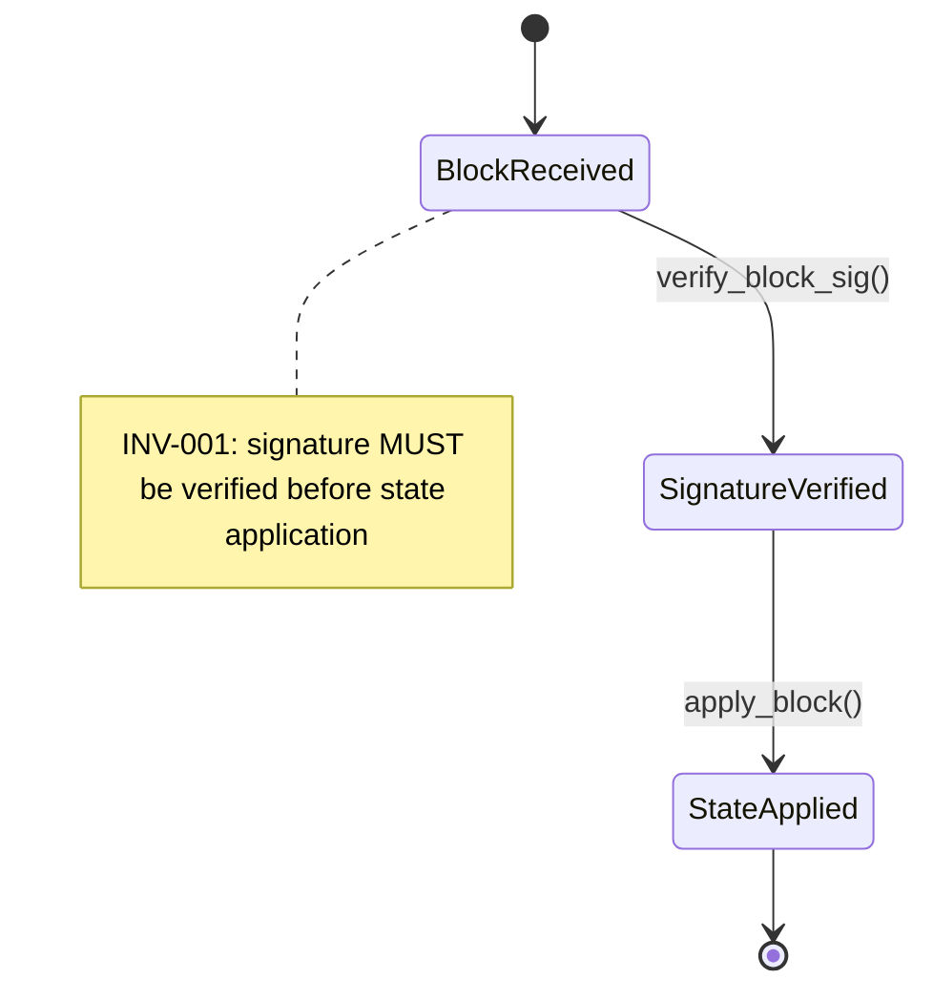

# ワークドエグザンプル: 1 つのプロパティを最後まで追う

SPECA が何をしているかを掴む最短ルートは、1 つのプロパティが仕様の文から結晶化し最終的に `04_PARTIAL_*.json` の verdict に至る過程を追うことです。本ページではそれを、各ステップでリアルな JSON 例を添えて行います。番号は内部フェーズ ID を使います。論文 Phase 1〜6 とのマッピングは [パイプライン概要](../pipeline/overview.md#フェーズ番号--論文-vs-内部-id) を参照してください。

## 出発点 — 仕様の 1 文

EIP 風ドキュメントに次の 1 行があるとします:

> "MUST verify the validator's signature on every block before applying it to the local state."

この 1 文が型付きプロパティとなり、最終的に監査 verdict になります。

## Phase 01a (Spec Discovery)

クローラが該当セクションを発見しインデックス化します。

```json
{
  "url": "https://eips.example.org/EIP-9999.md",
  "title": "EIP-9999 — Block Application",
  "section_id": "block-application",
  "section_text": "MUST verify the validator's signature on every block before applying it to the local state.",
  "links": ["https://...consensus-spec...", "..."]
}
```

出力: `outputs/01a_STATE.json` — 発見した仕様ページのインデックス。

## Phase 01b (Subgraph Extraction)

セクションが状態遷移フラグメントになり、RFC 2119 不変条件が紐付きます。



JSON 表現:

```json
{
  "spec_section_id": "FN-042",
  "spec_text": "MUST verify the validator's signature on every block before applying it to the local state.",
  "subgraph": {
    "states": ["BlockReceived", "SignatureVerified", "StateApplied"],
    "transitions": [
      {"from": "BlockReceived", "to": "SignatureVerified", "label": "verify_block_sig()"},
      {"from": "SignatureVerified", "to": "StateApplied", "label": "apply_block()"}
    ],
    "invariants": ["INV-001"]
  },
  "mermaid_file": "outputs/graphs/FN-042.mmd"
}
```

出力: `outputs/01b_PARTIAL_*.json`。

## Phase 01e (Property Generation)

STRIDE + CWE Top 25 が不変条件を型付きセキュリティプロパティに変えます。

```json
{
  "property_id": "PROP-101",
  "type": "Invariant",
  "description": "Signature on a block MUST be verified before its state transition is applied.",
  "covers": "FN-042",
  "classification": "STRIDE_Tampering",
  "cwe_related": ["CWE-345", "CWE-347"],
  "reachability": {
    "classification": "PUBLIC_API",
    "entry_points": ["process_block()", "on_block()"],
    "attacker_controlled": ["block.signature", "block.body"],
    "bug_bounty_scope": "in_scope"
  }
}
```

出力: `outputs/01e_PARTIAL_*.json`。`covers` が単一文字列 (主要仕様要素 ID) なのは [slim な 01e スキーマ判断](../agent-design/context-engineering.md#5-slim-な-01e-スキーマ--covers-は文字列) のとおりです。

## Phase 02c (Code Pre-resolution)

`tree_sitter` MCP がプロパティを対象リポジトリの具体コード位置に解決します。

```json
{
  "property_id": "PROP-101",
  "type": "Invariant",
  "description": "Signature on a block MUST be verified before its state transition is applied.",
  "code_scope": {
    "resolution_status": "resolved",
    "locations": [
      {
        "file": "consensus/src/block.rs",
        "symbol": "BlockProcessor::process",
        "line_range": [120, 198],
        "role": "primary",
        "note": "Caller invokes apply_block before verify_block_sig in the cache-hit branch — verify in Phase 03."
      },
      {
        "file": "consensus/src/sig.rs",
        "symbol": "verify_block_sig",
        "line_range": [42, 68],
        "role": "callee"
      }
    ]
  },
  "severity": "HIGH"
}
```

出力: `outputs/02c_PARTIAL_*.json`。primary location の `note` は Phase 02c が立てた仮説です — Phase 03 が検証または反証する必要があります。これが [事前解決 → 監査の引き渡し](../agent-design/context-engineering.md#2-02c-でのコード事前解決--1-度払って-03-で取り返す) です。

## Phase 03 (Audit — Map → Prove → Stress-Test)

エージェントが実装でプロパティが成立する証明を試みます。

```json
{
  "property_id": "PROP-101",
  "verdict": "FINDING",
  "proof_attempt": {
    "claim": "verify_block_sig() is always called before apply_block() on every reachable path of process()",
    "map": {
      "primary_symbol": "BlockProcessor::process",
      "relevant_blocks": ["validate", "cache_check", "apply"]
    },
    "prove": {
      "happy_path": "verify_block_sig at line 142 → apply_block at line 188 — proof closes",
      "cache_hit_path": "cache lookup at line 165 returns BlockState::Verified, jumps to line 188 directly without verify_block_sig",
      "proof_gap": "Cache stores blocks marked Verified by an earlier process() call but does not re-verify after a chain re-org. After re-org, a previously-Verified block may be applied without verification."
    },
    "stress_test": {
      "counterexample_constructed": true,
      "scenario": "Reorg between block N and block N+1 where N is in the cache; N is replayed and apply_block runs without re-verification."
    },
    "confidence": "HIGH"
  }
}
```

出力: `outputs/03_PARTIAL_*.json`。フローは [Phase 03 の制御フロー](./proof-attempt.md#phase-03-での実装) を参照。

## Phase 04 (Review — 3 ゲート FP フィルタ)

finding が Dead Code → Trust Boundary → Scope を順に通ります。

```json
{
  "property_id": "PROP-101",
  "finding_id": "FINDING-018",
  "verdict": "CONFIRMED_VULNERABILITY",
  "severity": "HIGH",
  "gate_results": [
    {"gate": "dead_code",     "passed": true,
     "rationale": "process() is reachable from the public p2p handler"},
    {"gate": "trust_boundary","passed": true,
     "rationale": "block.signature and block.body are attacker-controlled inputs from the network"},
    {"gate": "scope",         "passed": true,
     "rationale": "consensus/src/block.rs is in_scope per BUG_BOUNTY_SCOPE.json"}
  ]
}
```

出力: `outputs/04_PARTIAL_*.json`。これが `speca browse` に最終的に表示される行です。

## トレースできるもの

`speca browse` に並ぶ行については、プロパティ → サブグラフ → 仕様セクションが復元可能です:

```
04 verdict (FINDING-018)
   └─ property_id: PROP-101
       └─ covers: FN-042                      (01e → 01b)
           └─ spec_section_id: block-application  (01b → 01a)
               └─ url: eips.example.org/EIP-9999.md
```

このトレーサビリティが仕様駆動アプローチの最大の見返りです: 各 finding (および各 FP) が、それを生んだ判断の連鎖を本物の仕様の 1 文まで持って戻れます。
