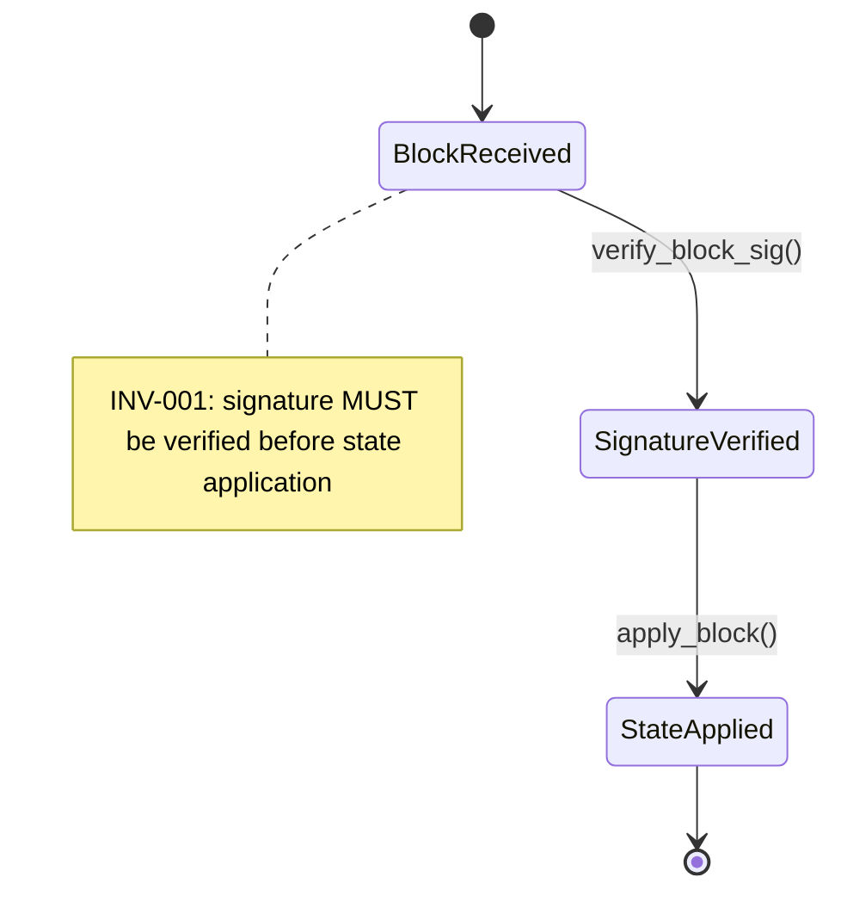

# Worked example: one property end-to-end

Sometimes the easiest way to see what SPECA does is to follow one property as it crystallises out of a spec sentence and ends up as a verdict in `04_PARTIAL_*.json`. This page does exactly that, with realistic-looking JSON at every step. The numbering uses internal phase IDs; for the paper-Phase-1-to-6 mapping, see [Pipeline overview](../pipeline/overview.md#phase-numbering--paper-vs-internal-ids).

## Starting point — one sentence in the spec

Imagine an EIP-style document with the line:

> "MUST verify the validator's signature on every block before applying it to the local state."

That single sentence will become a typed property and, eventually, an audit verdict.

## Phase 01a (Spec Discovery)

The crawler finds the spec section and indexes it.

```json
{
  "url": "https://eips.example.org/EIP-9999.md",
  "title": "EIP-9999 — Block Application",
  "section_id": "block-application",
  "section_text": "MUST verify the validator's signature on every block before applying it to the local state.",
  "links": ["https://...consensus-spec...", "..."]
}
```

Output: `outputs/01a_STATE.json` — index of every discovered spec page.

## Phase 01b (Subgraph Extraction)

The section becomes a state-transition fragment with an RFC-2119 invariant attached.



JSON form:

```json
{
  "spec_section_id": "FN-042",
  "spec_text": "MUST verify the validator's signature on every block before applying it to the local state.",
  "subgraph": {
    "states": ["BlockReceived", "SignatureVerified", "StateApplied"],
    "transitions": [
      {"from": "BlockReceived", "to": "SignatureVerified", "label": "verify_block_sig()"},
      {"from": "SignatureVerified", "to": "StateApplied", "label": "apply_block()"}
    ],
    "invariants": ["INV-001"]
  },
  "mermaid_file": "outputs/graphs/FN-042.mmd"
}
```

Output: `outputs/01b_PARTIAL_*.json`.

## Phase 01e (Property Generation)

STRIDE + CWE Top 25 turn the invariant into a typed security property.

```json
{
  "property_id": "PROP-101",
  "type": "Invariant",
  "description": "Signature on a block MUST be verified before its state transition is applied.",
  "covers": "FN-042",
  "classification": "STRIDE_Tampering",
  "cwe_related": ["CWE-345", "CWE-347"],
  "reachability": {
    "classification": "PUBLIC_API",
    "entry_points": ["process_block()", "on_block()"],
    "attacker_controlled": ["block.signature", "block.body"],
    "bug_bounty_scope": "in_scope"
  }
}
```

Output: `outputs/01e_PARTIAL_*.json`. Note `covers` is a single string (the primary spec element ID), per the [slim 01e schema decision](../agent-design/context-engineering.md#5-the-slim-01e-schema--covers-is-a-string).

## Phase 02c (Code Pre-resolution)

`tree_sitter` MCP resolves the property to concrete code locations in the target repo.

```json
{
  "property_id": "PROP-101",
  "type": "Invariant",
  "description": "Signature on a block MUST be verified before its state transition is applied.",
  "code_scope": {
    "resolution_status": "resolved",
    "locations": [
      {
        "file": "consensus/src/block.rs",
        "symbol": "BlockProcessor::process",
        "line_range": [120, 198],
        "role": "primary",
        "note": "Caller invokes apply_block before verify_block_sig in the cache-hit branch — verify in Phase 03."
      },
      {
        "file": "consensus/src/sig.rs",
        "symbol": "verify_block_sig",
        "line_range": [42, 68],
        "role": "callee"
      }
    ]
  },
  "severity": "HIGH"
}
```

Output: `outputs/02c_PARTIAL_*.json`. The `note` on the primary location is a Phase 02c hypothesis — Phase 03 must verify or refute it. This is the [pre-resolution → audit hand-off](../agent-design/context-engineering.md#2-code-pre-resolution-in-02c--pay-once-save-in-03).

## Phase 03 (Audit — Map → Prove → Stress-Test)

The agent attempts to prove the property holds in the implementation.

```json
{
  "property_id": "PROP-101",
  "verdict": "FINDING",
  "proof_attempt": {
    "claim": "verify_block_sig() is always called before apply_block() on every reachable path of process()",
    "map": {
      "primary_symbol": "BlockProcessor::process",
      "relevant_blocks": ["validate", "cache_check", "apply"]
    },
    "prove": {
      "happy_path": "verify_block_sig at line 142 → apply_block at line 188 — proof closes",
      "cache_hit_path": "cache lookup at line 165 returns BlockState::Verified, jumps to line 188 directly without verify_block_sig",
      "proof_gap": "Cache stores blocks marked Verified by an earlier process() call but does not re-verify after a chain re-org. After re-org, a previously-Verified block may be applied without verification."
    },
    "stress_test": {
      "counterexample_constructed": true,
      "scenario": "Reorg between block N and block N+1 where N is in the cache; N is replayed and apply_block runs without re-verification."
    },
    "confidence": "HIGH"
  }
}
```

Output: `outputs/03_PARTIAL_*.json`. Visual flow: [Phase 03 control flow](./proof-attempt.md#implementation-in-phase-03).

## Phase 04 (Review — 3-gate FP filter)

The finding runs through Dead Code → Trust Boundary → Scope.

```json
{
  "property_id": "PROP-101",
  "finding_id": "FINDING-018",
  "verdict": "CONFIRMED_VULNERABILITY",
  "severity": "HIGH",
  "gate_results": [
    {"gate": "dead_code",     "passed": true,
     "rationale": "process() is reachable from the public p2p handler"},
    {"gate": "trust_boundary","passed": true,
     "rationale": "block.signature and block.body are attacker-controlled inputs from the network"},
    {"gate": "scope",         "passed": true,
     "rationale": "consensus/src/block.rs is in_scope per BUG_BOUNTY_SCOPE.json"}
  ]
}
```

Output: `outputs/04_PARTIAL_*.json`. This is what `speca browse` ultimately renders.

## What you can trace

For any row that lands in `speca browse`, the property → subgraph → spec section is recoverable:

```
04 verdict (FINDING-018)
   └─ property_id: PROP-101
       └─ covers: FN-042                      (01e → 01b)
           └─ spec_section_id: block-application  (01b → 01a)
               └─ url: eips.example.org/EIP-9999.md
```

That traceability is the single biggest payoff of the spec-driven approach: every finding (and every false positive) carries the chain of decisions that produced it back to a sentence in a real spec.
